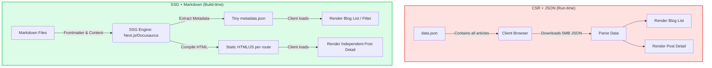

## Context & Problem

When I started building my CV project integrated with a personal Blog, my goal was to create a lightweight system with no server maintenance costs that could be hosted directly on GitHub Pages.

The first version was designed with a traditional Single Page Application (SPA) mindset: All articles were stored in a single `data.json` file. The Frontend (React) would fetch this JSON file at run-time, parse the data, and render the UI.

However, with a Daily Blogging goal, this model quickly revealed a **fatal weakness**:

1. **Data Bloat:** When the number of articles reached the hundreds, the `data.json` file bloated to several Megabytes.
2. **Bandwidth Bottleneck:** To read a single new article, the user's browser was forced to download the _entire_ article history.
3. **Terrible Developer Experience (DX):** Writing long content, inserting code snippets, or formatting text inside a JSON String is an escaping nightmare (`\n`, `\"`).

The only scalable solution was to completely change how data was stored and distributed.

## System Requirements

The new architecture needed to satisfy the strict constraints of a personal project:

- **Zero-backend:** No Database Server to save costs and maintenance effort.
- **Optimized TTI (Time to Interactive):** Whichever article the user visits, download exactly the data for that article.
- **Feature Preservation:** Still must support Filtering and Searching by Tag and Category.
- **Friendly DX:** Smooth writing support on an IDE, accurate code highlighting, and the ability to draw technical diagrams.

## Architecture Design

To solve this problem, I decided to switch from the **Client-side Rendering (CSR) + JSON** model to the **Static Site Generation (SSG) + Markdown** model.

The core of this change lies in moving the "data processing moment" from **Run-time** (when the user opens the web) to **Build-time** (when the code is pushed to GitHub).

**How the new data flow works:**

1. **Storage:** Each article is a separate `.md` or `.mdx` file. Metadata (Title, Date, Tags) is stored at the top of the file (Frontmatter YAML).
2. **Build-time:** When pushing code to GitHub, the SSG Engine scans the entire article directory. It extracts the Frontmatter to create a tiny metadata file (just a few dozen KBs) serving the list page. The Markdown content is compiled into individual static HTML pages.
3. **Distribution:** When users visit `/blog/my-post`, GitHub Pages returns exactly the HTML file for that post. Response speed is measured in milliseconds.

## Trade-off Analysis

Every architectural decision is a Trade-off. Although it solves the "JSON bloat", the new model also brings certain characteristics to consider:

<table style="width:100%; border-collapse: collapse; margin-bottom: 20px;">
  <thead>
    <tr style="border-bottom: 2px solid #e2e8f0; text-align: left;">
      <th style="padding: 8px;">Criteria</th>
      <th style="padding: 8px;">Old Model (JSON)</th>
      <th style="padding: 8px;">New Model (Markdown + SSG)</th>
    </tr>
  </thead>
  <tbody>
    <tr style="border-bottom: 1px solid #edf2f7;">
      <td style="padding: 8px"><b>Detail Page Load Speed</b></td>
      <td style="padding: 8px">Slow (Must parse large chunk of data)</td>
      <td style="padding: 8px">Extremely fast (Pre-rendered HTML)</td>
    </tr>
    <tr style="border-bottom: 1px solid #edf2f7;">
      <td style="padding: 8px"><b>Content Maintenance Cost</b></td>
      <td style="padding: 8px">Very hard (Fixing JSON syntax errors)</td>
      <td style="padding: 8px">Very easy (Git Version Control, IDE support)</td>
    </tr>
    <tr style="border-bottom: 1px solid #edf2f7;">
      <td style="padding: 8px"><b>Build Time (CI/CD)</b></td>
      <td style="padding: 8px">Fast (Just copying static files)</td>
      <td style="padding: 8px">Increases with post count (Compiling MD to HTML)</td>
    </tr>
    <tr>
      <td style="padding: 8px"><b>Dynamic Features (Comments)</b></td>
      <td style="padding: 8px">Can self-build via API</td>
      <td style="padding: 8px">Must rely on 3rd party (Giscus, Utterances)</td>
    </tr>
  </tbody>
</table>

For a personal Blog, 1-2 extra minutes of build time on GitHub Actions is a very cheap price to pay for absolute frontend performance and a smooth writing experience.

## Real-world Lessons & Best Practices

Through the migration process, here are the Best Practices I've gathered to maintain an SSG system long-term:

1. **Standardize Frontmatter from the start:** Defining a clear Schema for metadata (e.g., mandatory `date` in `YYYY-MM-DD` format, `tags` as an array) prevents build-time errors.
2. **Absolutely never load Content into the List Page:** When processing data at build-time, extract only the Frontmatter fields to create filters. Do not bring the body text into the metadata array, otherwise you'll repeat the "JSON bloat" error in the SSG version.
3. **Leverage MDX:** In the React ecosystem, using MDX (`.mdx`) allows directly embedding React Components (like Mermaid charts, interactive buttons, spreadsheets) right inside the Markdown article, blurring the line between static content and dynamic applications.
4. **Automate with GitHub Actions:** Set up a workflow so that whenever there's a new commit to the `main` branch, the system automatically runs `npm run build` and deploys the `dist` folder directly to the `gh-pages` branch. You just write, let the machines handle the rest.

A good architecture is not the most complex one, but the most suitable for the project's resources and specifics at the current time.
