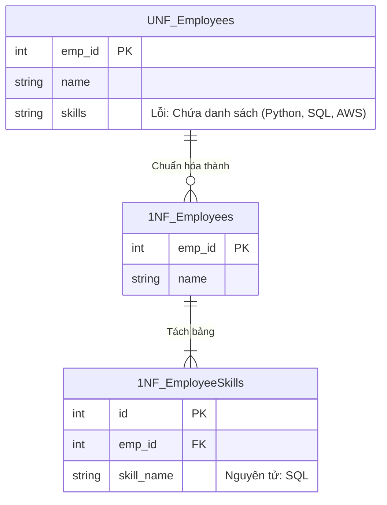

## Đề bài kinh doanh / Yêu cầu dữ liệu

Giả sử bạn là Data Engineer chịu trách nhiệm xây dựng hệ thống ERP (Enterprise Resource Planning) cho công ty. Module đầu tiên cần làm là **Quản lý Hồ sơ nhân sự (HR)**.
Trong giai đoạn đầu MVP, bảng `Employees` lưu trữ thông tin cơ bản. Để tiện lợi, các lập trình viên lưu toàn bộ các kỹ năng (skills) của nhân sự vào chung một cột `skills`, cách nhau bởi dấu phẩy (VD: "Python, SQL, AWS").

Khi công ty phát triển lên 500 nhân sự, Resource Manager cần tìm gấp các nhân sự biết "SQL" để đưa vào dự án mới. Việc dùng truy vấn `LIKE '%SQL%'` không những rất chậm (do không dùng được Index) mà còn dễ sai sót (có thể match nhầm với "NoSQL"). Hệ thống ERP bắt đầu bộc lộ điểm yếu đầu tiên.

## Mô hình hóa dữ liệu

Chuẩn 1NF yêu cầu: **Mỗi cột của một bảng phải là nguyên tử (không thể chia nhỏ hơn), không chứa các mảng hoặc danh sách, và mỗi dòng phải là duy nhất.**



## Xây dựng Pipeline / Script xử lý

Để chuyển đổi dữ liệu trên PostgreSQL, ta dùng hàm `unnest()` và `string_to_array()` để tách các kỹ năng thành từng dòng độc lập:

```sql
-- 1. Tạo bảng theo chuẩn 1NF
CREATE TABLE employees_1nf (
    emp_id SERIAL PRIMARY KEY,
    name VARCHAR(100) NOT NULL
);

CREATE TABLE employee_skills_1nf (
    id SERIAL PRIMARY KEY,
    emp_id INT REFERENCES employees_1nf(emp_id),
    skill_name VARCHAR(50) NOT NULL
);

-- 2. Migrate dữ liệu từ hệ thống cũ (UNF)
INSERT INTO employees_1nf (emp_id, name)
SELECT emp_id, name FROM employees_unf;

INSERT INTO employee_skills_1nf (emp_id, skill_name)
SELECT
    emp_id,
    TRIM(unnest(string_to_array(skills, ','))) AS skill_name
FROM employees_unf
WHERE skills IS NOT NULL;
```

## Kiểm thử dữ liệu & Tối ưu hiệu năng

- **Kiểm thử:** Truy vấn tìm nhân sự theo skill giờ sử dụng phép `JOIN` chuẩn mực: `SELECT e.name FROM employees_1nf e JOIN employee_skills_1nf s ON e.emp_id = s.emp_id WHERE s.skill_name = 'SQL';`
- **Tối ưu hiệu năng:** Bằng cách đánh B-Tree Index lên cột `skill_name`, tốc độ tìm kiếm nhân sự giảm từ `O(N)` (Quét toàn bộ bảng) xuống `O(log N)`.

## Tổng kết & Khuyến nghị

1NF là viên gạch đầu tiên của mọi hệ thống ERP. Tuyệt đối không dùng Comma-separated strings cho các trường dữ liệu cần dùng để phân tích hay lọc (Filter). Ở bài tiếp theo, chúng ta sẽ xem xét cách hệ thống ERP xử lý bài toán Phân công dự án và tiến lên chuẩn 2NF.
