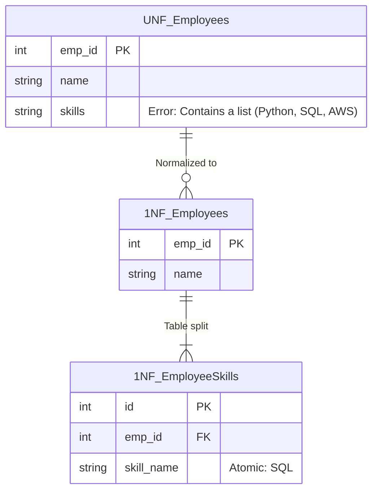

## Business Scenario / Data Requirement

Imagine you are a Data Engineer responsible for building an ERP (Enterprise Resource Planning) system for the company. The first module to be developed is **HR Profile Management**.
During the MVP phase, the `Employees` table stores basic information. For convenience, developers store all employee skills in a single `skills` column, separated by commas (e.g., "Python, SQL, AWS").

As the company grows to 500 employees, the Resource Manager urgently needs to find staff members with "SQL" skills for a new project. Using a `LIKE '%SQL%'` query is not only very slow (since it cannot utilize indexes) but also prone to errors (it might incorrectly match "NoSQL"). The ERP system begins to reveal its first weakness.

## Data Modeling

The 1NF standard requires: **Each column in a table must be atomic (indivisible) and contain no arrays or lists, and each row must be unique.**



## Building the Pipeline / Processing Script

To transform the data in PostgreSQL, use the `unnest()` and `string_to_array()` functions to split the skills into individual rows:

```sql
-- 1. Create tables according to 1NF standards
CREATE TABLE employees_1nf (
emp_id SERIAL PRIMARY KEY,
name VARCHAR(100) NOT NULL
);

CREATE TABLE employee_skills_1nf (
id SERIAL PRIMARY KEY,
emp_id INT REFERENCES employees_1nf(emp_id),
skill_name VARCHAR(50) NOT NULL
);

-- 2. Migrate data from the old system (UNF)
INSERT INTO employees_1nf (emp_id, name)
SELECT emp_id, name FROM employees_unf;

INSERT INTO employee_skills_1nf (emp_id, skill_name)
SELECT
emp_id,
TRIM(unnest(string_to_array(skills, ','))) AS skill_name
FROM employees_unf
WHERE skills IS NOT NULL;
```

## Data Testing & Performance Optimization

- **Testing:** The query to locate personnel based on skills now utilizes a standard `JOIN` operation: `SELECT e.name FROM employees_1nf e JOIN employee_skills_1nf s ON e.emp_id = s.emp_id WHERE s.skill_name = 'SQL';`
- **Performance Optimization:** By applying a B-Tree Index to the `skill_name` column, the search speed improves from `O(N)` (full table scan) to `O(log N)`.

## Summary & Recommendations

1NF serves as the foundational building block for any ERP system. Comma-separated strings must strictly be avoided for data fields intended for analysis or filtering. In the next article, we will examine how ERP systems handle project assignments and progress to the 2NF standard.
