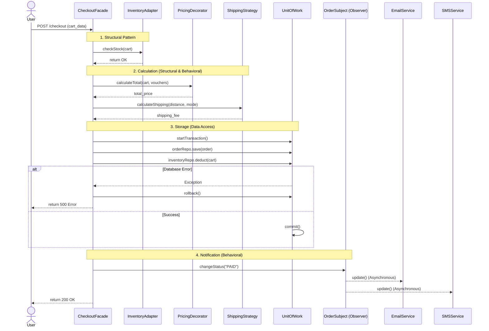

Static architecture is beautiful, but how do Patterns communicate with each other when the system is running (Runtime)? Let's follow a "Place Order" Request to see the rhythmic coordination of the system.

## Sequence Diagram: The Journey of an Order

## Touchpoints Analysis

1. **Entering through the Facade:** The Controller doesn't need to know how many steps are inside; it just calls `Facade.placeOrder()`.
2. **Checking with Adapter:** The Facade asks the Adapter if the warehouse has stock. The Adapter silently translates the request into XML and sends it to the old inventory system.
3. **Overlapping Calculations:** Discount vouchers stack on top of each other thanks to the `Decorator`. Shipping fees are calculated using a specific `Strategy` (e.g., Express Delivery).
4. **Data Commitment:** Saving the Order and deducting Stock must occur within the same `Unit of Work` to ensure ACID compliance.
5. **Event Propagation:** Once the order is saved, the status changes to PAID. The `Observer` automatically wakes up the Email/SMS services without the main thread having to wait.

This is exactly the difference between "Code that works" and "Standard Software Engineering Code".
