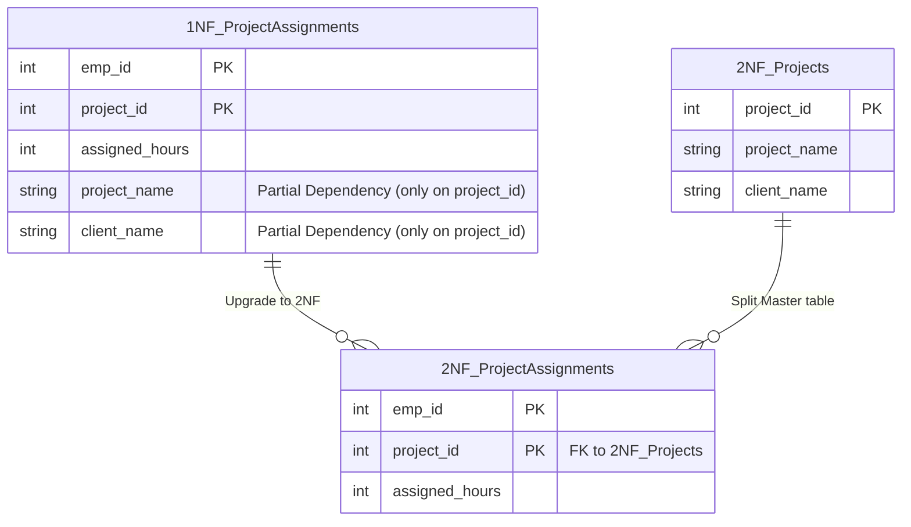

## Business Context / Data Requirements

Our ERP system continues to expand with the **Project Allocation Module**.
The engineers have created a `Project_Assignments` table to store which employee is assigned to which project, their working hours, along with `project_name` and `client_name` (partner name).

This table has a Composite Primary Key of `(emp_id, project_id)`. However, one day, the partner changes their company name (`client_name`). The system has to scan and UPDATE thousands of assignment rows for all employees involved in that project. Obviously, `project_name` and `client_name` do not depend on `emp_id`, they only depend on `project_id`. This is called **Partial Dependency**.

## Data Modeling

The 2NF standard requires: **The table must meet 1NF and NO non-key attribute can depend on only a part of the primary key.**



## Building the Pipeline / Processing Script

We extract the Project information into an independent Master table (Projects) and keep the Assignment table as the Transaction table:

```sql
-- 1. Create the Projects table (Master Data)
CREATE TABLE projects_2nf AS
SELECT DISTINCT project_id, project_name, client_name
FROM project_assignments_1nf;

ALTER TABLE projects_2nf ADD PRIMARY KEY (project_id);

-- 2. Create the 2NF compliant Assignments table
CREATE TABLE project_assignments_2nf AS
SELECT emp_id, project_id, assigned_hours
FROM project_assignments_1nf;

ALTER TABLE project_assignments_2nf ADD PRIMARY KEY (emp_id, project_id);
ALTER TABLE project_assignments_2nf
ADD FOREIGN KEY (project_id) REFERENCES projects_2nf(project_id);
-- (Note: emp_id should also have an FK pointing back to the employees_1nf table from the previous article)
```

## Data Testing & Performance Optimization

- **Update Testing:** Now, when a partner changes their name, we only need to run a single Update command: `UPDATE projects_2nf SET client_name = 'New Client' WHERE project_id = 101;`. Data is instantly synchronized across the entire assignment system.
- **Space Optimization:** Long strings (project names, partner names) are no longer duplicated thousands of times, reducing storage consumption and speeding up scans.

## Conclusion & Recommendations

The 2NF standard decisively solves the troubles of tables with Composite Primary Keys. A core principle in ERP: Always separate Master Data (like Projects, Customers) from Transaction Data (like Assignments, Timesheets).
