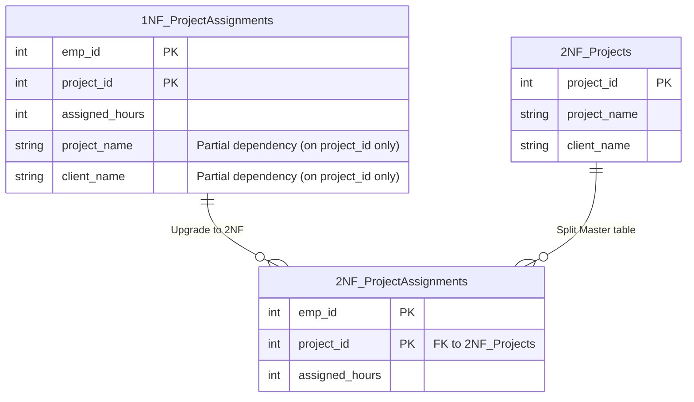

## Business Scenario / Data Requirement

Our ERP system is expanding to include a **Project Allocation Module**.
Engineers have created a `Project_Assignments` table to store data on which employees are assigned to which projects, the number of working hours, as well as the `project_name` and `client_name`.

This table uses a composite primary key consisting of `(emp_id, project_id)`. However, a situation arises where a client changes their company name (`client_name`). The system is then forced to scan and `UPDATE` thousands of assignment records for all employees involved in that project. Clearly, `project_name` and `client_name` do not depend on `emp_id`; they depend solely on `project_id`. This is known as **Partial Dependency**.

## Data Modeling

The 2NF standard requires: **The table must satisfy 1NF and have NO non-key attributes that depend on only a part of the primary key.**



## Building the Pipeline / Processing Script

We extract Project information into a standalone Master table (Projects) and retain the Assignments table as a Transaction table:

```sql
-- 1. Create Projects table (Master Data)
CREATE TABLE projects_2nf AS
SELECT DISTINCT project_id, project_name, client_name
FROM project_assignments_1nf;

ALTER TABLE projects_2nf ADD PRIMARY KEY (project_id);

-- 2. Create 2NF-compliant Assignments table
CREATE TABLE project_assignments_2nf AS
SELECT emp_id, project_id, assigned_hours
FROM project_assignments_1nf;

ALTER TABLE project_assignments_2nf ADD PRIMARY KEY (emp_id, project_id);
ALTER TABLE project_assignments_2nf
ADD FOREIGN KEY (project_id) REFERENCES projects_2nf(project_id);
-- (Note: emp_id should also have a foreign key referencing the employees_1nf table from the previous lesson)
```

## Data Testing & Performance Optimization

- **Update Testing:** Now, when a client changes their name, we only need to execute a single `UPDATE` statement: `UPDATE projects_2nf SET client_name = 'New Client' WHERE project_id = 101;`. The data is immediately synchronized across the entire assignment system.
- **Space Optimization:** Long strings (such as project names or client names) are no longer repeated thousands of times, which reduces storage requirements and speeds up data scanning.

## Summary & Recommendations

The 2NF standard effectively resolves the issues associated with tables using Composite Keys. A core principle in ERP systems is to always separate Master Data (e.g., Projects, Clients) from Transaction Data (e.g., Assignments, Timekeeping records).
