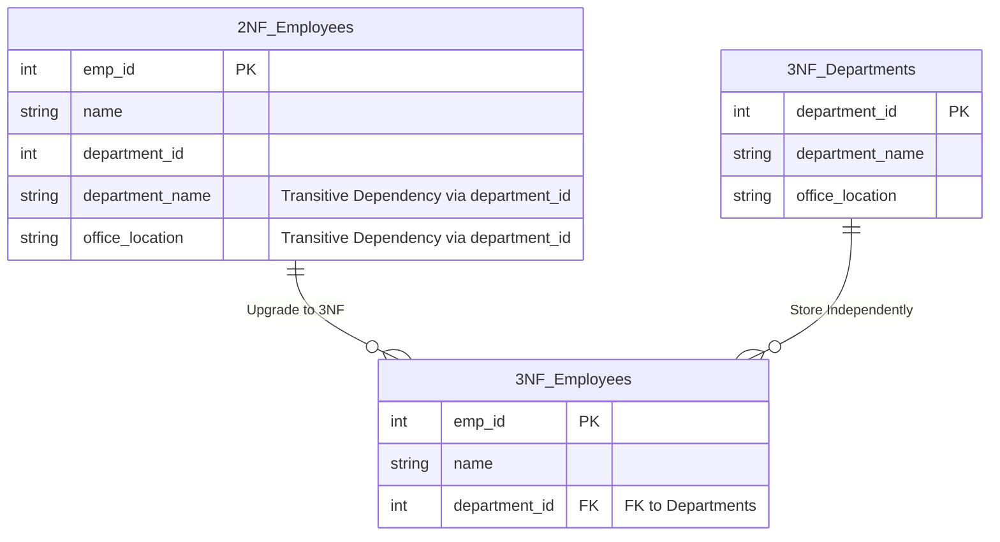

## Business Context / Data Requirements

The ERP system continues to add an **Organizational Chart Management Module**. We update the `Employees` table (from article 1) by adding department information: `department_id`, `department_name`, and `office_location`.

The primary key of the `Employees` table is `emp_id` (single key). Therefore, this table automatically satisfies 2NF (since there's no composite key, partial dependencies are impossible).
However, an Anomaly appears: When the company relocates the "Engineering Dept" from Floor 2 to Floor 5 (`office_location`), we have to update hundreds of employees. The reason is that `office_location` depends on `department_id`, and `department_id` depends on the primary key `emp_id`. This is called **Transitive Dependency**.

## Data Modeling

The 3NF standard requires: **Meets 2NF and there are NO non-key attributes that depend on another non-key attribute.**



## Building the Pipeline / Processing Script

```sql
-- 1. Create an independent Departments table
CREATE TABLE departments_3nf AS
SELECT DISTINCT department_id, department_name, office_location
FROM employees_2nf;

ALTER TABLE departments_3nf ADD PRIMARY KEY (department_id);

-- 2. Refactor the Employees table to meet 3NF
CREATE TABLE employees_3nf AS
SELECT emp_id, name, department_id
FROM employees_2nf;

ALTER TABLE employees_3nf ADD PRIMARY KEY (emp_id);
ALTER TABLE employees_3nf
ADD FOREIGN KEY (department_id) REFERENCES departments_3nf(department_id);
```

## Data Testing & Performance Optimization

- **Data Integrity Testing:** Any changes to departments (renaming, moving offices) are now isolated within the `departments_3nf` table.
- **Meeting OLTP Standards:** 3NF eliminates maximum Redundancy. This is the ideal design for ERP core systems (OLTP), optimizing Write speed and guaranteeing ACID properties.

## Conclusion & Recommendations

Reaching 3NF is a mandatory goal for all primary data tables in an ERP architecture. Adhering to "nothing but the key" prevents the system from accumulating severe Technical Debt as the company's personnel scale and organizational chart become increasingly complex.
