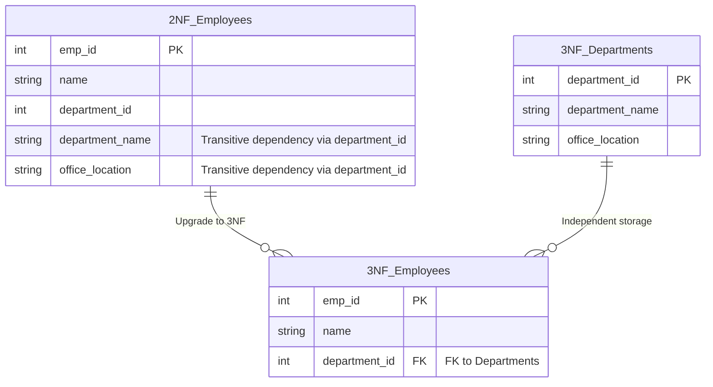

## Business Scenario / Data Requirements

The ERP system is being expanded to include an **Organizational Chart Management Module**. We are updating the `Employees` table (from the previous exercise) by adding department-related information: `department_id`, `department_name`, and `office_location`.

The primary key for the `Employees` table is `emp_id` (a single-column key). Consequently, the table automatically satisfies 2NF (since there is no composite key, partial dependencies cannot exist).
However, an anomaly arises: when the company relocates the "Technical Department" office from the 2nd floor to the 5th floor (`office_location`), we must update records for hundreds of employees. This occurs because `office_location` depends on `department_id`, and `department_id` in turn depends on the primary key `emp_id`. This is known as a **Transitive Dependency**.

## Data Modeling

The 3NF standard requires: **Compliance with 2NF AND the absence of any non-key attribute depending on another non-key attribute.**



## Pipeline / Processing Script Construction

```sql
-- 1. Create an independent Departments table
CREATE TABLE departments_3nf AS
SELECT DISTINCT department_id, department_name, office_location
FROM employees_2nf;

ALTER TABLE departments_3nf ADD PRIMARY KEY (department_id);

-- 2. Refactor the Employees table to achieve 3NF
CREATE TABLE employees_3nf AS
SELECT emp_id, name, department_id
FROM employees_2nf;

ALTER TABLE employees_3nf ADD PRIMARY KEY (emp_id);
ALTER TABLE employees_3nf
ADD FOREIGN KEY (department_id) REFERENCES departments_3nf(department_id);
```

## Data Testing & Performance Optimization

- **Data Integrity Testing:** Any changes regarding departments (name changes, office relocations) are now isolated within the `departments_3nf` table.
- **OLTP Compliance:** 3NF helps minimize data redundancy. This is an ideal design for ERP core systems (OLTP), optimizing write speeds while ensuring ACID compliance.

## Summary & Recommendations

Achieving 3NF is a mandatory requirement for all primary data tables within an ERP architecture. Adhering to the principle of "nothing but the key" helps the system avoid significant technical debt as the company's workforce and organizational structure grow in complexity.
