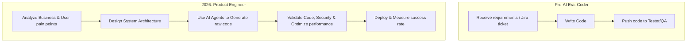
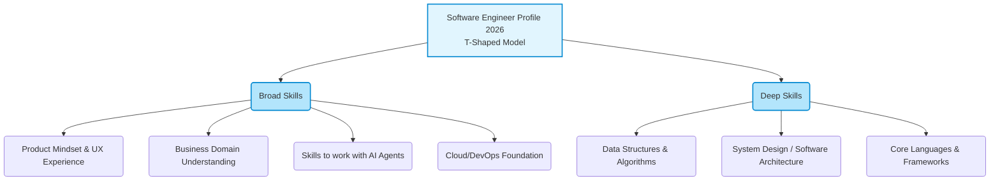

The global and Vietnamese IT labor markets are undergoing their harshest purification in the past decade. The golden era of "just knowing how to code guarantees a thousand-dollar salary" has officially ended. Below is my personal perspective on the ongoing shifts, the core causes, and how we can reposition ourselves.

## The Wave of Lay-offs and AI: Stealing the Spotlight but Unable to Replace Software Engineers

Looking globally, data from Layoffs.fyi indicates that by mid-2026, over 150,000 tech workers have been laid off, and notably, 55% of these cuts explicitly cited restructuring to invest in AI and automation as the cause. In Vietnam, the picture paints a similar tone. According to TopDev's report, the Vietnamese market currently has about 560,000 IT personnel, but ITviec's 2025-2026 survey report reveals a cold reality: 38.7% of IT businesses plan to adopt a "no growth/headcount reduction" policy—the highest rate since 2020—primarily due to deploying AI to increase productivity.

**My Perspective:** This wave of lay-offs is real, and AI is gradually taking over thanks to its incredibly good Generative AI capabilities. However, **AI absolutely cannot replace the job of a true Software Engineer.**

The reason lies in the core nature of the profession: Software Engineering has never been purely about "typing code". It is a problem-solving process based on the highly ambiguous business requirements of humans. Stack Overflow's 2025-2026 Developer Survey proved this interestingly: Although 84% of developers are currently or will be using AI in their work, only 29% truly trust the accuracy of the results generated by AI.

AI can write a perfect function in 3 seconds, but it cannot take responsibility when the system crashes. It doesn't understand the constraints of server costs (cloud cost), it doesn't know how to communicate with other departments to lock down project scope, and it cannot independently make architectural trade-offs. Software engineers now play the role of "Validator" and "Architect" to assemble the pieces generated by AI into a secure product.

## The Hiring Paradox: Demanding "Supermen" on a "Budget"

If you browse through recruitment sites today, it's not hard to find Job Descriptions (JD) looking for a Junior/Mid-level developer but demanding knowledge of Frontend, Backend, smooth operation with Cloud (AWS/GCP), DevOps understanding, and even a Product mindset. The accompanying salary often does not match that massive volume of requirements.

**My Perspective:** Employers always demand more than they can pay for, but the root cause isn't just about "squeezing the price."

In the context of tightening investment capital and the 2022-2024 layoffs pushing a large number of Senior personnel into the market, businesses have the luxury of choice. However, the core motive is that **they are buying your "future adaptability," not just your "current skills."**

- **From the business side:** They want candidates capable of continuously acquiring knowledge to automatically solve emerging problems without having to hire new people.
- **From the candidate side:** You are forced to have the ability to self-learn beyond your current working domain. If you are Frontend, you must understand how Backend works to optimize API calls. If you are Backend, you must understand how to deploy to operate the system yourself. The "greed" of businesses is essentially a filter to find individuals capable of surviving in a tech environment that changes daily.

## The Decline of the "Coder" and the Rise of the "Product Engineer"

Another perspective I want to add to complete this picture is the strong shift from the concept of a "Coder" to a "Product Engineer".

Previously, a programmer's value was measured by how fast they coded and how few bugs they had when receiving a ticket. Today, AI does that part well. The only remaining competitive advantage for humans is **Business Context and User Empathy.**

A Product Engineer doesn't start with the question _"What framework should we use?"_ but with _"What value does this feature bring to the user, and is it worth the company's resources to invest in?"_.

## Actionable Recommendations for the Present

The market isn't "dead"; it's just raising the bar to a new level. To survive and break through in 2026, here are specific action strategies:

- **Reshape yourself into a "T-Shaped Engineer":** Don't just bury your head in one programming language. Dig deep into a core expertise (the vertical bar of the T) like data structures, algorithms, or architectural design, but simultaneously broaden your knowledge (the horizontal bar of the T) into areas like DevOps, Cloud, Security, and Product Mindset.
- **Turn AI into your "Junior":** Instead of fearing AI, learn how to manage it. The most important skill right now is "Reviewing AI's code," detecting security vulnerabilities or silly logic created by AI due to "hallucinations."
- **Focus on "System Design" rather than "Syntax":** Syntax can be forgotten and AI can remind you, but System Design thinking—connecting microservices, designing high-load databases, solving scaling problems—is something current AI cannot replace humans for in a complex business context.
- **Understand the Business Domain:** Choose a niche industry (Finance, Healthcare, Logistics, E-commerce...) and dive deep into it. When you understand the industry's business processes, you can advise on technological solutions that bring money to the company. That is when you become irreplaceable.

**In summary:** The current wave is not the end of the Software Engineer profession, but an inevitable evolution. The high demands of businesses and the entry of AI are actually freeing engineers from boring lines of code, forcing us to step up and do work with a higher intellectual content: Designing architecture, understanding business, and solving problems with practical value.
