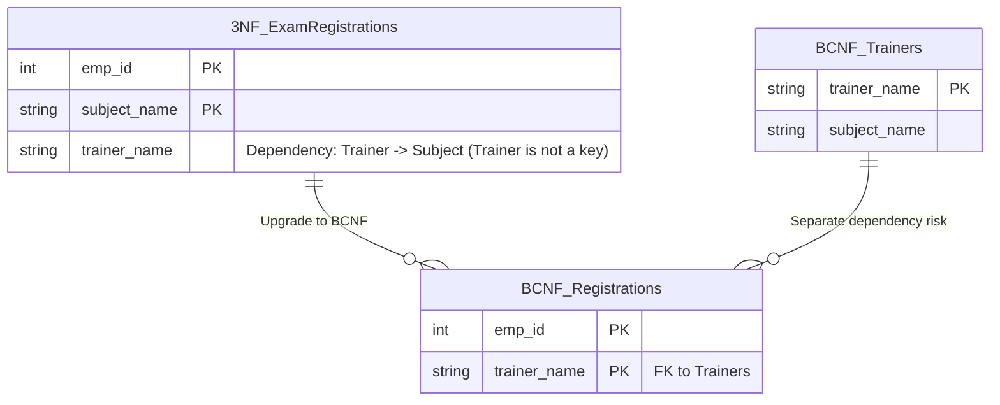

## Business Scenario / Data Requirements

The ERP system incorporates an **Internal Training & Certifications Module**.
We have an `Exam_Registrations` table storing the following information: `emp_id`, `subject_name`, and `trainer_name` (internal instructor).

The company's business rules are as follows:

1. An employee can take multiple subjects. A single subject can be taught by multiple instructors across different classes.
2. An employee registers with only one instructor for a specific subject.
3. **Each instructor specializes in teaching EXACTLY ONE subject.**

Candidate keys that uniquely identify a row could be: `(emp_id, subject_name)` or `(emp_id, trainer_name)`. Since all columns are part of the candidate keys, the table **already satisfies 3NF**.
However, there is a risk: `subject_name` depends on `trainer_name` (because an instructor teaches only one subject). If all employees cancel their registration for "Trainer Bob's" class and the data is deleted, the system loses the information that "Trainer Bob teaches AWS" (Delete Anomaly).

## Data Modeling

BCNF requires: **Compliance with 3NF, and for every functional dependency X -> Y, X must be a Superkey.**
In this case, `trainer_name -> subject_name` exists, but `trainer_name` alone is not a table key (it does not uniquely identify the entire row). Therefore, it violates BCNF.



## Building the Pipeline / Processing Script

We separate trainers and subjects into a distinct catalog:

```sql
-- 1. Create Trainers table (Captures Trainer -> Subject dependency)
CREATE TABLE trainers_bcnf AS
SELECT DISTINCT trainer_name, subject_name
FROM exam_registrations_3nf;

ALTER TABLE trainers_bcnf ADD PRIMARY KEY (trainer_name);

-- 2. Create Exam Registrations table (Remove Subject column)
CREATE TABLE exam_registrations_bcnf AS
SELECT emp_id, trainer_name
FROM exam_registrations_3nf;

ALTER TABLE exam_registrations_bcnf ADD PRIMARY KEY (emp_id, trainer_name);
ALTER TABLE exam_registrations_bcnf
ADD FOREIGN KEY (trainer_name) REFERENCES trainers_bcnf(trainer_name);
```

## Data Testing & Performance Optimization

- **Data Integrity:** We can define a new trainer and the subject they teach (INSERT into the `trainers_bcnf` table) even before any employee has registered for that class.
- **Robust Design:** BCNF eliminates the final vulnerability found in tables with complex composite key logic.

## Summary & Recommendations

In ERP systems, functions such as shift scheduling, class timetabling, or equipment usage scheduling frequently encounter scenarios that satisfy 3NF but violate BCNF. Always use BCNF as a robustness test for data tables that utilize composite keys.
