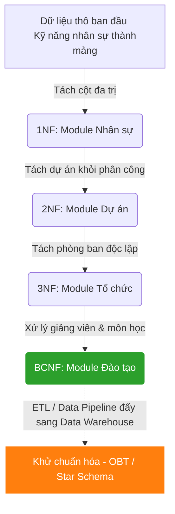

## Đề bài kinh doanh / Yêu cầu dữ liệu

Quay lại với hệ thống ERP của chúng ta. Trải qua 4 module (Nhân sự, Dự án, Phòng ban, Đào tạo), CSDL backend hiện đã đạt chuẩn 3NF/BCNF cực kỳ chặt chẽ, an toàn, không có dư thừa dữ liệu. Các thao tác Update, Delete diễn ra hoàn hảo.

Thế nhưng, Ban Giám Đốc yêu cầu team Data Analytics tạo một **Dashboard Phân bổ Nguồn lực (Resource Allocation)** trên Looker Studio. Báo cáo này cần hiển thị: _Nhân sự nào thuộc phòng ban nào, có kỹ năng gì, đang làm dự án cho client nào, và học chứng chỉ gì._
Câu truy vấn (Query) giờ đây phải `JOIN` qua 7-8 bảng khác nhau trên tập dữ liệu hàng triệu dòng. Backend Database bị thắt cổ chai, dashboard quay vòng vòng (timeout).

Đây là lúc chúng ta thảo luận về kỹ thuật **Denormalization (Khử chuẩn hóa)** dành cho phân tích OLAP/Data Warehouse.

## Bức tranh tổng thể: Tiến trình Chuẩn hóa và Khử chuẩn hóa



## Bảng So Sánh Các Chuẩn Thiết Kế

<table style="width:100%; border-collapse: collapse; margin-bottom: 20px;">
  <thead>
    <tr style="border-bottom: 2px solid #e2e8f0; text-align: left;">
      <th style="padding: 8px;">Tiêu chí</th>
      <th style="padding: 8px;">1NF</th>
      <th style="padding: 8px;">2NF</th>
      <th style="padding: 8px;">3NF</th>
      <th style="padding: 8px;">BCNF (3.5NF)</th>
      <th style="padding: 8px;">Denormalization (OLAP)</th>
    </tr>
  </thead>
  <tbody>
    <tr style="border-bottom: 1px solid #edf2f7;">
      <td style="padding: 8px;"><strong>Quy tắc</strong></td>
      <td style="padding: 8px;">Nguyên tử, ko mảng lặp.</td>
      <td style="padding: 8px;">1NF + Ko phụ thuộc 1 phần PK.</td>
      <td style="padding: 8px;">2NF + Ko phụ thuộc bắc cầu.</td>
      <td style="padding: 8px;">3NF + Mọi quyết định là Siêu khóa.</td>
      <td style="padding: 8px;">Cố tình gộp bảng, cho phép lặp dữ liệu.</td>
    </tr>
    <tr style="border-bottom: 1px solid #edf2f7;">
      <td style="padding: 8px;"><strong>Vấn đề giải quyết trong ERP</strong></td>
      <td style="padding: 8px;">Lỗi parse chuỗi skills, ko Index.</td>
      <td style="padding: 8px;">Update sai lệch client_name dự án.</td>
      <td style="padding: 8px;">Update thiếu địa chỉ phòng ban.</td>
      <td style="padding: 8px;">Delete nhầm dữ liệu môn học nội bộ.</td>
      <td style="padding: 8px;">Truy vấn báo cáo (JOIN) quá chậm.</td>
    </tr>
    <tr style="border-bottom: 1px solid #edf2f7;">
      <td style="padding: 8px;"><strong>Đặc điểm mô hình</strong></td>
      <td style="padding: 8px;">Bảng ít, cột chứa list.</td>
      <td style="padding: 8px;">Sinh ra bảng Master/Trans.</td>
      <td style="padding: 8px;">Nhiều bảng, ForeignKey chặt.</td>
      <td style="padding: 8px;">An toàn tuyệt đối logic phức tạp.</td>
      <td style="padding: 8px;">Một bảng siêu rộng (One Big Table).</td>
    </tr>
    <tr style="border-bottom: 1px solid #edf2f7;">
      <td style="padding: 8px;"><strong>Phép JOIN</strong></td>
      <td style="padding: 8px;">Rất ít</td>
      <td style="padding: 8px;">Trung bình</td>
      <td style="padding: 8px;">Rất nhiều</td>
      <td style="padding: 8px;">Rất nhiều</td>
      <td style="padding: 8px;">Ít hoặc Không có</td>
    </tr>
    <tr style="border-bottom: 1px solid #edf2f7;">
      <td style="padding: 8px;"><strong>Use case</strong></td>
      <td style="padding: 8px;">Data Staging</td>
      <td style="padding: 8px;">Module nhỏ</td>
      <td style="padding: 8px;">Core ERP Backend (OLTP)</td>
      <td style="padding: 8px;">Module Lịch, Phân ca (OLTP)</td>
      <td style="padding: 8px;">Data Warehouse, Dashboard BI</td>
    </tr>
  </tbody>
</table>

## Xây dựng Pipeline / Script xử lý (Denormalization)

Để giải quyết bài toán Report, thay vì đập bỏ thiết kế BCNF của Core ERP, Data Engineer xây dựng một **Materialized View** (hoặc dùng ETL đẩy sang BigQuery/ClickHouse) để "Khử chuẩn hóa" thành One Big Table (OBT):

```sql
-- Tạo Materialized View phục vụ Looker Studio (Khử chuẩn hóa)
CREATE MATERIALIZED VIEW mv_resource_analytics AS
SELECT
    e.emp_id,
    e.name AS employee_name,
    d.department_name,
    d.office_location,
    sk.skill_name,
    p.project_name,
    p.client_name,
    pa.assigned_hours
FROM employees_3nf e
JOIN departments_3nf d ON e.department_id = d.department_id
LEFT JOIN employee_skills_1nf sk ON e.emp_id = sk.emp_id
LEFT JOIN project_assignments_2nf pa ON e.emp_id = pa.emp_id
LEFT JOIN projects_2nf p ON pa.project_id = p.project_id;

-- Tạo index để hỗ trợ filter dashboard
CREATE INDEX idx_mv_dept ON mv_resource_analytics(department_name);
CREATE INDEX idx_mv_skill ON mv_resource_analytics(skill_name);

-- Lên lịch REFRESH MATERIALIZED VIEW định kỳ (VD: mỗi đêm)
```

## Kiểm thử dữ liệu & Tối ưu hiệu năng

- **Core ERP (Chuẩn 3NF/BCNF):** Các thao tác nhân sự, cập nhật dự án diễn ra siêu tốc, lock bảng rất ít, bảo vệ toàn vẹn ACID.
- **Hệ thống Analytics (Khử chuẩn hóa):** Truy vấn tổng hợp số giờ làm việc theo Phòng ban và Kỹ năng giảm từ vài phút xuống vài chục mili-giây do loại bỏ hoàn toàn chi phí JOIN.

## Tổng kết & Khuyến nghị

- **Luôn hướng đến 3NF/BCNF** làm nền tảng tiêu chuẩn khi thiết kế Database cho Backend Services, ERP. Sự chặt chẽ của Codd và Boyce sẽ cứu bạn khỏi những đêm thức trắng fix bug Data Inconsistency.
- **Hãy linh hoạt phá vỡ quy tắc:** Ở tầng Data Engineering / Analytics, Khử chuẩn hóa (Denormalize) với Dimensional Modeling hoặc One-Big-Table mới là chân lý tốc độ.
- Một Software/Data Engineer xuất sắc không chỉ nằm lòng các chuẩn mực thiết kế, mà còn biết **khi nào nên tuân thủ, và khi nào nên vượt rào** để tối ưu hóa giá trị hệ thống.
