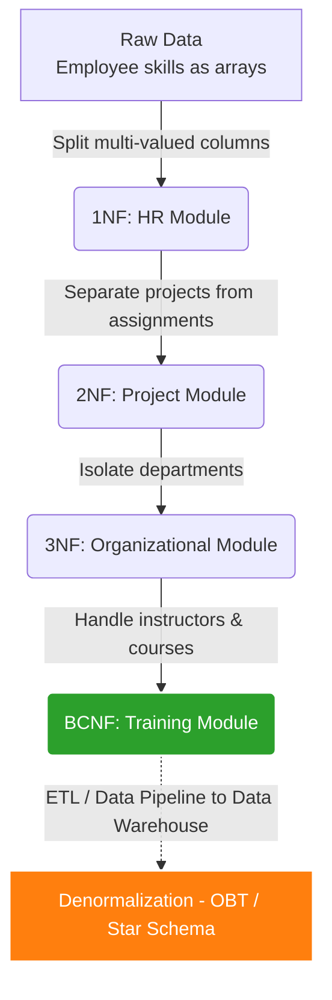

## Business Scenario / Data Requirements

Let's revisit our ERP system. After implementing four modules (HR, Projects, Departments, and Training), the backend database has achieved a rigorous 3NF/BCNF standard-ensuring security and eliminating data redundancy. Update and Delete operations function flawlessly.

However, the Board of Directors has requested that the Data Analytics team create a **Resource Allocation Dashboard** in Looker Studio. This report needs to display: _which department an employee belongs to, their skills, the client project they are currently working on, and the certifications they have obtained._
The query now requires `JOIN` operations across 7–8 different tables within a dataset containing millions of rows. This creates a bottleneck in the backend database, causing the dashboard to hang and eventually time out.

This is the perfect moment to discuss the technique of **Denormalization** for OLAP analysis and Data Warehousing.

## The Big Picture: Normalization vs. Denormalization



## Design Standard Comparison Table

<table style="width:100%; border-collapse: collapse; margin-bottom: 20px;">
    <thead>
        <tr style="border-bottom: 2px solid #e2e8f0; text-align: left;">
            <th style="padding: 8px;">Criteria</th>
            <th style="padding: 8px;">1NF</th>
            <th style="padding: 8px;">2NF</th>
            <th style="padding: 8px;">3NF</th>
            <th style="padding: 8px;">BCNF (3.5NF)</th>
            <th style="padding: 8px;">Denormalization (OLAP)</th>
        </tr>
    </thead>
    <tbody>
        <tr style="border-bottom: 1px solid #edf2f7;">
            <td style="padding: 8px;"><strong>Rule</strong></td>
            <td style="padding: 8px;">Atomic values, no repeating arrays.</td>
            <td style="padding: 8px;">1NF + No partial PK dependency.</td>
            <td style="padding: 8px;">2NF + No transitive dependency.</td>
            <td style="padding: 8px;">3NF + Every determinant is a superkey.</td>
            <td style="padding: 8px;">Intentional table merging; allows data redundancy.</td>
        </tr>
        <tr style="border-bottom: 1px solid #edf2f7;">
            <td style="padding: 8px;"><strong>ERP Issues Resolved</strong></td>
            <td style="padding: 8px;">Skill string parsing errors, no indexing.</td>
            <td style="padding: 8px;">Incorrect update of project `client_name`.</td>
            <td style="padding: 8px;">Update missing department address.</td>
            <td style="padding: 8px;">Accidental deletion of internal course data.</td>
            <td style="padding: 8px;">Report queries (JOINs) are too slow.</td>
        </tr>
        <tr style="border-bottom: 1px solid #edf2f7;">
            <td style="padding: 8px;"><strong>Model Characteristics</strong></td>
            <td style="padding: 8px;">Few tables; columns contain lists.</td>
            <td style="padding: 8px;">Master/Transaction table structure.</td>
            <td style="padding: 8px;">Many tables; strict Foreign Keys.</td>
            <td style="padding: 8px;">High safety; complex logic.</td>
            <td style="padding: 8px;">One Big Table.</td>
        </tr>
        <tr style="border-bottom: 1px solid #edf2f7;">
            <td style="padding: 8px;"><strong>JOIN Operations</strong></td>
            <td style="padding: 8px;">Very few</td>
            <td style="padding: 8px;">Moderate</td>
            <td style="padding: 8px;">Many</td>
            <td style="padding: 8px;">Many</td>
            <td style="padding: 8px;">Few or None</td>
        </tr>
        <tr style="border-bottom: 1px solid #edf2f7;">
            <td style="padding: 8px;"><strong>Use Case</strong></td>
            <td style="padding: 8px;">Data Staging</td>
            <td style="padding: 8px;">Small module</td>
            <td style="padding: 8px;">Core ERP Backend (OLTP)</td>
            <td style="padding: 8px;">Calendar/Shift Scheduling Module (OLTP)</td>
            <td style="padding: 8px;">Data Warehouse, BI Dashboard</td>
        </tr>
    </tbody>
</table>

## Building a Processing Pipeline/Script (Denormalization)

To address reporting requirements-rather than dismantling the Core ERP's BCNF design-a Data Engineer creates a **Materialized View** (or uses an ETL process to push data to BigQuery/ClickHouse) to "denormalize" the data into a "One Big Table" (OBT) format:

```sql
-- Create a Materialized View for Looker Studio (Denormalization)
CREATE MATERIALIZED VIEW mv_resource_analytics AS
SELECT
e.emp_id,
e.name AS employee_name,
d.department_name,
d.office_location,
sk.skill_name,
p.project_name,
p.client_name,
pa.assigned_hours
FROM employees_3nf e
JOIN departments_3nf d ON e.department_id = d.department_id
LEFT JOIN employee_skills_1nf sk ON e.emp_id = sk.emp_id
LEFT JOIN project_assignments_2nf pa ON e.emp_id = pa.emp_id
LEFT JOIN projects_2nf p ON pa.project_id = p.project_id;

-- Create indexes to support dashboard filtering
CREATE INDEX idx_mv_dept ON mv_resource_analytics(department_name);
CREATE INDEX idx_mv_skill ON mv_resource_analytics(skill_name);

-- Schedule periodic MATERIALIZED VIEW refreshes (e.g., nightly)
```

## Data Testing & Performance Optimization

- **Core ERP (3NF/BCNF Compliant):** HR operations and project updates execute at lightning speed with minimal table locking, ensuring ACID integrity.
- **Analytics System (Denormalized):** Queries aggregating work hours by Department and Skill dropped from minutes to tens of milliseconds, thanks to the complete elimination of JOIN overhead.

## Summary & Recommendations

- **Always aim for 3NF/BCNF** as the standard foundation when designing databases for backend services and ERP systems. Adhering to Codd and Boyce’s rigorous principles will save you from sleepless nights spent fixing data inconsistency bugs.
- **Be flexible enough to break the rules:** At the Data Engineering/Analytics layer, denormalization-using Dimensional Modeling or a "One-Big-Table" approach-is the key to achieving high performance.
- An outstanding Software or Data Engineer not only masters design standards but also knows **when to adhere to them and when to break the mold** to maximize system value.
