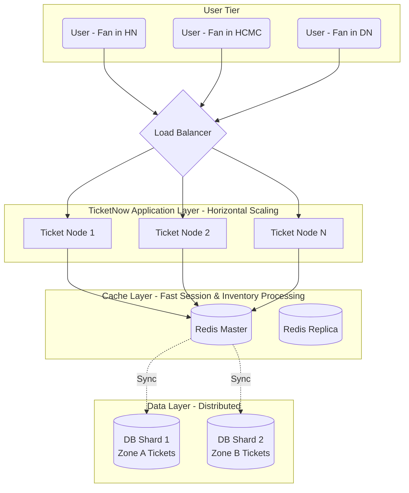

The core commonality of this architecture is breaking local centralization, distributing resources, and spreading the load evenly across many independent, peer-to-peer nodes (servers). To understand this better, let's put this architecture into the context of building the **TicketNow** system - a large-scale concert, movie, and event ticketing platform.

## Context & The Problem

Imagine the TicketNow system has just won the exclusive distribution rights for the "Brother Overcoming a Thousand Thorns 2026" concert tickets. Exactly at 9:00 AM on the opening day, 500,000 users simultaneously hit F5 on the app to fight for 50,000 tickets.

Using the old architecture, the only solution is to buy a "super-massive" server. However, physical hardware power always has a "ceiling," and upgrade costs are absurd. Even worse, if that single server overloads and crashes (Single Point of Failure - SPOF), the entire TicketNow platform will "die standing."

This forces TicketNow to adopt **Horizontal Architecture**: using dozens or hundreds of standard, reasonably priced servers connected together to collectively "shoulder" this massive traffic. So,

## What is Horizontal Architecture?

In the 1980s–1990s, systems were primarily built on expensive Mainframe servers. When the system overloaded, the only solution was to buy a bigger, more powerful server (Scale-up). However, when the Internet era exploded in the early 2000s (with the rise of Google, Amazon), data and user volume increased exponentially. Physical hardware power quickly hit its "ceiling," upgrade costs became absurd, and a single server crashing (Single Point of Failure - SPOF) would bring down the entire platform. This drove the birth of Horizontal Architecture: using thousands of standard, cheap servers (commodity hardware) connected together to handle massive computational problems.

This is a system design method where performance and processing power are increased by _adding more small servers (nodes)_ into a network to share the workload, rather than continuously upgrading components (CPU, RAM) for a single giant server. In this structure, the nodes play peer roles, process independently, and can be easily added or removed without disrupting the service.

## Purpose of Horizontal Architecture

To break the physical limits of individual hardware, ensuring the system can handle unlimited traffic while eliminating the risk of a total system crash when a single component fails.

## When to use Horizontal Architecture?

- **Burst traffic:** Typically like TicketNow on concert "ticket hunting" days.
- **High Availability requirements:** Committing to an uptime of 99.99%. Even if 2 out of 10 TicketNow servers have their hard drives burn out, users can still book tickets normally on the remaining 8 servers.
- **Massive Data Volumes (Big Data):** Transaction history, access logs, and seat selection actions of millions of people exceed the capacity of a traditional hard drive.
- **Geographically Distributed Systems:** Servers need to be placed in Hanoi, Da Nang, and HCMC so users in any region can access TicketNow at the fastest speed.

## Architecture Design

In a modern horizontal architecture model, a **Load Balancer** stands at the gateway to receive all requests, then distributes them evenly to multiple peer application servers below.

**Basic Operating Principle at TicketNow:**

1. Hundreds of thousands of "Select Seat" requests from users pouring into the system will hit the Load Balancer.
2. The Load Balancer uses algorithms (like Round Robin) to forward the request to an idle **Ticket Node**.
3. Because Ticket Nodes are designed as peers, any Node can process the ticket booking. If Node 1 runs out of RAM and crashes, the Load Balancer automatically cuts the traffic and funnels it to Node 2 and Node 3.
4. At the Database tier, seat map and ticket information are also partitioned (Sharding) to prevent hundreds of thousands of people from writing to the same hard drive simultaneously, causing a bottleneck.

## Trade-off Analysis

**Comparison with traditional architecture (Vertical Scaling - Scale Up):**

<table style="width:100%; border-collapse: collapse; margin-bottom: 20px;">
  <thead>
    <tr style="border-bottom: 2px solid #e2e8f0; text-align: left;">
      <th style="padding: 8px;">Criteria</th>
      <th style="padding: 8px;">Vertical Scaling (One super-powerful server)</th>
      <th style="padding: 8px;">Horizontal Architecture (Network of servers)</th>
    </tr>
  </thead>
  <tbody>
    <tr style="border-bottom: 1px solid #edf2f7;">
      <td style="padding: 8px;"><strong>Nature</strong></td>
      <td style="padding: 8px;">Upgrading CPU, RAM, Hard Drive for 1 existing server.</td>
      <td style="padding: 8px;">Plugging more new servers into the system cluster.</td>
    </tr>
    <tr style="border-bottom: 1px solid #edf2f7;">
      <td style="padding: 8px;"><strong>Scalability</strong></td>
      <td style="padding: 8px;">"Hits the ceiling" due to physical hardware limits.</td>
      <td style="padding: 8px;">Virtually limitless.</td>
    </tr>
    <tr style="border-bottom: 1px solid #edf2f7;">
      <td style="padding: 8px;"><strong>High Availability (HA)</strong></td>
      <td style="padding: 8px;">Low. If the server crashes, TicketNow stops selling tickets.</td>
      <td style="padding: 8px;">Very high. A few nodes crash, the system still operates.</td>
    </tr>
    <tr style="border-bottom: 1px solid #edf2f7;">
      <td style="padding: 8px;"><strong>Data Management</strong></td>
      <td style="padding: 8px;">Easy. Ensures absolute consistency (ACID).</td>
      <td style="padding: 8px;">Complex. Distributed data must face synchronization problems.</td>
    </tr>
    <tr style="border-bottom: 1px solid #edf2f7;">
      <td style="padding: 8px;"><strong>Cost</strong></td>
      <td style="padding: 8px;">Very expensive for specialized/proprietary machines.</td>
      <td style="padding: 8px;">Cheaper per machine unit, but costs time and effort for network infrastructure management.</td>
    </tr>
  </tbody>
</table>

**Disadvantages & Tough Problems of Horizontal Architecture:**

1. **Complexity:** Configuring, monitoring, and deploying code to 100 TicketNow servers simultaneously is much harder than to 1 server.
2. **Network Latency:** Servers communicate with each other over network cables instead of on the same motherboard, causing latency.
3. **Data Consistency:** This is the "fatal weakness" of a ticketing app. If TicketNow distributes data across 3 servers, how do we make sure **two different users don't buy the same ticket for seat A1**? (The Overselling problem and CAP Theorem - will be discussed in detail in Part 5).

## Practical Lessons & Best Practices for TicketNow

For horizontal architecture to operate smoothly in reality, TicketNow must adhere to the following immutable design principles:

- **Build Stateless applications:** Do not store any login state (session), shopping cart, or ticket image files on the local RAM/hard drive of a single Ticket Node. Push everything into a peer Cache cluster (like Redis) and Object storage (like AWS S3). If User A is operating on Node 1, and Node 1 crashes, the Load Balancer pushes User A to Node 2. Node 2 can still retrieve their cart state from Redis to continue the checkout.
- **Comprehensive Automation (Auto-scaling):** On days without events, TicketNow only needs 5 servers to save money. But the system must be able to Monitor automatically: If it detects traffic starting to spike at 8:45 AM, the system must automatically "spin up" (turn on) 50 new servers within a few minutes to prepare for the load of the 9:00 AM opening.
- **Retry & Circuit Breaker Mechanisms:** In a distributed architecture, 1-2 internal connections timing out is normal. If the partner Payment Gateway is overloaded, TicketNow needs a "Circuit Breaker" mechanism to temporarily stop calling it, avoiding traffic buildup that crashes the entire ticket selection flow for other customers.
- **Centralized Observability:** When a customer complains, "I paid and money was deducted, but I don't see the ticket," an engineer cannot blindly SSH into each of the 50 servers to find the log. There must be a centralized tool to collect Logs, Metrics, and Traces (like ELK Stack, Datadog) to accurately trace which nodes that customer ID's request went through, and where the error occurred.

> _In Part 2, we will dive deep into **"How to design a system with horizontal architecture"**, going into specific design patterns to prepare a robust infrastructure for TicketNow ahead of million-dollar events._
