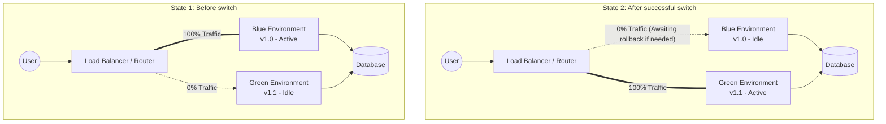

## Article Objective

In modern software environments, service interruption (downtime) during version updates is highly undesirable. This article is part of the **DevOps, Cloud & Tooling** series, focusing on analyzing and guiding the implementation of the **Blue-Green Deployment** strategy within CI/CD pipelines.

The article addresses two core questions:

- **When to use it?** Use it when the system requires **zero-downtime**, needs the ability to **instantly roll back** if errors occur, and involves mission-critical applications (such as those in finance, healthcare, or large-scale e-commerce).

- **How ​​to use it?** By maintaining two independent yet infrastructure-identical environments, combined with a flexible traffic routing mechanism at the Load Balancer or Router layer.

## Architecture / Operating Principles

The principle of Blue-Green Deployment revolves around operating two identical infrastructure environments in parallel:

- **Blue Environment (Active):** Currently running the existing version and serving 100% of user traffic.

- **Green Environment (Idle):** A standby environment used to deploy and test the new version (vNext).

Once the new version in the Green environment passes all tests (health checks, integration tests), the router (Load Balancer, API Gateway, or Ingress) redirects all traffic from Blue to Green. At this point, Green becomes Active, and Blue becomes Idle (awaiting decommissioning or use in the next deployment).



## Step-by-step Setup

Below is a standard CI/CD workflow using popular tools (such as GitLab CI/GitHub Actions, Docker, and Nginx as the Load Balancer).

### Step 1: Infrastructure Preparation (Infrastructure as Code)

Ensure you have the capability for flexible traffic routing. Example Nginx upstream configuration:

```nginx
# nginx.conf
upstream backend_servers {
  # This variable will be modified by CI/CD during the swap
  server 10.0.0.1:8080; # Blue IP
  # server 10.0.0.2:8080; # Green IP
}

server {
  listen 80;
  location / {
    proxy_pass http://backend_servers;
  }
}
```

### Step 2: Continuous Integration (CI)

When a developer pushes new code (v1.1):

1. **Build:** Package the source code (e.g., build a Docker image).
2. **Test:** Run Unit Tests and Linting.
3. **Push:** Push the image to a Container Registry (Docker Hub, GCR, AWS ECR).

### Step 3: Continuous Deployment (CD - Deploy to Green)

1. **Identify Idle Environment:** The CD script checks which environment is currently Active. If Blue is Active, the deployment target is Green.
2. **Deploy:** Pull the latest Docker image and launch containers in the Green environment.
3. **Pre-flight Checks:** Run integration tests and API health checks directly against the Green environment's internal IP (bypassing the external Load Balancer).

### Step 4: Traffic Switch (Cutover)

1. **Update Router:** If the tests in Step 3 pass, the pipeline updates the Nginx configuration file (pointing `backend_servers` to the Green environment's IP).
2. **Reload Service:** Execute the router reload command (e.g., `nginx -s reload`) to apply changes without dropping existing connections.
3. **Verification:** Monitor for errors (HTTP 5xx) during the first few minutes. If the system remains stable, the process is complete.

## Troubleshooting and Common Issues

1. Database Conflicts (Database Schema Changes)

- **Issue:** Both Blue and Green environments share the same database. If update v1.1 deletes a column that v1.0 (currently serving users) still requires, the v1.0 system will crash immediately.
- **Solution:** Always implement **Forward/Backward Compatible Migrations**. Split schema changes into two steps: _Deploy v1.1_ to add a new column while the code supports both the old and new columns; _Deploy v1.2_ to permanently remove the old column once v1.0 is no longer in use.

2. User Session Loss During Swap

- **Issue:** When traffic shifts from Blue to Green, users may be logged out or experience payment flow interruptions because sessions are stored in the Blue server's RAM.
- **Solution:** Stateless Architecture. Move all session state to an external storage system such as **Redis** or Memcached.

3. Challenges with Data Rollback

- **Issue:** While switching traffic back to Blue is rapid, what happens if the Green environment wrote a large volume of "junk data" or malformed data to the database while it was active?
- **Mitigation:** Decouple database migrations from the code CI/CD pipeline. If the code logic is flawed, simply roll back traffic to Blue. If the data is incorrect, a pre-planned Data Rollback or manual Data Fix procedure must be in place.

## Evaluation & Extensions

### Evaluation

- **Pros:**
  - Achieves true zero-downtime.
  - Rollback takes only seconds (simply reconfiguring the Load Balancer).
  - Reduces psychological pressure on Dev/Ops teams during releases.
- **Cons:**
  - Doubled costs: Requires maintaining double the infrastructure (at least during the deployment phase).
  - Extremely complex database management.

### Evaluation & Future Scaling

1. **Canary Release:** Instead of shifting 100% of traffic immediately, configure the router to route traffic incrementally 5% -> 10% -> 50% -> 100% to the Green environment to assess risk.
2. **Automated Rollback:** Integrate CI/CD with monitoring tools (e.g., Prometheus, Datadog). If the error rate (5xx errors) exceeds 1% for two minutes after switching to Green, the CI/CD pipeline automatically triggers a script to revert traffic to Blue.
3. **Kubernetes (K8s):** In cloud-native environments, Blue-Green deployment can be easily implemented by updating the `Service` selector to point to `Pods` labeled with the new version, eliminating the need for manual Nginx configuration management.
