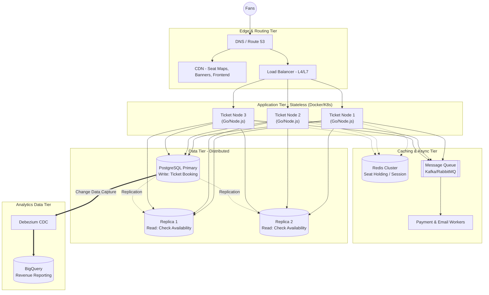

With the problem of **TicketNow** - where a concert ticket sale event can attract 500,000 concurrent users in just 5 minutes - designing a single tier incorrectly can lead to total system collapse.

Below is the detailed design blueprint (Deep Dive) on how to decouple and scale each tier of TicketNow.

## TicketNow Overall System Diagram

## Edge & Routing Layer

Before a request reaches the application server (Ticket Node), it needs to be optimally routed to minimize the load on the backend system. During a BlackPink ticket hunt, TicketNow cannot afford for servers to be exhausted just serving stadium image maps.

- **Content Delivery Network (CDN):** All static resources like artist images, CSS, JS, ultra-sharp SVG seat maps, or the Frontend source code (Next.js/Vue) are pushed to global CDNs. This offloads 30-50% of massive bandwidth traffic, stopping unnecessary requests from ever touching the main servers.
- **Multi-tier Load Balancer:**
  - **Layer 4 (Transport):** Handles ultra-fast routing based on IP/Port, used to balance massive volumes of TCP/UDP connections when hundreds of thousands of people hit F5 simultaneously.
  - **Layer 7 (Application):** Intelligent load balancing based on HTTP/HTTPS content. For example: TicketNow configures the Load Balancer to route `/api/concerts` (viewing info only) to Server Cluster A (dedicated for Read), and `/api/bookings` (booking) to Server Cluster B (dedicated for Write, with stronger configurations).

## Application Layer - The Stateless Principle

This is the easiest tier to scale if designed correctly. The heart of horizontal scaling at this tier is: **Absolutely trust no single server.**

- **Stateless Containerization:** TicketNow packages the application using Docker. Every launched container is an identical clone. Whether using Go, Rust, or Node.js, the application never saves temporary files or user sessions on the local RAM or hard drive of that server.
- **Externalize Session & State:** Move all "state" outside.
  - _Practical example:_ When User A selects seat "VIP-A1", the state "Seat VIP-A1 is temporarily locked for 10 minutes" must be saved to the **Redis Cluster**. If Ticket Node 1 (serving User A) suddenly crashes due to a RAM bottleneck, the Load Balancer kicks User A to Ticket Node 2. Thanks to Redis, Node 2 still knows the seat VIP-A1 belongs to User A and allows them to proceed with payment; the user experience is entirely uninterrupted.

## Data Layer - The Toughest Bottleneck

Scaling applications is easy (just boot more Dockers), but scaling Databases is thousands of times more complex because integrity must be guaranteed (not letting 2 people buy 1 ticket).

- **Phase 1: Master-Slave Replication (Read/Write Splitting)**
  - **Primary Node (Master):** Only handles `INSERT`, `UPDATE` commands (Executing payments, locking seats).
  - **Replica Nodes (Slaves):** Dedicated to handling `SELECT` commands. When hundreds of thousands of people continuously reload the page to see "how many empty seats are left", queries are thrown to the Slave nodes. Data from the Master is continuously synchronized (Replication) to the Slaves with millisecond latency.
- **Phase 2: Sharding / Partitioning**
  When transaction data becomes too massive, TicketNow must split the database. For example: Event booking data in Hanoi is stored in DB Shard 1, HCMC events are stored in DB Shard 2.
- **Phase 3: Separating OLTP and OLAP systems**
  Absolutely never run complex reporting queries (like "Revenue statistics by ticket class in the past 1 hour") directly on the main DB selling tickets (OLTP). TicketNow sets up **CDC (Change Data Capture)** to continuously "vacuum" raw data into a Data Warehouse (like BigQuery), serving Dashboards for Organizers (OLAP) without lagging the ticketing system.

## Asynchronous & Event-Driven Tier

When the system faces a "Spike" in traffic (surging at 9:00 AM), traditional horizontal architecture will still "suffocate" if it forces users to wait for sequential (Synchronous) processing.

- **Injecting Message Queues (Kafka/RabbitMQ) between components:**
  - **How it works at TicketNow:** When a user clicks "Pay", the API does not directly call the VNPay payment gateway, nor does it immediately call the API to generate a PDF ticket and send an Email (this process can take 5-10s and is highly prone to timeout).
  - Instead, the API simply returns `200 OK - Processing` (under 50ms) and throws an `OrderPending` event into Kafka.
  - In the background, an army of horizontally scaled **Background Workers** continuously pulls events from the Queue to process them gradually (calling VNPay, updating DB, rendering PDF, sending Email). This keeps the API always load-free to receive the next wave of customers.

## Deployment & Automation (Orchestration)

Distributed architecture becomes an operational "nightmare" if done manually. With hundreds of nodes, you cannot SSH into each machine to type the start command.

- **Auto-Scaling:** The TicketNow system is orchestrated by Kubernetes (K8s). When Metrics (Datadog/Prometheus) alarm that the API cluster's average CPU exceeds 75% at 8:50 AM, K8s automatically boots 50 new Pods (containers) and hooks them into the Load Balancer. When the event sells out at 11:00, the system automatically "kills" excess containers to optimize Cloud costs.
- **Service Discovery:** As the number of nodes constantly fluctuates, services automatically "find" each other via internal K8s (or Consul) mechanisms instead of hardcoding static IP addresses which easily cause errors.

> Designing a horizontal system is the art of **Decoupling**. By breaking a massive monolith into multiple tiers, separating State from Application, using Message Queues as buffers, and splitting Database Read/Write flows, TicketNow has acquired an infrastructure with near-infinite load capacity.
