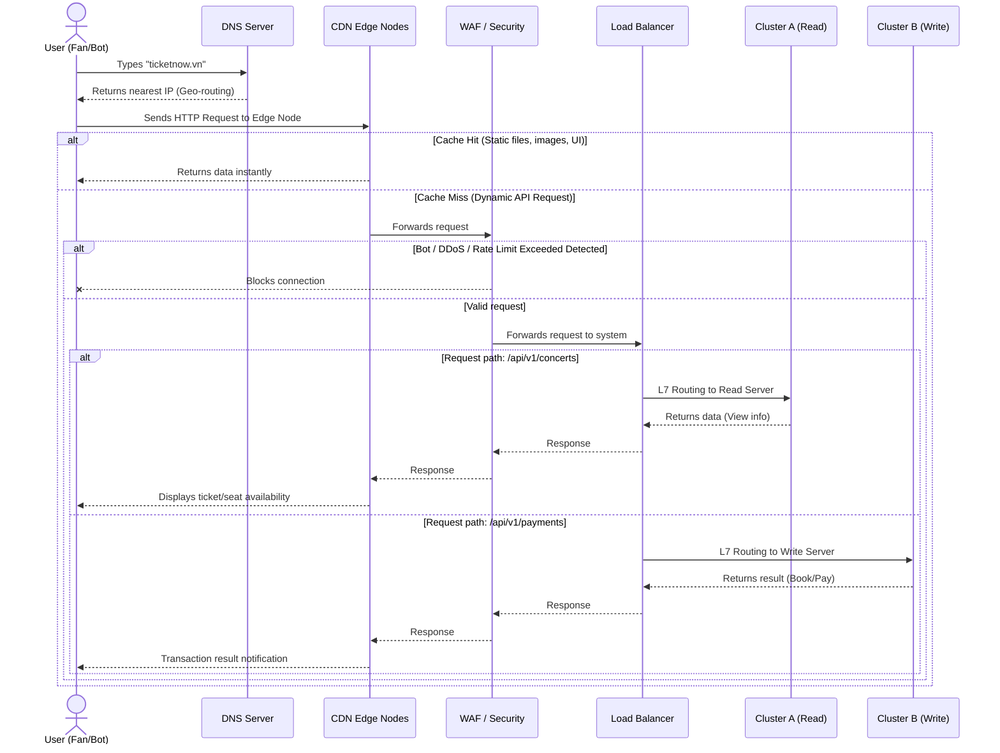

Imagine the ticket opening wave for the "Brother Overcoming a Thousand Thorns 2026" concert on TicketNow: there are hundreds of thousands of real fans continuously hitting F5 (refreshing the page) alongside thousands of scalper Bots lurking. Without a good Edge Tier, the inner application servers would crash in the very first second.

Below is a deep-dive analysis of the Edge Tier and practical implementation guidelines for TicketNow in two environments: traditional VPS and Google Cloud Platform (GCP).

## Analyzing the Communication & Edge Optimization Tier

When a user types `ticketnow.vn` and presses Enter, the request goes through the following edge layers before touching the Application Nodes:



**1. Domain Name Resolution (DNS) and Global Routing**

DNS doesn't just translate domain names into IPs. In horizontal architectures, DNS is used for geographical routing (Geo-routing) or Latency-based routing. If TicketNow has server clusters in Vietnam and Singapore, smart DNS will return the IP of the Vietnam cluster to users accessing from HCMC to completely minimize network latency when "snatching" tickets.

**2. Content Delivery Network (CDN)**

Over 60-80% of a ticketing platform's bandwidth payload consists of static files: Artist images (Banners, Posters), ultra-sharp SVG stadium maps, and Frontend source code (Next.js/Vue).

- **Offload Server:** CDN caches these resources temporarily on hundreds of physical servers located at Data Centers (Edge nodes) globally.
- When a user loads the TicketNow page, the CDN serves static files directly from the node closest to them (e.g., a node at a local VNPT/FPT station) without the request ever traveling to the origin server. Thanks to this, TicketNow's application servers only have to focus their CPU power on returning API data (JSON) for seat holding and payments.

**3. Reverse Proxy & Load Balancer**

This is the true "traffic controller."

- **SSL Termination (Offloading encryption burdens):** Decrypting HTTPS consumes massive computational resources. The Load Balancer steps in to receive the SSL certificate, decrypts HTTPS streams into standard HTTP, and only then pushes the raw data stream into the internal network for Ticket Nodes to process.
- **L7 Routing (Application Layer):** Capable of reading paths (URLs). For example: a request to `/api/v1/concerts` (viewing info) is pushed to Server Cluster A (dedicated Read), while an `/api/v1/payments` request (payment) is pushed to Server Cluster B (dedicated to highly secure transaction processing).
- **Health Check:** Continuously "pings" backend nodes. If a Ticket Node (Docker container) freezes due to a RAM overflow, the Load Balancer instantly crosses its name off the load-sharing list until that node is revived, ensuring no user falls into a "black hole."

## System Setup Guide

Usually, when adopting horizontal architecture, we have two choices: Self-managed or Managed Cloud services. Most modern large-scale horizontal systems use the Cloud due to the benefits it provides. However, a system has to start somewhere, and the starting point is often Self-managed to understand the most basic mechanisms, then scaling up to the Cloud when necessary.

Deploying an LB on a VPS (Nginx) requires engineers to manually configure everything and face Single Point of Failure risks. Conversely, a Global Load Balancer architecture on the Cloud gives TicketNow the ability to withstand millions of requests/second, global bandwidth, and powerful CDNs and Web Application Firewalls (WAF) with just a few clicks.

### Setup on Traditional VPS (Self-managed)

At the Startup stage or during load testing, a VPS environment is the cost-optimal choice. The most common setup is combining **Cloudflare (DNS/CDN)** with **Nginx (Load Balancer)**.

**TicketNow Deployment Model (Small scale)**

- **Tier 1 (Public Edge):** Use Cloudflare Proxy.
- **Tier 2 (Load Balancer Node):** 1 VPS (Ubuntu 24.04) running Nginx as a Reverse Proxy.
- **Tier 3 (App Nodes):** 3 VPS running the Ticket Backend application (Go/Node.js) via Docker.

**Detailed Configuration Steps**

**Step 1: DNS Delegation and Enabling CDN on Cloudflare**
Move `ticketnow.vn`'s Nameservers to Cloudflare. In the dashboard, enable the "Orange Cloud" (Proxied) icon for the A record pointing to the Load Balancer VPS IP. Cloudflare will activate free CDN and WAF (basic Bot blocking, anti-DDoS).

**Step 2: Install and configure Nginx as a Load Balancer**
SSH into the Load Balancer VPS, install Nginx:

```bash
sudo apt update && sudo apt install nginx -y
```

Open the Nginx config file (`/etc/nginx/sites-available/ticketnow`) and set up the upstream (backend server cluster):

```nginx
# Define the TicketNow backend server cluster (Horizontal Scaling)
upstream ticket_api {
    # Use least_conn algorithm to push booking requests to the server with the fewest connections
    least_conn;

    # List of internal App Nodes (Must use Private LAN IPs)
    server 10.0.0.101:3000 max_fails=3 fail_timeout=5s;
    server 10.0.0.102:3000 max_fails=3 fail_timeout=5s;
    server 10.0.0.103:3000 max_fails=3 fail_timeout=5s;
}

server {
    listen 80;
    server_name api.ticketnow.vn;

    location / {
        # Forward traffic to the ticket_api cluster
        proxy_pass http://ticket_api;

        # Forward important headers so the App Node knows the User's real IP
        proxy_set_header Host $host;
        proxy_set_header X-Real-IP $remote_addr;
        proxy_set_header X-Forwarded-For $proxy_add_x_forwarded_for;
        proxy_set_header X-Forwarded-Proto $scheme;
    }
}
```

> **The architecture's fatal flaw:** The critical downside of this model is that the Nginx Node becomes a **Single Point of Failure (SPOF)**. If the Nginx VPS suffers network congestion and crashes, the entire TicketNow system crashes even if the 3 backend nodes are alive. Engineers often use Keepalived and a Floating IP to run 2 Nginx VPSs as cross-backups for each other.

### Setting up the Network on the Cloud (Google Cloud Platform - GCP)

When TicketNow hosts an A-list celebrity event, the VPS model is no longer safe. Shifting to a Cloud-native architecture on GCP, the SPOF weakness of self-hosted Nginx is entirely eliminated. Google's Load Balancer service is a globally distributed virtualized system (Anycast technology).

**Deployment Model on GCP**

- **DNS:** Google Cloud DNS.
- **Edge Tier:** Google Cloud External HTTP(S) Load Balancer integrated with Cloud CDN and Cloud Armor (WAF).
- **Application Tier:** Serverless Network Endpoint Groups (NEGs) combined with Cloud Run.

**Steps to configure the architecture on GCP**

**Step 1: Set up Cloud DNS**
Go to GCP Console > Cloud DNS > Create Managed Zone. Declare the domain `ticketnow.vn`. Internal resolution within Google's VPC network has extremely low latency.

**Step 2: Prepare Application Server Groups (Backend Service)**
TicketNow packages the source code into Docker images and runs them on **Cloud Run** (Serverless, capable of auto-scaling horizontally from 0 to thousands of containers in the blink of an eye when 9:00 AM ticket sales hit).
Create Network Endpoint Groups (NEG) pointing to this Cloud Run service.

**Step 3: Set up Global HTTP(S) Load Balancer**
Go to _Network Services > Load balancing > Create Load Balancer_. Choose Application Load Balancer (HTTP/S). This process consists of 3 core parts:

1.  **Frontend Configuration:**
    - Allocate a Global Static IP.
    - Create an SSL certificate managed by Google (Google-managed SSL) entirely free, automatically renewed. The Load Balancer handles the SSL Termination.
2.  **Backend Configuration:**
    - Create a Backend Service. Attach TicketNow's NEG (Cloud Run) here.
    - Check **Enable Cloud CDN**. Instantly, the Load Balancer becomes an ultra-fast CDN network, automatically caching static resources at Google's Edge nodes.
    - Configure **Cloud Armor** (WAF) to this Backend Service. Set rules: Block IPs showing signs of data scraping (Rate Limiting), block User-Agents from automated bot systems to reserve "bandwidth" for real users.
3.  **Routing Rules (URL Map):**
    - Create routing rules (L7): Path `/*` (Frontend) -> points to Backend Bucket (Cloud Storage containing static files). Path `/api/*` -> points to Backend Service Cloud Run (Ticketing logic).

> In distributed architecture, edge tier design is not just about load sharing, but the art of 'Pushing work away from the center'. An optimized edge tier radically reduces the load on application servers by temporarily storing static resources (CDN), automatically intercepting security risks (WAF), and intelligently coordinating traffic flows (Load Balancer). Without this edge tier, all the power of the horizontal architecture inside becomes meaningless in the face of sudden traffic storms. In the next article, we will analyze TicketNow's Application Tier - The 'Stateless' Heart of the system.
