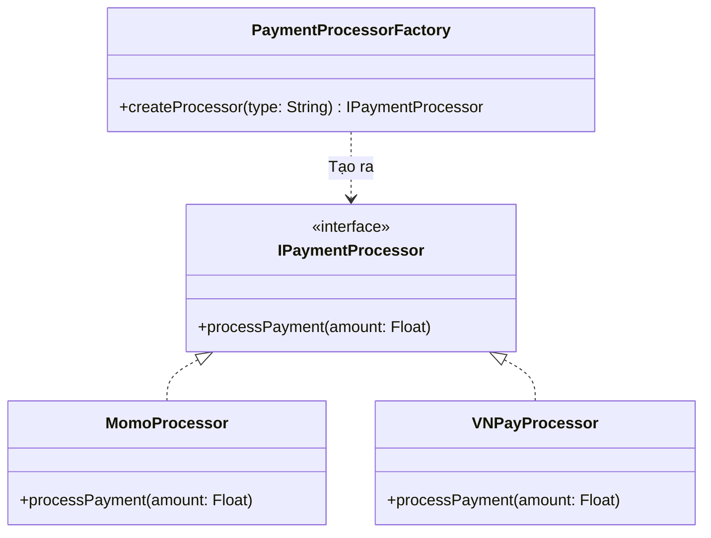

## Mô tả bài toán

Đơn hàng đã được lưu vào Database. Giờ là lúc khách hàng thanh toán. Yêu cầu nghiệp vụ đặt ra là hệ thống phải hỗ trợ nhiều phương thức: Ví điện tử Momo, VNPay, hoặc Thẻ tín dụng quốc tế (Stripe). Mỗi cổng lại có cách gọi API, mã hóa chữ ký (signature) hoàn toàn khác nhau.

Nếu viết tất cả `if-else` trong `OrderService`, code sẽ vi phạm nguyên tắc Open/Closed (OCP) và rất khó bảo trì. **Factory Method** giải quyết triệt để vấn đề này.

## Factory Method Pattern là gì?

Pattern này định nghĩa một interface để tạo một đối tượng, nhưng để các lớp con (subclasses) quyết định lớp nào sẽ được khởi tạo. Factory Method ủy thác việc khởi tạo object cho các subclass.

## Áp dụng vào Hệ thống Xử lý Đơn hàng

Thay vì khởi tạo trực tiếp `new MomoPayment()` hay `new VNPayPayment()`, chúng ta tạo một `PaymentProcessorFactory`. Dựa trên tham số đầu vào, Factory sẽ đẻ ra object xử lý thanh toán tương ứng mà chuẩn hóa qua một Interface chung là `IPaymentProcessor`.



## Cài đặt (Mã giả)

```typescript
// 1. Giao diện chung
interface IPaymentProcessor {
  processPayment(amount: number): boolean;
}

// 2. Các lớp thực thi cụ thể
class MomoProcessor implements IPaymentProcessor {
  processPayment(amount: number): boolean {
    console.log(`Processing ${amount} VND via Momo...`);
    // Logic gọi API Momo
    return true;
  }
}

class VNPayProcessor implements IPaymentProcessor {
  processPayment(amount: number): boolean {
    console.log(`Processing ${amount} VND via VNPay...`);
    // Logic tạo chữ ký, gọi API VNPay
    return true;
  }
}

// 3. Factory Class
class PaymentProcessorFactory {
  public static createProcessor(method: string): IPaymentProcessor {
    switch (method.toLowerCase()) {
      case "momo":
        return new MomoProcessor();
      case "vnpay":
        return new VNPayProcessor();
      default:
        throw new Error("Phương thức thanh toán không được hỗ trợ");
    }
  }
}

// Cách sử dụng tại Controller
const selectedMethod = "vnpay"; // Lấy từ request của user
const processor = PaymentProcessorFactory.createProcessor(selectedMethod);
processor.processPayment(1000000);
```

## Lợi ích

Sau này, khi cần tích hợp thêm ZaloPay, bạn chỉ việc tạo class `ZaloPayProcessor` và thêm 1 case vào Factory, hoàn toàn không chạm vào lõi của `OrderService`.
Tuy nhiên, nếu hệ thống có thêm nhiều quy trình đi kèm với nhau (Vận chuyển, Tính thuế) theo từng phân loại (Nội địa / Quốc tế), Factory Method sẽ trở nên quá tải. Đó là lúc ta nâng cấp lên **Abstract Factory Pattern**.
