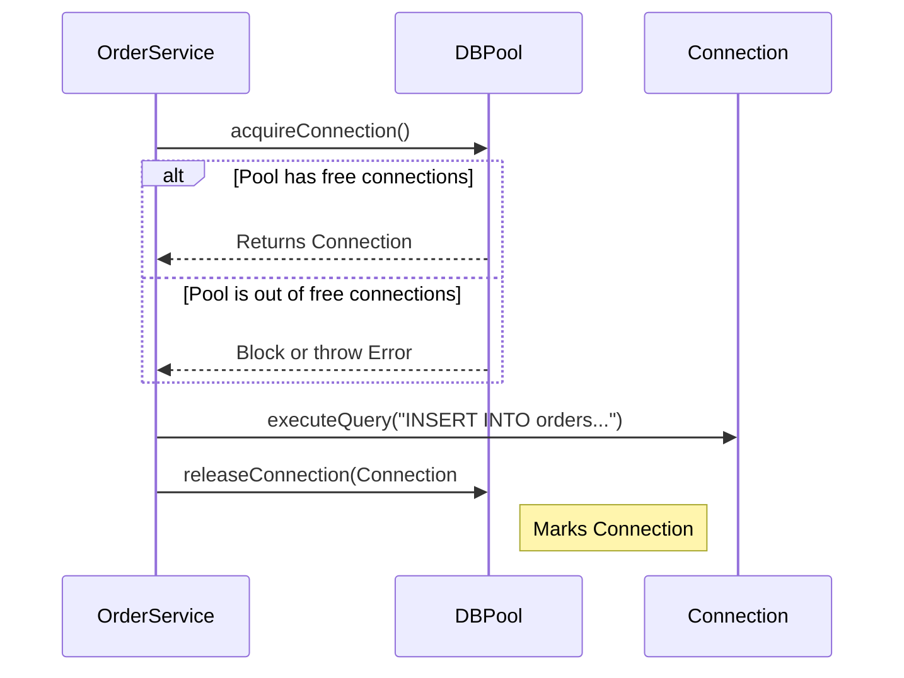

## Problem Description

After configuring with Singleton, the Order Processing System needs to save data into the Database. During major Sales events, thousands of orders are generated per second. Opening and closing TCP connections to the Database (like PostgreSQL or MySQL) for every single order is an extremely expensive operation and will quickly crash the system.

The **Object Pool Pattern** is the optimal solution for this scenario.

## What is the Object Pool Pattern?

Instead of continuously creating and destroying objects, an Object Pool maintains a "pool" of pre-initialized objects. When needed, the client borrows an object from the pool, uses it, and then returns it for other clients to use.

## Applying to the Order Processing System

We will build a `DatabaseConnectionPool`. This pool will maintain 10 ready DB connections. When `OrderRepository` needs to save an order, it takes a connection from the Pool, executes the Query, and returns it.



## Implementation (Pseudocode)

```typescript
class DatabaseConnection {
  public id: number;
  constructor(id: number) {
    this.id = id; /* Connect to DB */
  }
  public query(sql: string) {
    console.log(`Conn ${this.id} executing: ${sql}`);
  }
}

class DatabaseConnectionPool {
  private available: DatabaseConnection[] = [];
  private inUse: DatabaseConnection[] = [];

  constructor(size: number) {
    for (let i = 0; i < size; i++) {
      this.available.push(new DatabaseConnection(i));
    }
  }

  public acquire(): DatabaseConnection {
    if (this.available.length === 0) {
      throw new Error("No available connections!");
    }
    const conn = this.available.pop()!;
    this.inUse.push(conn);
    return conn;
  }

  public release(conn: DatabaseConnection) {
    this.inUse = this.inUse.filter((c) => c !== conn);
    this.available.push(conn);
  }
}

// Usage
const pool = new DatabaseConnectionPool(5); // Initialize pool with 5 connections
const conn = pool.acquire(); // Borrow
conn.query("INSERT INTO orders (total) VALUES (500)");
pool.release(conn); // Return
```

## Summary

The Object Pool significantly reduces latency in backend systems. In the next step, after saving the order, the customer needs to proceed with payment. We will use the **Factory Method Pattern** to flexibly handle various payment gateways (VNPay, Momo, Stripe).
