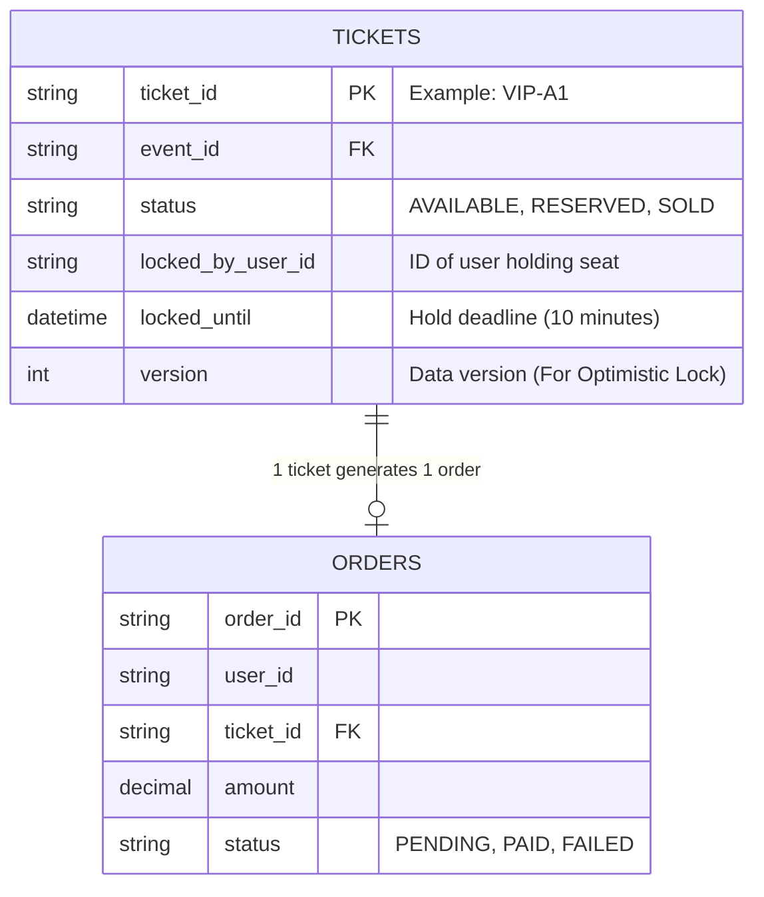
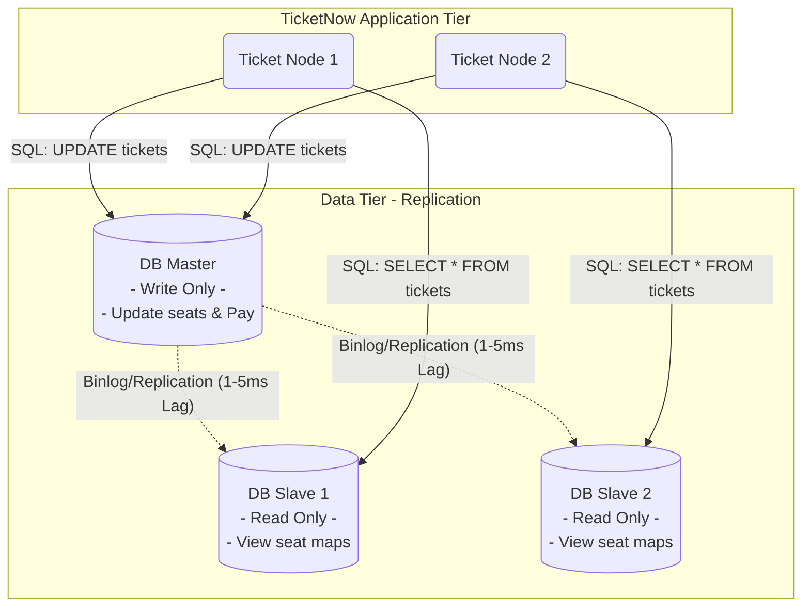
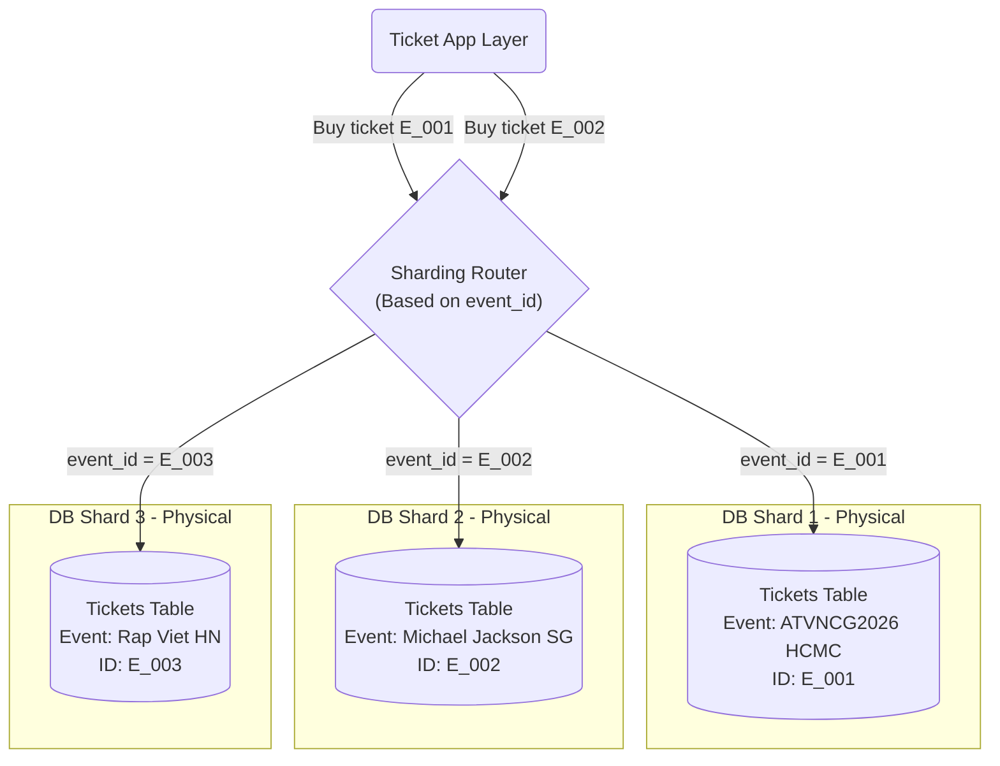
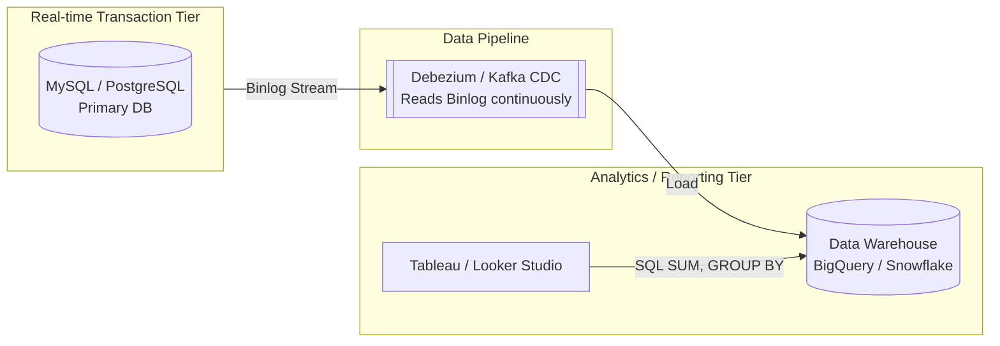

In a horizontal architecture, you can easily boot up 100 application servers with a single click, but you **cannot** naturally plug more hard drives into the Database without breaking data integrity. With TicketNow, a mistake at the DB tier doesn't just slow down the system; it leads to a PR disaster: **Hundreds of users successfully paying for the exact same VIP ticket**.

Let's dissect every phase of TicketNow's Database optimization, from basic to hyper-distributed.

## Phase 1: The Concurrency & Overselling Problem

At 9:00 AM, tickets for "Brother Overcoming a Thousand Thorns 2026" (ATVNCG2026) go on sale. Seat `VIP-A1` lights up. The system registers **5,000 users** clicking on that same seat in the very same millisecond.

If your code is simply written as: `SELECT status FROM tickets WHERE id = 'VIP-A1'`, checks if it's empty, and then `UPDATE status = 'SOLD'`, a **Race Condition** occurs, and all 5,000 people will buy the ticket.

**Solution: Using Optimistic Locking with a Version field.**

Instead of locking the entire table (causing system bottlenecks), TicketNow designs the `tickets` table with an added `version` column.



**How it works:**

1. When User A and User B both read ticket `VIP-A1`, the system returns: `status = AVAILABLE, version = 1`.
2. User A clicks "Pay", the SQL command the Ticket Node pushes down to the DB is not a normal UPDATE command, but:
   ```sql
   UPDATE tickets
   SET status = 'RESERVED', locked_by_user_id = 'UserA', version = 2
   WHERE ticket_id = 'VIP-A1' AND version = 1;
   ```
3. User A's command finishes, the ticket's `version` becomes 2.
4. One millisecond later, User B's command arrives: `... WHERE ticket_id = 'VIP-A1' AND version = 1`. This command will **fail (0 rows affected)** because the current version is already 2. User B receives a "Someone was faster" notification.
   _The double-booking problem is solved at the Database level!_

## Phase 2: Read/Write Load Reduction with Master-Slave Replication

Next problem: Out of 500,000 online people on TicketNow, only about 50,000 actually manage to buy tickets (Write). The other 450,000 are continuously hitting F5 to view the seat map (Read).
If everyone pokes the main DB, the DB will crash due to Connection Overload.

**Solution: Read/Write Splitting**

TicketNow establishes a **Master-Slave Replication** architecture. All booking transactions (UPDATE/INSERT) point to the Master. All operations fetching seat maps or viewing event lists (SELECT) are evenly distributed among Slaves.



**Trade-off: Replication Lag Problem.**
When User A has just bought seat `VIP-A1` (Writes to Master), but the Master hasn't synchronized it to Slave 1 yet (takes a few milliseconds). User C loads the page, reads from Slave 1, and still sees `VIP-A1` as empty. However, when User C clicks buy, the command will be sent to the Master, and thanks to the Optimistic Lock mechanism in Phase 1, User C will still be safely blocked. Eventual Consistency is maintained.

## Phase 3: Sharding when capacity exceeds limits

A few years pass, TicketNow opens sales for thousands of events, storing billions of historical transaction records. No matter how premium the DB Master is (64 Cores, 256GB RAM), writing data to a single hard drive will "hit the ceiling" of IOPS (Input/Output per Second).

**Solution: Horizontal Partitioning (Sharding)**

TicketNow proceeds to "chop" the massive table into multiple isolated physical databases. The most logical Sharding Key for this system is `event_id` (or geographical region).



Thanks to Sharding, if the ATVNCG2026 event is bottlenecked, it only slows down Shard 1, while customers buying movie tickets on Shard 3 remain completely unaffected. However, Sharding makes JOINing data between 2 different events (Cross-shard JOIN) a nightmare, forcing the application to process it in RAM.

## Phase 4: Separating OLTP and OLAP

Right when 500,000 people are scrambling for tickets (Transactional - OLTP), TicketNow's Director opens the BI (Business Intelligence) Dashboard and clicks "Refresh" to view the chart: _"Total revenue from Male users, aged 18-24, buying VIP area tickets in the last 30 days"_.

This massive SQL query containing `SUM()`, `GROUP BY`, and `JOIN` across 5-6 tables will "Lock" a large number of rows in the DB, completely crashing the customers' ticket buying flow.

**Solution: Push reporting data to a Data Warehouse (OLAP)**

Absolutely never run analytics on the transactional DB. TicketNow deploys CDC (Change Data Capture) using tools like **Debezium**.



Every time a ticket is sold, MySQL writes to the Binlog. Debezium reads this Binlog and instantly pushes it to BigQuery. Now, the Director can freely "dissect" billions of data rows on BigQuery while the MySQL ticketing system's CPU doesn't spike even 1%.

> For TicketNow's Data Tier to survive traffic "earthquakes", we have applied a chain of divide and conquer arts: Using **Locking** to protect the integrity of every seat, using **Replication** to split Read/Write flows, using **Sharding** to chop up physical volume, and using **CDC/OLAP** to banish analytical reporting pressure from the core transactional flow.

But hold on! If a customer successfully pays via credit card, the system needs to call an API to tell the partner to deduct money, generate a QR code PDF file, and send thousands of confirmation emails. If we force the customer's Request to "wait" (Synchronous) until the Email is sent, a thousand optimized Databases will still crash due to timeouts.

> To solve this problem, I invite you to continue the journey to **Part 6: Asynchronous Processing Tier** - where we turn Message Queues into magic "buffers" that salvage the system!
