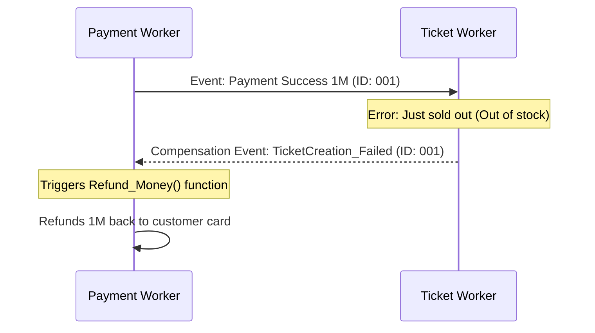

It absorbs traffic spikes and circulates event streams between microservices so the system doesn't "freeze" when there are too many heavy tasks to process simultaneously.

However, when we put TicketNow into an asynchronous state - especially distributed across multiple regions (Multi-Region) - we immediately face a computer science nightmare: **Data Inconsistency**.

## The Nature of the Asynchronous Processing Tier

Let's look at the ticket checkout flow on TicketNow:

- **In Synchronous architecture:** When a user clicks "Pay", the request goes straight through the API -> Calls VNPay -> Saves DB -> Renders PDF ticket -> Sends confirmation Email -> Returns result to web. This process takes about 5-10 seconds. If the Email system suddenly errors, the whole transaction crashes, the customer is charged but the web shows a 500 error.

- **In Asynchronous architecture (Event-Driven):**

```mermaid
sequenceDiagram
  actor User as User
  participant API as API Service
  participant VNPay as VNPay
  participant DB as Database
  participant Kafka as Message Queue
  participant WorkerPDF as PDF Worker
  participant S3 as AWS S3
  participant WorkerEmail as Email Worker

  User->>API: 1. Clicks Pay

  activate API
  API->>VNPay: 2. Calls Payment Gateway
  VNPay-->>API: 3. Returns Result: Success

  API->>DB: 4. Saves DB (Status: Processing)
  API-XKafka: 5. Publish Event: TicketPaid

  API-->>User: 6. Returns 200 OK (Wait for issue)<br>Time: &lt;200ms
  deactivate API

  par Background Processing
    Kafka-)WorkerPDF: 7a. Consume Event (TicketPaid)
    activate WorkerPDF
    WorkerPDF->>WorkerPDF: Render PDF Ticket
    WorkerPDF->>S3: Save PDF file
    deactivate WorkerPDF
  and
    Kafka-)WorkerEmail: 7b. Consume Event (TicketPaid)
    activate WorkerEmail
    WorkerEmail-->>User: Sends email with attached ticket
    deactivate WorkerEmail
  end
```

Thanks to Kafka (Message Queue), the API instantly returns `200 OK` to the customer after just a few hundred milliseconds. Clusters of **Background Workers** (PDF Worker, Email Worker) will automatically pull messages from the Queue for background processing.

The system is Decoupled, but in trade, the customer has to accept a web screen saying _"Issuing ticket, please wait 1-2 minutes"_ before the ticket actually lands in their Email.

## Core Causes of Asynchronicity and Conflict

Asynchronicity in horizontal systems is not a "bug"; it is a **feature** we actively design, but it is governed by laws of physics:

**1. Speed of Light Limits and Network Latency**

No matter the premium fiber optics used, a packet traveling from a Data Center in Singapore to the US still takes 150ms - 250ms. If TicketNow sells tickets globally, a "Hold Seat" event fired in Singapore will always be received late by a Worker in the US. In those 200ms, if a customer in the US performs an action overwriting that seat, a conflict (Race Condition) occurs.

**2. CAP Theorem**

In a distributed system, you cannot have all 3 elements: **C**onsistency, **A**vailability, and **P**artition Tolerance. For TicketNow to never crash (High Availability), engineers must sacrifice Strict Consistency and accept **Eventual Consistency**. Meaning at the present moment, the displayed inventory count might be slightly off, but eventually, they will sync accurately.

## Asynchronous Solutions to Ensure Consistency

To reign in Eventual Consistency and ensure no customer is unjustly charged, TicketNow must apply these strict Design Patterns:

**1. Idempotency - The Core Protection Shield**

In an asynchronous network, connections can be spotty, making the Message Queue falsely assume the Worker hasn't received the event and automatically sends it again (Retry). This leads to a Worker receiving the `Deduct_1_Ticket` event twice.

- **Solution:** Every API and Worker must have Idempotency. Meaning, whether an event is run 1 time or 100 times, the final result on the Database only changes exactly once.
- **Practice at TicketNow:** Use an `Idempotency-Key` (a unique UUID string, e.g., VNPay Transaction ID). Before the Worker creates the PDF ticket and deducts inventory, it must check the DB to see if this `Key` already exists. If it does, it knows the event is duplicated and ignores it.

**2. Saga Pattern instead of 2-Phase Commit**

When a transaction spans multiple independent services: `Payment Service -> Ticket Service -> Email Service`. If the _Ticket Service_ fails (because tickets suddenly ran out), we cannot use the traditional SQL `ROLLBACK` command because the services use entirely different Databases.

- **Saga Solution:** Break the transaction into a sequence of events. When a step fails, the system triggers **Compensating Transactions** to backtrack and undo.



Everything is completely asynchronous but still guarantees customers never lose money unjustly.

**3. Dead Letter Queue (DLQ)**

There will always be unrecoverable error events (like the Mailgun Email API going down long-term). If the Worker keeps trying to send the email and retrying forever, the entire queue will be deadlocked.

- **Solution:** After 5 failed retry attempts, that "Send Email" event must automatically fall into a special queue called a **Dead Letter Queue (DLQ)**. TicketNow engineers will set Alerts for the DLQ, manually analyze the root cause. When Mailgun is back up, engineers just click "Replay" to push events from the DLQ back into the main queue.

**4. Multi-Region Synchronization Strategy**

Dealing with geographical latency when selling tickets globally:

- **Data Locality Routing:** The Edge Layer routes users to the exact Data Center region containing that ticket info. Users buying VN events will always be routed to VN servers for processing, eliminating the chance of 2 simultaneous write commands from 2 continents causing conflict.
- **Global Event Sourcing:** Instead of saving "seat state", the system saves the entire "action history" into Kafka as the Source of Truth. The Kafka cluster in Asia automatically replicates to the US. DBs in each region read events and independently "rebuild" the seat map.

> Stepping into the Asynchronous Processing Tier means you accept trading the "simple, easy to debug" nature of old architectures for "infinite scalability and load-bearing capacity". Thanks to Message Queues acting as "buffers", Idempotency acting as "shields" blocking data duplication, and the Saga Pattern acting as "insurance" for refunds, the TicketNow system can run smoothly even when traffic storms hit and a few internal services intermittently drop out.
