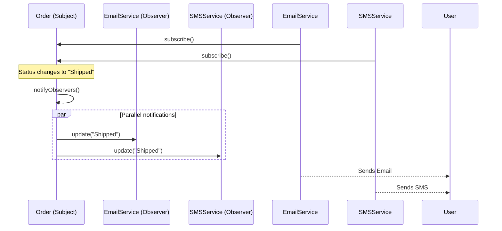

## Problem Description

An order has just been updated from _Pending_ to _Shipped_. Right now, the Marketing department wants to send a congratulatory Email, the Customer Care department wants to send an SMS, and the Mobile App team wants to send a Push Notification to the user's phone.

If we hardcode the API calls to send Emails, SMS, and Pushes inside the `updateOrderStatus()` function, `OrderService` handles too much, violating the Single Responsibility Principle (SRP). The **Observer Pattern** is the lifesaver for this scenario.

## 1. What is the Observer Pattern?

Observer is a Behavioral design pattern that defines a one-to-many relationship between objects. When one object changes its state (Subject), all its dependents (Observers) are automatically notified and updated. This is the foundation of the **Event-driven** architecture.

## 2. Applying to the Order Processing System

We will turn `Order` into a _Subject_. Services like `EmailNotifier`, `SMSNotifier` will act as _Observers_. These Observers will "subscribe" to track the Subject. When the Order changes its status, it simply calls `notifyObservers()`, and the services know how to handle their own work.



## 3. Implementation (Pseudocode - TypeScript)

```typescript
// 1. Observer Interface
interface IObserver {
  update(orderId: string, status: string): void;
}

// 2. Subject (Observed Object)
class OrderSubject {
  private observers: IObserver[] = [];
  private orderId: string;
  private status: string = "Pending";

  constructor(orderId: string) {
    this.orderId = orderId;
  }

  public attach(observer: IObserver): void {
    this.observers.push(observer);
  }

  public detach(observer: IObserver): void {
    this.observers = this.observers.filter((obs) => obs !== observer);
  }

  public changeStatus(newStatus: string): void {
    console.log(`\n[Order ${this.orderId}] Status changed: ${newStatus}`);
    this.status = newStatus;
    this.notify();
  }

  private notify(): void {
    for (const observer of this.observers) {
      observer.update(this.orderId, this.status);
    }
  }
}

// 3. Concrete Observers
class EmailNotifier implements IObserver {
  update(orderId: string, status: string): void {
    console.log(
      `[Email] Sending email for order ${orderId} - Status: ${status}`,
    );
  }
}

class SMSNotifier implements IObserver {
  update(orderId: string, status: string): void {
    console.log(
      `[SMS] Sending message for order ${orderId} - Status: ${status}`,
    );
  }
}

// 4. Usage
const order = new OrderSubject("ORD-12345");
const emailService = new EmailNotifier();
const smsService = new SMSNotifier();

// Subscribe for notifications
order.attach(emailService);
order.attach(smsService);

// Status changes
order.changeStatus("Processing");
// Output: [Email] Sending..., [SMS] Sending...

// Unsubscribe SMS, only receive Email
order.detach(smsService);
order.changeStatus("Shipped");
// Output: [Email] Sending... (No SMS)
```

## 4. Pros / Cons Evaluation

**Pros:**

- **Loose Coupling:** The Subject doesn't know what the Observers are doing; it just calls `update()`.
- Easily add or remove Observers (e.g., Attaching Slack/Telegram Notifications) while the system is running.
- Perfect support for broadcast communication (1 Subject sends to N Observers).

**Cons:**

- If Observers perform heavy tasks synchronously, they can block the Subject's execution flow, slowing down the system. (Fix by pushing to Message Queues like RabbitMQ/Kafka for asynchronous processing).
- The order of notifications to Observers is not guaranteed, which can cause bugs if Observers are mutually dependent.
- Very high risk of "Memory Leaks" if you forget to call `detach()` (unsubscribe) when the Observer object is destroyed (Lapsed Listener problem).
