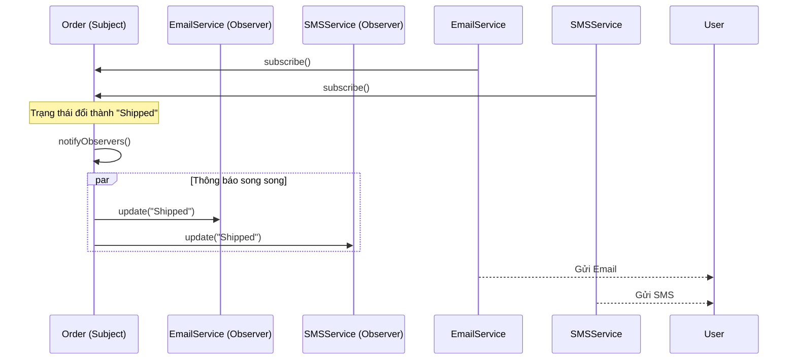

## Mô tả bài toán

Đơn hàng vừa được cập nhật trạng thái từ _Pending (Chờ xử lý)_ sang _Shipped (Đang giao)_. Ngay lúc này, bộ phận Marketing muốn gửi Email chúc mừng, bộ phận Chăm sóc khách hàng muốn nhắn tin SMS, và team Mobile App muốn đẩy một thông báo (Push Notification) lên điện thoại người dùng.

Nếu trong hàm `updateOrderStatus()` chúng ta viết cứng (hardcode) các dòng gọi API gửi Email, gửi SMS, gửi Push... thì `OrderService` đang ôm đồm quá nhiều việc, vi phạm nguyên tắc Single Responsibility (SRP). **Observer Pattern** là cứu cánh cho kịch bản này.

## 1. Observer Pattern là gì?

Observer là mẫu thiết kế Hành vi định nghĩa mối quan hệ một-nhiều giữa các đối tượng. Khi một đối tượng thay đổi trạng thái (Subject), tất cả các đối tượng phụ thuộc vào nó (Observers) đều được thông báo và cập nhật tự động. Đây là nền tảng của kiến trúc **Event-driven** (Lập trình hướng sự kiện).

## 2. Áp dụng vào Hệ thống Xử lý Đơn hàng

Chúng ta sẽ biến `Order` thành một _Subject_. Các dịch vụ như `EmailNotifier`, `SMSNotifier` sẽ đóng vai trò là các _Observer_. Các Observer này sẽ "đăng ký" (subscribe) theo dõi Subject. Khi Order đổi trạng thái, nó chỉ việc hô lên `notifyObservers()`, các dịch vụ tự biết cách xử lý phần việc của mình.



## 3. Cài đặt (Mã giả - TypeScript)

```typescript
// 1. Giao diện Observer
interface IObserver {
  update(orderId: string, status: string): void;
}

// 2. Subject (Đối tượng bị quan sát)
class OrderSubject {
  private observers: IObserver[] = [];
  private orderId: string;
  private status: string = "Pending";

  constructor(orderId: string) {
    this.orderId = orderId;
  }

  public attach(observer: IObserver): void {
    this.observers.push(observer);
  }

  public detach(observer: IObserver): void {
    this.observers = this.observers.filter((obs) => obs !== observer);
  }

  public changeStatus(newStatus: string): void {
    console.log(`\n[Order ${this.orderId}] Trạng thái thay đổi: ${newStatus}`);
    this.status = newStatus;
    this.notify();
  }

  private notify(): void {
    for (const observer of this.observers) {
      observer.update(this.orderId, this.status);
    }
  }
}

// 3. Concrete Observers
class EmailNotifier implements IObserver {
  update(orderId: string, status: string): void {
    console.log(
      `[Email] Đang gửi email cho đơn ${orderId} - Trạng thái: ${status}`,
    );
  }
}

class SMSNotifier implements IObserver {
  update(orderId: string, status: string): void {
    console.log(
      `[SMS] Đang gửi tin nhắn cho đơn ${orderId} - Trạng thái: ${status}`,
    );
  }
}

// 4. Cách sử dụng
const order = new OrderSubject("ORD-12345");
const emailService = new EmailNotifier();
const smsService = new SMSNotifier();

// Đăng ký nhận thông báo
order.attach(emailService);
order.attach(smsService);

// Thay đổi trạng thái
order.changeStatus("Processing");
// Output: [Email] Đang gửi..., [SMS] Đang gửi...

// Hủy đăng ký SMS, chỉ nhận Email
order.detach(smsService);
order.changeStatus("Shipped");
// Output: [Email] Đang gửi... (Không có SMS)
```

## 4. Đánh giá Ưu / Nhược điểm

**Ưu điểm:**

- **Lỏng lẻo (Loose Coupling):** Subject không hề biết các Observers thực hiện việc gì, nó chỉ gọi hàm `update()`.
- Dễ dàng thêm, bớt các Observer (VD: Gắn thêm Slack/Telegram Notification) ngay trong lúc hệ thống đang chạy.
- Hỗ trợ broadcast communication hoàn hảo (1 Subject gửi cho N Observers).

**Nhược điểm:**

- Nếu Observers thực hiện tác vụ nặng một cách đồng bộ (synchronous), chúng có thể chặn luồng (block) thực thi của Subject, làm chậm hệ thống. (Khắc phục bằng cách đẩy vào Message Queue như RabbitMQ/Kafka để xử lý bất đồng bộ).
- Thứ tự thông báo đến các Observers không được đảm bảo, có thể gây lỗi nếu chúng ta thiết kế các Observers bị phụ thuộc lẫn nhau.
- Nguy cơ "Memory Leak" (rò rỉ bộ nhớ) cực kỳ cao nếu bạn quên gọi hàm `detach()` (unsubscribe) khi đối tượng Observer bị hủy (Lỗi Lapsed Listener).
