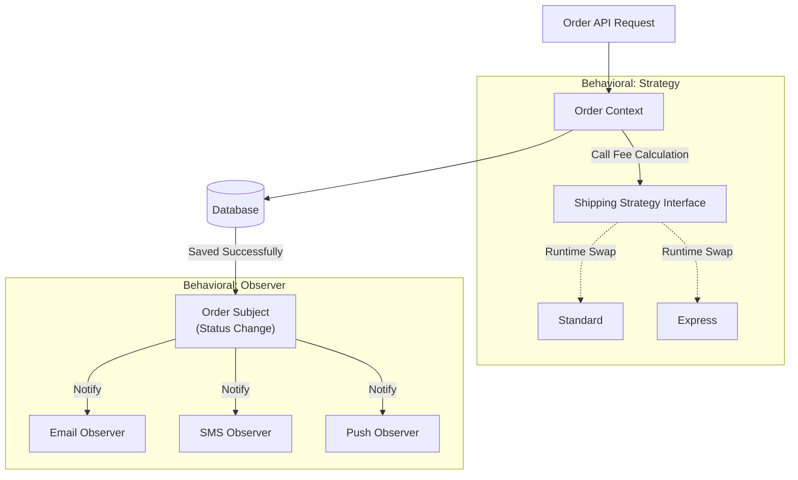

## Problem Description

Through the 2 articles on **Strategy** and **Observer**, we have solved complex problems regarding algorithm changes and event coordination in the **Order Processing System**. The Behavioral group does not worry about object instantiation, but focuses on **responsibility delegation** and **communication** between them.

## System Interaction with Behavioral Patterns

Let's look back at the processing flow after applying both Strategy and Observer:

As you can see, **Strategy** plays a "Pull" role - the Context actively calls the strategy to get the calculation result. Meanwhile, **Observer** plays a "Push" role - the Subject automatically pushes the new status to the passively waiting services.

## Selection Criteria (Decision Matrix)

Besides Strategy and Observer, the Behavioral group has many other patterns. Use the table below to decide the appropriate pattern for your backend problem:

<table style="width:100%; border-collapse: collapse; margin-bottom: 20px;">
  <thead>
    <tr style="border-bottom: 2px solid #e2e8f0; text-align: left;">
      <th style="padding: 8px;">Problem Specification (Use Case)</th>
      <th style="padding: 8px;">Pattern</th>
      <th style="padding: 8px;">Real-world application example (Backend)</th>
    </tr>
  </thead>
  <tbody>
    <tr style="border-bottom: 1px solid #edf2f7;">
      <td style="padding: 8px;">Does the system have <strong>multiple algorithms/rules</strong> that can be substituted for one another (e.g., discounts, ranking, tax calculation) leading to a jungle of <code>if-else</code>?</td>
      <td style="padding: 8px;"><strong>Strategy</strong></td>
      <td style="padding: 8px;">Calculating shipping fees, choosing file compression methods, applying encryption algorithms (AES, DES).</td>
    </tr>
    <tr style="border-bottom: 1px solid #edf2f7;">
      <td style="padding: 8px;">Does an event occurring in one module need to <strong>trigger actions in multiple other modules</strong>, but you don't want them to be tightly coupled?</td>
      <td style="padding: 8px;"><strong>Observer</strong></td>
      <td style="padding: 8px;">Pub/Sub Systems, Notification Engines, Cache updates when DB changes.</td>
    </tr>
    <tr style="border-bottom: 1px solid #edf2f7;">
      <td style="padding: 8px;">Does your object have <strong>too many states</strong> (Draft, Pending, Shipped, Cancelled) and behavior completely changes depending on that state?</td>
      <td style="padding: 8px;"><strong>State</strong> <em>(Extension)</em></td>
      <td style="padding: 8px;">Vending machines, Article approval flows, Order Lifecycle.</td>
    </tr>
    <tr style="border-bottom: 1px solid #edf2f7;">
      <td style="padding: 8px;">Need to encapsulate a request/action into an object so it can be <strong>Stored, Undone, or Queued</strong>?</td>
      <td style="padding: 8px;"><strong>Command</strong> <em>(Extension)</em></td>
      <td style="padding: 8px;">Task Scheduler Systems (Job Queue), Undo/Redo operations, Macro recording.</td>
    </tr>
  </tbody>
</table>

## Best Practices

1. **With Strategy:** Do not put state inside the Concrete Strategy. Strategy classes should be completely Stateless, only taking input for calculation and returning output.
2. **With Observer in Distributed Backend (Microservices):** Traditional Observer Pattern (running in the same Process) is often replaced by **Message Broker / Event Bus** architectures (RabbitMQ, Kafka). The principle is the same (Publish / Subscribe), but the scope expands to the Infrastructure level.
3. **Beware of Latency:** Whenever you notify multiple Observers, ask yourself: _"Do they need to run synchronously?"_. If not, always prioritize asynchronous processing (Async) to avoid blocking the main thread.

In the next chapter, we will step into the final but extremely interesting group: **Structural Patterns (Decorator, Adapter, Facade)**. We will solve the problem of multi-layered discount vouchers and connecting with legacy shipping partners.
