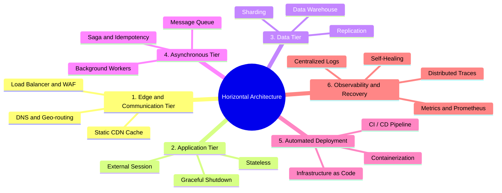

In this final article, we will summarize the entire core philosophy of the series, pinpoint the exact "tipping points" that force you to restructure your system, and look back at the evolutionary process of a real-world system from zero to millions of users through the lens of TicketNow.

## Summary of Horizontal Architecture Philosophy

Throughout the 8 previous articles, we have dissected horizontal architecture into 6 main pillars. Look at the mind map below to see the tight integration of the entire system:

**6 Core Pillars:**

1. **Communication & Edge Tier:** Use DNS, CDN, and Load Balancers as shields. Push maximum static resources to the edge to reduce load on the system core.
2. **Stateless Application Tier:** Servers (Node.js, Go, Rust) must suffer from "amnesia", not saving files or sessions locally. All states must be pushed to Redis/S3 so Nodes can freely spawn and die.
3. **Distributed Data Tier:** Scale by separating Read/Write flows (Replication), then partitioning data (Sharding). Do not use Transactional DBs (OLTP) for analytics; you must use CDC to push data to a Data Warehouse.
4. **Asynchronous Processing Tier:** Absorb traffic spikes using Message Queues (Kafka/Pub/Sub). Apply Idempotency and the Saga pattern to handle multi-region conflicts.
5. **Automated Deployment (CI/CD & IaC):** Use immutable infrastructure (Docker). No SSHing into servers. All infrastructure resources must be defined as Code (Terraform) and deployed automatically (GitOps).
6. **Operations & Self-Healing (Observability):** Build monitoring systems via Metrics, Logs, and Traces instead of manual debugging. Grant infrastructure (K8s/Cloud Run) the authority to automatically "shoot down" sick nodes and replace them with new ones.

## When DO YOU NEED to Redesign Architecture? ("Red Alert" Indicators)

Don't rush to design horizontal architectures (Over-engineering) from day one when your project only has 1,000 users. Microservices and distributed architectures bring massive costs and complexity.

You should only start "breaking" the Monolithic architecture to build a horizontal one when the system hits the following quantitative metrics:

- **Traffic Metrics:** Exceeding **1,000 RPS (Requests Per Second)** at peak times, or reaching **100,000 DAU (Daily Active Users)**.
- **Database Bottleneck Metrics:** CPU of the largest Database server you can rent (e.g., 64 vCPUs, 256GB RAM) continuously exceeds the **75%** mark. Or core data tables (like `Orders`, `Transactions`) surpass **50 - 100 million rows**, causing INDEXed queries to lose effectiveness and slow down.
- **User Experience Metrics (Latency P99):** Tracking the P99 metric (response time of the slowest 1% of users). If P99 frequently exceeds **2-3 seconds** (especially for Write tasks), your system is suffering from a severe internal bottleneck.
- **Organizational Metrics (Team Scaling):** When the engineering team exceeds **20-30 people**. Everyone coding on a single Monolithic repo causes continuous Merge Conflicts, every Deploy takes 30 minutes, and people wait on each other. This is the time to split into Microservices so teams can work independently.

## Case Study: The Evolution of the TicketNow Event Ticketing System

To visualize it best, let's examine the evolutionary journey of the TicketNow ticketing system, where traffic can spike from 100 req/s to 50,000 req/s in just 1 minute when tickets for major stars go on sale.

**Phase 1: Traditional Architecture (Startup Days)**

- **Infrastructure:** 1 giant VPS (Ubuntu) rented from a local provider.
- **Structure:** Running Next.js for Frontend, Node.js for Backend API, and a PostgreSQL database installed together on the same machine. Sessions stored in Node.js RAM. Event images stored in the `/public/uploads` folder.
- **Crisis (Outbreak):** Opening sales for a huge show. 10,000 people rush in simultaneously. CPU hits 100%, the VPS freezes hard. Node.js crashes, taking away all customer shopping carts (since they are in RAM). The company loses billions of VND and gets boycotted on social media.

**Phase 2: Statelessness and the Cloud (Firefighting & Stabilization)**

The engineering team recognizes the problem and starts migrating to Google Cloud Platform (GCP).

- **Edge & Frontend:** The entire Frontend (Next.js SSG) and images are pushed to Cloudflare CDN and Google Cloud Storage. The server no longer has to serve static files.
- **Database:** PostgreSQL is separated from the application server and shifted to Cloud SQL (Managed Service) to ensure no hardware crashes.
- **App Node (Stateless):** Backend rewritten in Go/Node.js following the 12-Factor App standards. Sessions pushed to **Redis**. Application packaged via Docker and deployed to **Google Cloud Run**.
- **Result:** When traffic spikes, Cloud Run automatically scales from 2 containers to 200 containers in 3 seconds. Being Stateless, the Load Balancer evenly distributes 10,000 people across 200 containers. The experience becomes smooth.

**Phase 3: Database Bottleneck (Solving the Data Tier)**

The App scales infinitely, but Cloud SQL (Database) does not. 200 containers simultaneously open thousands of connections (Connection Pool), bombarding `INSERT` commands to create tickets, causing the Database to "Lock" tables and freeze.

- **Solution:** Read/Write splitting. All `SELECT` commands (viewing event info) are pointed to 3 DB Replica Nodes.
- **Write Optimization using Redis:** During ticket rushes, the system doesn't write straight to SQL. Instead, it loads the list of 5,000 tickets into Redis (Memory). Users click buy, Redis uses the `DECR` command (atomic decrement) to deduct tickets in RAM at 1-millisecond speed.

**Phase 4: Maturity - Comprehensive Asynchronous Horizontal Architecture**

The system expands across Southeast Asia, integrating payments, electronic invoices, email sending, and financial reconciliation.

- **Event-Driven Architecture:** Upon successful purchase on Redis, the API returns the result instantly to the user. Simultaneously, the API packs a `TicketPurchased` event and pushes it to **Pub/Sub (Message Queue)**.
- **Peer-to-peer Microservices:** A Worker cluster written in Rust (performance optimized) silently vacuums messages from Pub/Sub to gradually run `INSERT` commands on the Database, send Emails, and issue invoices without bottlenecking the user's main flow.
- **Data Pipeline:** Data from PostgreSQL is continuously extracted by CDC (Change Data Capture) tools and pushed to **BigQuery (Data Warehouse)**. The Data Engineering team uses analytics tools to build real-time reports without touching a single request on the Transaction DB serving customers.

**SERIES CONCLUSION**

From a frequently crashing VPS, TicketNow has evolved into a fully distributed ecosystem capable of automatically swelling to bear 50,000 req/s and shrinking at night to save costs, operating smoothly without any manual intervention.

Horizontal architecture has fulfilled its mission. Thank you for following along with this massive 9-part series. I hope this will serve as a practical handbook helping you confidently design and conquer large-scale systems in the future!
