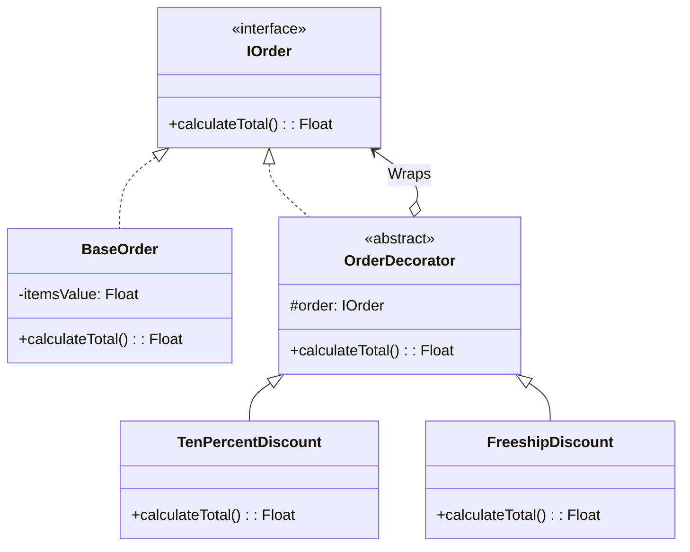

## Problem Description

In our E-commerce platform, the Promotion feature is one of the most complex ones.
Suppose an order can have applied: a 10% off voucher, Free shipping, and a direct 50k discount for VIP members. Users can use 1, 2, or all 3 of these codes **at the same time**.

If you use Inheritance, you will have to create dozens of classes like: `OrderWithFreeship`, `OrderWithDiscountAndFreeship`, `OrderWithVIPAndFreeship`... This leads to "Class Explosion". The **Decorator Pattern** is the "specific cure" for this problem.

## What is the Decorator Pattern?

The Decorator allows you to dynamically attach new behaviors to an object by placing that object inside a wrapper object (decorator) that contains the behavior.

## Applying to the Order Processing System

We define an `IOrder` interface with a `calculateTotal()` function. `BaseOrder` is the original order. Decorators (like `TenPercentDiscount`, `FreeShipDiscount`) will wrap `IOrder`, modify the result of `calculateTotal()`, and return the new value.



## Implementation (Pseudocode - TypeScript)

```typescript
// 1. Common Component
interface IOrder {
  calculateTotal(): number;
}

// 2. Base Component (Original Order)
class BaseOrder implements IOrder {
  private value: number;
  constructor(value: number) {
    this.value = value;
  }

  calculateTotal(): number {
    return this.value;
  }
}

// 3. Abstract Decorator Class
abstract class OrderDecorator implements IOrder {
  protected order: IOrder;
  constructor(order: IOrder) {
    this.order = order;
  }

  abstract calculateTotal(): number;
}

// 4. Concrete Decorators (Specific Vouchers)
class TenPercentDiscount extends OrderDecorator {
  calculateTotal(): number {
    const currentTotal = this.order.calculateTotal();
    console.log("- Applying 10% discount");
    return currentTotal * 0.9;
  }
}

class FlatDiscount extends OrderDecorator {
  private discountAmount: number;
  constructor(order: IOrder, amount: number) {
    super(order);
    this.discountAmount = amount;
  }

  calculateTotal(): number {
    const currentTotal = this.order.calculateTotal();
    console.log(`- Applying flat discount ${this.discountAmount}`);
    return currentTotal - this.discountAmount;
  }
}

// 5. Usage (Stacking)
let myOrder: IOrder = new BaseOrder(1000000); // 1,000,000 VND
console.log("Original price:", myOrder.calculateTotal());

// Customer adds 10% discount code
myOrder = new TenPercentDiscount(myOrder);

// Customer adds flat 50k discount code
myOrder = new FlatDiscount(myOrder, 50000);

console.log("Final price:", myOrder.calculateTotal());
// Output:
// - Applying flat discount 50000
// - Applying 10% discount
// -> The results are calculated nested through the layers.
```

## Pros / Cons Evaluation

**Pros:**

- Extremely flexible: Easily add/remove features (vouchers) at runtime without affecting the original class.
- Adheres to SRP (Single Responsibility): Each decorator only does exactly 1 task (calculating 1 type of promotion).
- Perfect replacement for Inheritance when needing to combine multiple features.

**Cons:**

- **Wrapping order is very important:** Decreasing 10% first and then subtracting 50k will yield a different result than subtracting 50k then decreasing 10%. Developers need to carefully manage this order.
- Creates many small objects in the system, making debugging difficult because you have to trace through multiple layers (wrappers).
