When a startup is newly established, a few thousand transactions a day are not an issue. A few simple Python scripts running overnight are enough. But as the system scales, expanding to multi-channel sales, running ads across numerous platforms, and integrating dozens of payment gateways, the volume of generated data reaches millions of records per day. Traditional scripts start showing weaknesses, runtime extends from 2 hours to 10 hours, and finally, they "clinically die" without finishing.

The goal of this series is to work with you to tear down and rebuild the entire Data Pipeline from scratch. We will solve the Omni-Reconciliation problem, designing a new architecture using Rust, DuckDB, and PostgreSQL to compress processing times from hours down to just a few minutes.

But before prescribing a cure, we need to properly diagnose the disease.

## The Omni-Reconciliation Problem and 3 Deadly Bottlenecks

**Omni-Reconciliation** is the life-or-death problem for every e-commerce, booking, or fintech business. The core business logic is straightforward: You have millions of transactions recorded on your internal system (Website, App), and you have millions of files/data returned from partners (VNPay, Momo, Facebook Ads, Google Ads...). The system's task is to "match" these two data sources to answer 3 questions:

- Which transactions match perfectly?
- Which transactions have discrepancies (hidden fees, wrong exchange rates)?
- Which transactions are missing (present on our system but not recorded by the partner, or vice versa)?

It sounds simple, but in actual operation, legacy systems usually collapse at these 3 "death points":

**Death Point 1: The Out-Of-Memory (OOM) Nightmare When Processing Massive Files**

Major partners (or your own company's Data Warehouse) usually return end-of-day reconciliation files as CSVs or Avro files exported from BigQuery weighing several GBs.
The most naive approach by engineers is using libraries like Pandas (Python) or loading the entire array into memory (Node.js/PHP) to process. The result? A 2GB data file when unzipped into RAM can balloon to 8-10GB. The server lacks sufficient RAM, the swap fills up, and the process is instantly "shot down" by the operating system to protect the system.

**Death Point 2: "Traffic Jam" at the Ingestion Gateway**

Not every partner sends files. Many platforms require you to call their APIs to pull data (e.g., pulling campaign costs from the Facebook Business Manager API).
The problem is these APIs are very fickle. They respond slowly, drop packets constantly, and crucially, have rate limits. If your data-pulling script runs sequentially (blocking I/O), it will hang on slow requests, stretching the ingestion process from 20 minutes to half a day.

**Death Point 3: Crashing the Main Database with JOIN Commands**

After struggling to fetch the data, the next biggest mistake is dumping all raw partner data straight into the same relational database (like PostgreSQL or MySQL) running the main application.
To find mismatched transactions, you write a cross `SELECT ... JOIN` query between the `internal_transactions` table (millions of rows) and the `partner_transactions` table (millions of rows). When this query runs, it consumes all CPU, creates locks on the table, and causes user requests on the App/Web to timeout en masse. You have just manually performed a Denial of Service (DDoS) attack on your own system.

We cannot solve these 3 bottlenecks by throwing money at a bigger server. To cure the root cause, the system needs a new "ideology" regarding data architecture and heavy-duty tools born specifically for speed.

## The Medallion Architecture: New Order for Chaos

To thoroughly resolve the above death points, the first principle is to **absolutely prevent the main database system from shouldering calculations and reconciliation**. We need a dedicated space, a data "refining factory." This is when **Medallion Architecture** – a concept making waves in the Data Lake space – is brought into application for Backend/Data Engineering systems.

This architecture divides the data flow into 3 distinct tiers, each with a single responsibility:

- **Bronze Tier (Landing / Raw):** Where raw data is ingested. However a CSV file is downloaded, or however JSON is returned from an API, it is stored as-is.
  - _Golden rule:_ Append-only, no modifications. If downstream processing fails, you simply re-pull data from the Bronze tier to rerun, rather than biting the bullet to re-call partner APIs and getting token-locked for hitting Rate Limits.
- **Silver Tier (Cleaned / Standardized):** Where raw data is "washed." Date fields are parsed to a unified `ISO 8601` format, garbage/null data is eliminated, and data types are accurately cast. At this point, data from 10 different partners speaks a common language.
- **Gold Tier (Business Level / Matched):** Where the real magic happens. The most complex business logic (like joining internal and partner tables, finding mismatched transactions, calculating hidden fees) is executed here. Gold data carries the highest business value, ready to serve APIs and power Dashboards.

## "Heavyweight" Tech Stack: Choosing the Right Tools

Having a good architecture while using the wrong tools leaves the system sluggish. To operate the 3 Medallion tiers, we will assemble an optimal toolchain for speed and resources: **Rust + DuckDB + PostgreSQL**.

**Rust - The Untiring "Carrier" for the Bronze Tier**

Why Rust for the Ingestion flow (API fetching)?
Unlike Python or Node.js, Rust has no Garbage Collector, ensuring the system never experiences inexplicable "pauses." More importantly, Rust's async/await model is so lightweight and efficient that you can spawn tens of thousands of concurrent tasks (e.g., calling the Facebook API every 20 minutes for thousands of ad accounts) while RAM consumption hovers around a few dozen MBs. Rust handles Rate Limits and I/O-bound tasks extremely gracefully.

**DuckDB - The Data "Crusher" (In-process OLAP)**

This is the heart of the Matching Engine at the Silver and Gold tiers.
DuckDB is an analytical database (OLAP) running directly within the application process, similar to SQLite but designed for massive data volumes.

- **Solving OOM (Death Point 1):** DuckDB features **Out-of-core** processing. This means you can throw a 10GB Avro shard file from BigQuery at it, and it will still query smoothly on a computer with only 4GB of RAM by optimizing data spilling to the hard drive (SSD).
- **Solving DB Lock (Death Point 3):** Spare the main DB! We bring the data into DuckDB, executing multi-million row `JOIN` queries there. DuckDB is built for this, with Vectorized query speeds dozens of times faster than PostgreSQL when analyzing data.

**PostgreSQL + JSONB - The Flexible "Assembly Point"**

DuckDB does the heavy lifting, while PostgreSQL serves as the final storage destination at the Gold tier.
Why? Because after reconciliation, we have tons of heterogeneous information (different metadata from individual partners). Instead of creating hundreds of columns in a table, we leverage the power of the **JSONB** data type in PostgreSQL combined with a **GIN Index**. Data is "shot" into Postgres by Rust using a **Batch Insert/Copy** strategy (thousands of rows at once), ensuring the Backend (e.g., Node.js or Go) can query reports for the Vue 3 Dashboard in a flash without the DB breaking a sweat.

## Data Flow Overview

Imagine the journey of a transaction passing through our new Omni-Recon system. This separation yields a pristine lifecycle: **Ingestion (Rust) -> Processing (DuckDB) -> Serving (PostgreSQL).** Wherever it slows down, we scale there without impacting other components.

```mermaid
flowchart LR
    %% Styling definitions for technologies and layers
    classDef source fill:#e2e8f0,stroke:#64748b,stroke-width:1px,color:#0f172a
    classDef rust fill:#f4a261,stroke:#e76f51,stroke-width:2px,color:#fff,font-weight:bold
    classDef duckdb fill:#e9c46a,stroke:#e76f51,stroke-width:2px,color:#264653,font-weight:bold
    classDef postgres fill:#336791,stroke:#234a66,stroke-width:2px,color:#fff,font-weight:bold
    classDef vue fill:#41b883,stroke:#34495e,stroke-width:2px,color:#fff,font-weight:bold
    classDef bronze fill:#cd7f32,stroke:#8c5a24,stroke-width:2px,color:#fff
    classDef silver fill:#c0c0c0,stroke:#808080,stroke-width:2px,color:#000
    classDef gold fill:#ffd700,stroke:#b8860b,stroke-width:2px,color:#000

    %% 1. Data Sources
    subgraph Data_Sources ["1. Data Sources"]
        API["Partner APIs\n(Rate Limited)"]:::source
        BQ["BigQuery\n(Avro/CSV Shards)"]:::source
    end

    %% 2. Ingestion Phase
    subgraph Ingestion ["2. Ingestion Phase"]
        RustWorker{"Rust Async\nWorkers"}:::rust
    end

    %% 3. Processing Phase (Medallion)
    subgraph Medallion_Pipeline ["3. Medallion Architecture & Processing"]
        direction TB
        Bronze[("Bronze Layer\n(Raw JSON/Avro)")]:::bronze
        DuckDB_Parse(("DuckDB Engine\n(Clean & Cast)")):::duckdb
        Silver[("Silver Layer\n(Standardized Parquet)")]:::silver
        DuckDB_Match(("DuckDB Engine\n(Heavy JOIN/Match)")):::duckdb
        Gold[("Gold Layer\n(Matched Results)")]:::gold

        Bronze -. "Out-of-core Read" .-> DuckDB_Parse
        DuckDB_Parse -- "Transform" --> Silver
        Silver -. "Vectorized Read" .-> DuckDB_Match
        DuckDB_Match -- "Business Logic" --> Gold
    end

    %% 4. Serving & UI
    subgraph Serving ["4. Serving & UI"]
        PG[("PostgreSQL\n(JSONB + GIN Index)")]:::postgres
        API_Backend["API Service\n(Node.js / Go)"]:::source
        VueUI["Omni-Recon Dashboard\n(Vue 3)"]:::vue
    end

    %% Data flows
    API -->|"Fetch Async"| RustWorker
    BQ -->|"Download"| RustWorker

    RustWorker -->|"Append-only"| Bronze

    Gold -->|"Batch Insert/Copy"| PG
    PG -->|"Query"| API_Backend
    API_Backend -->|"REST/GraphQL"| VueUI
```

## Conclusion

Optimizing data systems doesn't lie in blindly writing more complex code or throwing money at RAM upgrades. It relies on reorganizing the architecture (Medallion) and delegating the right tasks to the right tools:

- Rust: To fetch I/O-bound data tirelessly.
- DuckDB: To "chew" CPU-bound data dozens of times faster.
- PostgreSQL: To store flexible and secure Gold data.

> The design blueprint is complete. In the next article: [Data Real-World #02] Optimizing the Ingestion Phase: Automating data pulling pipelines with Rust, we will roll up our sleeves, open our IDEs, and write our first lines of Rust code to build multi-source data-fetching workers without worrying about "traffic jams" or hitting Rate Limits. See you in part 2!
