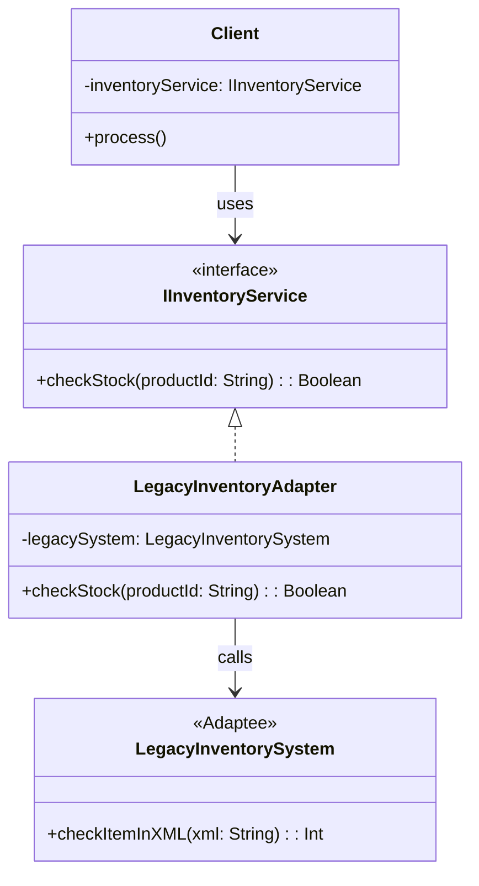

## Problem Description

In reality, our system isn't always written from scratch. Suppose the company just merged with an old logistics partner. Our Order system communicates entirely in **JSON**, but the partner's Inventory System is a **Legacy System** that only accepts **XML** data via the SOAP protocol.

We cannot force the partner to tear down and rewrite their system, but we also cannot dirty our Order logic with messy XML parsing code. We need an "adapter" - the **Adapter Pattern**.

## What is the Adapter Pattern?

The Adapter is a pattern belonging to the Structural group. It allows incompatible interfaces to work together. It acts like a 3-prong to 2-prong electrical plug adapter.

## Applying to the System

The core system needs an `IInventoryService` interface with the function `checkStock(productId: string) : boolean`.
The old system has the `LegacyInventorySystem` class with the function `checkItemInXML(xmlPayload: string) : number`.
We create `LegacyInventoryAdapter` to implement `IInventoryService`, inside which it will call `LegacyInventorySystem` and perform the data conversion task.



## Implementation (Pseudocode - TypeScript)

```typescript
// 1. Standard Interface of our system (Target)
interface IInventoryService {
  checkStock(productId: string): boolean;
}

// 2. Incompatible old system (Adaptee)
class LegacyInventorySystem {
  public checkItemInXML(xmlPayload: string): number {
    console.log(`[Legacy] Received XML: ${xmlPayload}`);
    // Simulate processing, return inventory quantity (e.g., 10)
    return 10;
  }
}

// 3. Adapter Class
class LegacyInventoryAdapter implements IInventoryService {
  private legacySystem: LegacyInventorySystem;

  constructor(legacySystem: LegacyInventorySystem) {
    this.legacySystem = legacySystem;
  }

  checkStock(productId: string): boolean {
    // Convert standard JSON / Data into XML format that Adaptee understands
    const xmlPayload = `<request><itemId>${productId}</itemId></request>`;

    // Call legacy system
    const quantity = this.legacySystem.checkItemInXML(xmlPayload);

    // Convert result (Int) back to the format our system needs (Boolean)
    return quantity > 0;
  }
}

// 4. Client Usage
const legacyAPI = new LegacyInventorySystem();
const inventoryAdapter = new LegacyInventoryAdapter(legacyAPI);

// The Client knows absolutely nothing about XML or the Legacy System
const isAvailable = inventoryAdapter.checkStock("PROD-999");
console.log(`Product available: ${isAvailable}`);
```

## Pros / Cons Evaluation

**Pros:**

- **Reusability:** Reuses old classes and 3rd-party libraries without needing to modify their source code.
- **Decoupling:** Code for data conversion (XML <-> JSON) is hidden within the Adapter, keeping Business Logic clean.

**Cons:**

- Can increase the complexity of the codebase due to the creation of additional intermediate classes/interfaces.
- If the Adaptee (legacy system) has too many complex functions, writing a complete Adapter will take a lot of effort (in that case, consider using a _Facade_ instead).
