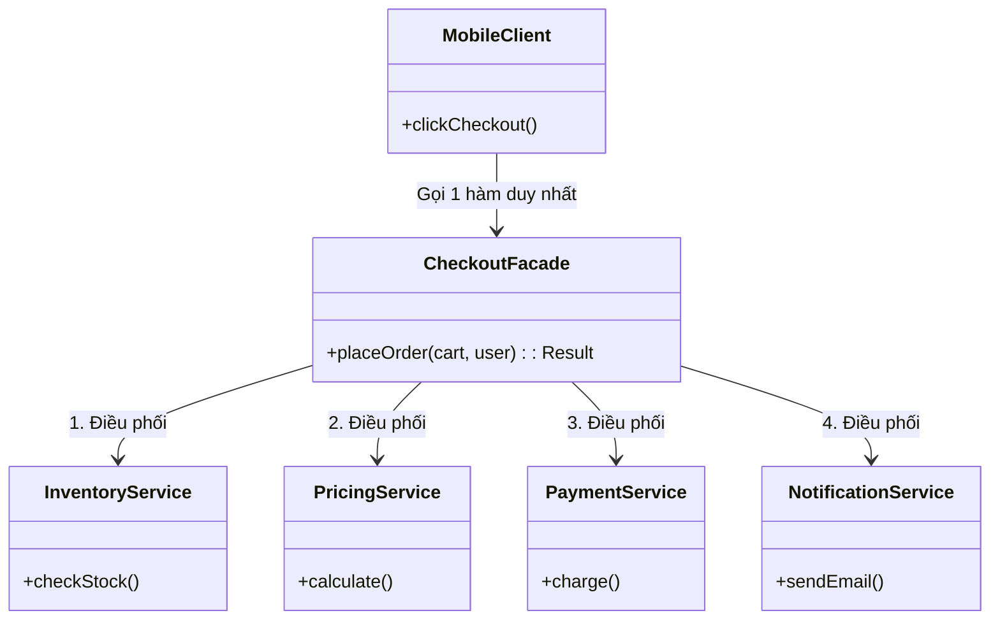

## Mô tả bài toán

Chúng ta đã xây dựng rất nhiều module nhỏ gọn và mạnh mẽ: Tính giá (Decorator), Tồn kho (Adapter), Thanh toán (Factory), Thông báo (Observer).
Bây giờ, tại API Endpoint `/checkout`, client (Mobile App / Web React) chỉ muốn gọi một API duy nhất để hoàn tất đơn hàng.

Nếu Controller phải tự mình gọi lần lượt: Check tồn kho -> Apply Voucher -> Charge thẻ tín dụng -> Lưu DB -> Bắn Email... thì Controller sẽ biến thành một "Thảm họa" (Fat Controller). **Facade Pattern** giúp chúng ta tạo ra một lớp giao tiếp thân thiện hơn.

## Facade Pattern là gì?

Facade (Mặt tiền) cung cấp một giao diện cấp cao, đơn giản hóa và đồng nhất cho một nhóm các giao diện phức tạp của một hệ thống con (subsystem). Nó "che đậy" sự phức tạp bên dưới khỏi Client.

## Áp dụng vào Hệ thống

Chúng ta tạo class `CheckoutFacade`. Mobile/Web chỉ việc gọi `checkoutFacade.placeOrder(cart, user)`. Bên trong Facade sẽ đứng ra điều phối tất cả các service khác nhau.



## Cài đặt (Mã giả - TypeScript)

```typescript
// Các hệ thống con (Subsystems) - Rất phức tạp
class InventorySvc {
  checkStock(id: string) {
    return true;
  }
}
class PricingSvc {
  applyDiscount(val: number) {
    return val * 0.9;
  }
}
class PaymentSvc {
  process(val: number) {
    console.log(`Charged ${val}`);
    return true;
  }
}
class NotiSvc {
  send(msg: string) {
    console.log(`Email sent: ${msg}`);
  }
}

// Lớp Facade
class CheckoutFacade {
  private inventory: InventorySvc;
  private pricing: PricingSvc;
  private payment: PaymentSvc;
  private noti: NotiSvc;

  constructor() {
    this.inventory = new InventorySvc();
    this.pricing = new PricingSvc();
    this.payment = new PaymentSvc();
    this.noti = new NotiSvc();
  }

  // Giao diện duy nhất phơi bày cho Client
  public placeOrder(productId: string, price: number): boolean {
    console.log("--- Bắt đầu quy trình Checkout ---");

    if (!this.inventory.checkStock(productId)) {
      console.log("Hết hàng!");
      return false;
    }

    const finalPrice = this.pricing.applyDiscount(price);

    if (!this.payment.process(finalPrice)) {
      console.log("Thanh toán lỗi!");
      return false;
    }

    this.noti.send(`Đơn hàng cho SP ${productId} đã thành công!`);
    console.log("--- Hoàn tất Checkout ---");
    return true;
  }
}

// Tại Controller (Client) - Rất sạch sẽ và ngắn gọn
const facade = new CheckoutFacade();
facade.placeOrder("IPHONE-15", 30000000);
```

## Đánh giá Ưu / Nhược điểm

**Ưu điểm:**

- Cực kỳ thân thiện với Client, giảm sự kết dính (coupling) giữa giao diện người dùng / HTTP Controller với logic lõi.
- Dễ dàng nâng cấp hoặc thay đổi các subsystem bên trong mà không ảnh hưởng đến API gọi từ bên ngoài.

**Nhược điểm:**

- Nguy cơ Facade trở thành một "God Object" (Lớp chứa quá nhiều thứ) nếu bạn nhồi nhét mọi logic vào đây.
- Facade không ngăn chặn client sử dụng trực tiếp các subsystem nếu họ muốn. Nó chỉ cung cấp một lối đi tiện lợi hơn.
