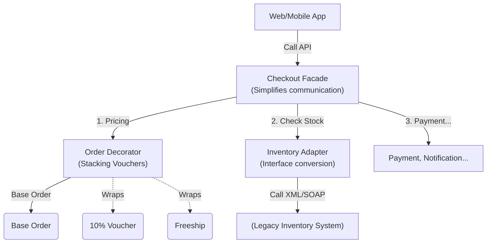

## Problem Description

Through the 3 articles on **Structural Patterns**, our Order Processing System's architecture has been significantly perfected. This group solves the problem: _"How can independent classes / modules work together under a flexible overall structure?"_

## System Interaction with Structural Patterns

Let's see how these patterns connect the entire system:

- **Facade:** Acts as the Entry point, hiding complexity.
- **Decorator:** Flexibly handles billing operations at the Business Logic layer.
- **Adapter:** Acts as an interpreter at the Infrastructure / 3rd-party communication layer.

## Selection Criteria (Decision Matrix)

When facing the "assembly" of a system, use the following table to choose the appropriate Pattern:

<table style="width:100%; border-collapse: collapse; margin-bottom: 20px;">
  <thead>
    <tr style="border-bottom: 2px solid #e2e8f0; text-align: left;">
      <th style="padding: 8px;">Problem Specification (Use Case)</th>
      <th style="padding: 8px;">Pattern</th>
      <th style="padding: 8px;">Real-world application example (Backend)</th>
    </tr>
  </thead>
  <tbody>
    <tr style="border-bottom: 1px solid #edf2f7;">
      <td style="padding: 8px;">You have an old or 3rd-party API/Library with an <strong>interface incompatible</strong> with the current system standards?</td>
      <td style="padding: 8px;"><strong>Adapter</strong></td>
      <td style="padding: 8px;">Wrapping old logger libraries, integrating payment gateways with quirky payloads, parsing XML to JSON.</td>
    </tr>
    <tr style="border-bottom: 1px solid #edf2f7;">
      <td style="padding: 8px;">You want to provide a <strong>single, simple API</strong> to call a series of complex underlying steps?</td>
      <td style="padding: 8px;"><strong>Facade</strong></td>
      <td style="padding: 8px;">Creating Checkout API, System Bootstrapper, Module Entrypoint.</td>
    </tr>
    <tr style="border-bottom: 1px solid #edf2f7;">
      <td style="padding: 8px;">You want to <strong>add features to an object at runtime</strong>, allowing combinations of features without using Inheritance?</td>
      <td style="padding: 8px;"><strong>Decorator</strong></td>
      <td style="padding: 8px;">Middleware (Express/NestJS), Interceptors, Adding discount codes, Tagging logs.</td>
    </tr>
    <tr style="border-bottom: 1px solid #edf2f7;">
      <td style="padding: 8px;">You have objects organized in a <strong>Tree structure</strong> (Folders - Files) and want to treat them uniformly?</td>
      <td style="padding: 8px;"><strong>Composite</strong> <em>(Extension)</em></td>
      <td style="padding: 8px;">Multi-level Product Category structures, Dynamic Menu Systems, Org Charts.</td>
    </tr>
    <tr style="border-bottom: 1px solid #edf2f7;">
      <td style="padding: 8px;">You need a "representative" object to <strong>control access, lazy load, or log</strong> before calling the real object?</td>
      <td style="padding: 8px;"><strong>Proxy</strong> <em>(Extension)</em></td>
      <td style="padding: 8px;">Caching Database Queries, API Rate Limiters, Auth Guards blocking access.</td>
    </tr>
  </tbody>
</table>

## Best Practices

1.  **Facade vs Adapter:** Very easy to confuse.
    - _Adapter_ changes an existing interface to make it compatible with another interface. It works with a single object.
    - _Facade_ defines a new, simpler interface for a subsystem of MULTIPLE objects.
2.  **Decorator vs Inheritance:** Prioritize Decorators (Composition) over Inheritance when the number of feature combinations is massive. Inheritance is a static relationship (Compile-time), while Decorators are dynamic (Run-time).
3.  **Limit God Facade:** A good Facade should only act to "delegate" to subsystems. Do not write Business logic, complex loops, or algorithms directly inside the Facade.

In the final group, **Data Access Patterns**, we will explore how the system communicates with the Database via the **Repository** and ensures data integrity with **Unit Of Work**.
