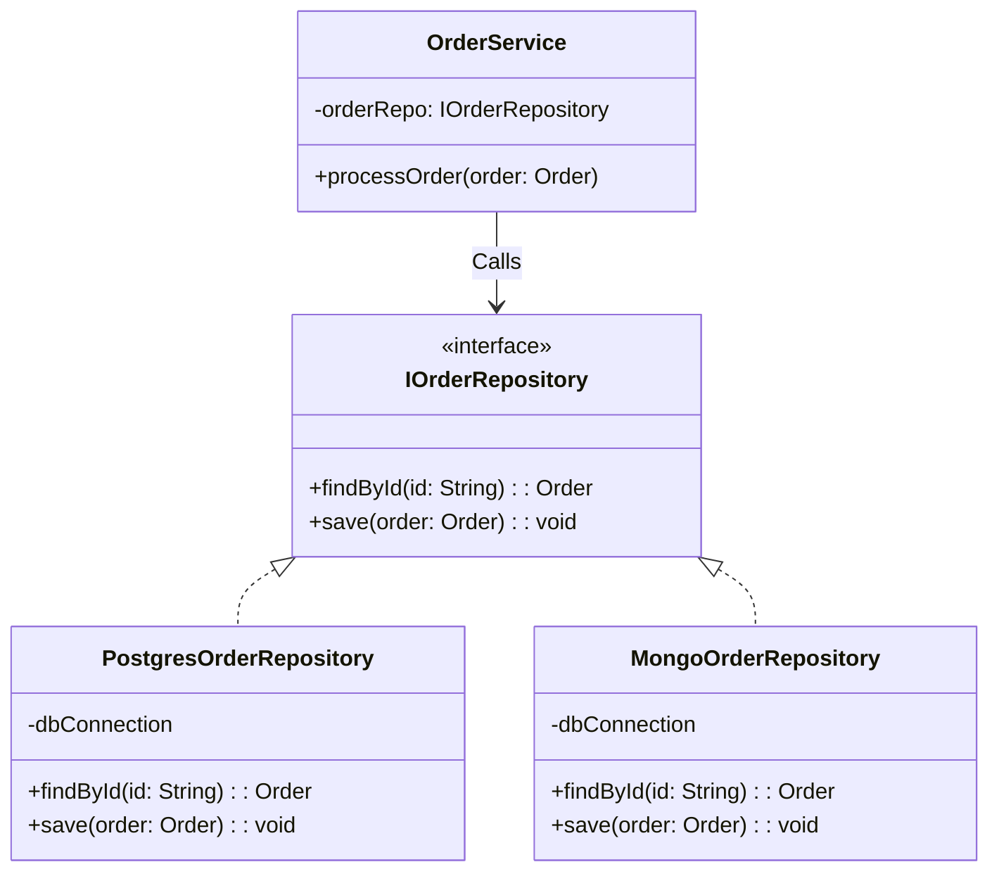

## Problem Description

In our `OrderService`, after processing logic like applying discount codes and calculating shipping fees, the next step is to save the order into the Database (e.g., PostgreSQL).

If you embed SQL or ORM commands (like `SELECT`, `INSERT`) directly inside the `OrderService`, your source code will be "tightly coupled" to the table structures in the Database. If the company later decides to switch to MongoDB, you will have to tear down and rewrite the entire `OrderService`. The **Repository Pattern** is the protective layer that saves you from that scenario.

## What is the Repository Pattern?

The Repository acts as an intermediary between the Business Logic layer (Service) and the Data Access layer (Database). It acts like an in-memory collection of objects, hiding all details about how the data is stored or queried underneath.

## Applying to the Order Processing System

We will define an `IOrderRepository` interface. `OrderService` will only communicate with this interface. Below, we implement `PostgresOrderRepository` which contains the actual SQL commands.



## Implementation (Pseudocode - TypeScript)

```typescript
// 1. Domain Model
class Order {
  constructor(
    public id: string,
    public total: number,
    public status: string,
  ) {}
}

// 2. Repository Interface
interface IOrderRepository {
  findById(id: string): Order | null;
  save(order: Order): void;
}

// 3. Concrete Repository (Real implementation for PostgreSQL)
class PostgresOrderRepository implements IOrderRepository {
  public findById(id: string): Order | null {
    console.log(
      `[Postgres] Executing: SELECT * FROM orders WHERE id = '${id}'`,
    );
    return new Order(id, 100000, "Pending"); // Simulated return data
  }

  public save(order: Order): void {
    console.log(
      `[Postgres] Executing: INSERT INTO orders VALUES ('${order.id}', ${order.total})`,
    );
  }
}

// 4. Concrete Repository (Used for Unit Tests)
class MockOrderRepository implements IOrderRepository {
  private db: Map<string, Order> = new Map();

  public findById(id: string): Order | null {
    return this.db.get(id) || null;
  }

  public save(order: Order): void {
    this.db.set(order.id, order);
  }
}

// 5. Service (Depends only on the Interface)
class OrderService {
  private orderRepo: IOrderRepository;

  constructor(orderRepo: IOrderRepository) {
    this.orderRepo = orderRepo;
  }

  public createOrder(id: string, total: number) {
    const newOrder = new Order(id, total, "Pending");
    this.orderRepo.save(newOrder);
    console.log("Order saved successfully!");
  }
}

// Usage
const dbRepo = new PostgresOrderRepository();
const service = new OrderService(dbRepo);
service.createOrder("ORD-001", 500000);
```

## Pros / Cons Evaluation

**Pros:**

- **Easy to Unit Test:** You can easily create a `MockOrderRepository` that stores data in an array/Map in RAM to test the `OrderService` without needing a real DB connection.
- **Separation of Concerns (SoC):** Changing the database structure or switching ORMs (from Sequelize to Prisma) only affects the Repository file, without breaking the Service logic.
- Makes the code read more like natural language (Domain-driven) rather than DB manipulation commands.

**Cons:**

- Creates a lot of boilerplate files (interfaces, class implementations).
- Can be considered an overhead for small projects (basic CRUD) or when using modern ORMs that inherently apply the Active Record or Repository patterns built-in.

However, if the system requires saving data into 2 or 3 tables simultaneously, and demands an all-or-nothing completion (Transaction), a standalone Repository won't cut it. We need the combination with the **Unit Of Work Pattern** in the next article.
