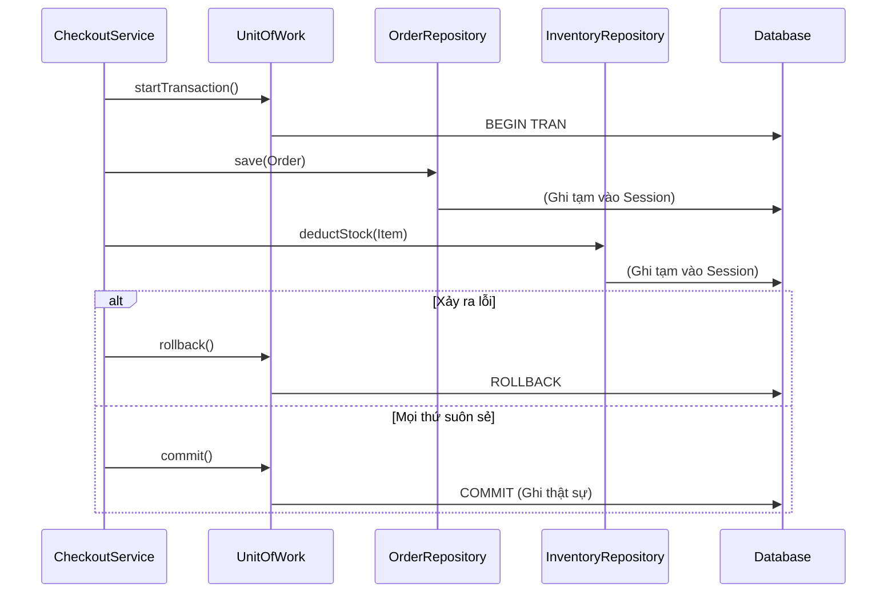

## Mô tả bài toán

Trong quy trình thanh toán (Checkout) thực tế, hệ thống không chỉ lưu vào bảng `Orders`. Nó phải làm chuỗi tác vụ sau:

1. Lưu đơn hàng vào bảng `Orders`.
2. Trừ số lượng tồn kho trong bảng `Inventory`.
3. Lưu lịch sử thanh toán vào bảng `Payments`.

Nếu bước (1) và (2) thành công, nhưng bước (3) thất bại (do lỗi mạng), đơn hàng đã được tạo nhưng tiền không được ghi nhận, và kho thì bị trừ sai.
Chúng ta cần một khái niệm **Transaction**: "All or Nothing" (Thành công tất cả hoặc quay lại từ đầu). **Unit of Work (UoW) Pattern** kết hợp với các Repositories sẽ giải quyết bài toán này.

## Unit of Work Pattern là gì?

Unit of Work (Đơn vị Công việc) duy trì một danh sách các đối tượng bị ảnh hưởng bởi một giao dịch thương mại/nghiệp vụ. Nó điều phối việc ghi toàn bộ những thay đổi đó vào Database trong cùng một Database Transaction. Cung cấp các thao tác `commit()` (lưu) và `rollback()` (hủy bỏ).

## Áp dụng vào Hệ thống Xử lý Đơn hàng

Chúng ta tạo một `IUnitOfWork`. Class này không chỉ nắm giữ tham chiếu đến `OrderRepository`, `InventoryRepository` mà còn quản lý kết nối DB (Connection/Session) chung cho tất cả các Repo đó.



## Cài đặt (Mã giả - TypeScript)

```typescript
// 1. Interface cho Unit of Work
interface IUnitOfWork {
  orders: IOrderRepository;
  inventory: IInventoryRepository;

  startTransaction(): void;
  commit(): void;
  rollback(): void;
}

// 2. Triển khai UoW cụ thể
class PostgresUnitOfWork implements IUnitOfWork {
  private dbConnection: any; // Giả lập DB Session
  public orders: IOrderRepository;
  public inventory: IInventoryRepository;

  constructor() {
    this.dbConnection = {}; // Lấy connection từ Connection Pool
    // Pass chung connection cho các repo để chúng share chung 1 Transaction
    this.orders = new PostgresOrderRepository(this.dbConnection);
    this.inventory = new PostgresInventoryRepository(this.dbConnection);
  }

  startTransaction() {
    console.log("--- BEGIN TRANSACTION ---");
  }

  commit() {
    console.log("--- COMMIT (Lưu vào DB) ---");
  }

  rollback() {
    console.log("--- ROLLBACK (Khôi phục dữ liệu) ---");
  }
}

// 3. Service xử lý nghiệp vụ
class CheckoutService {
  private uow: IUnitOfWork;

  constructor(uow: IUnitOfWork) {
    this.uow = uow;
  }

  public processCheckout(order: Order, productId: string) {
    this.uow.startTransaction();
    try {
      // Thực hiện nhiều thao tác
      this.uow.orders.save(order);
      this.uow.inventory.deductStock(productId, 1);

      // Nếu không có lỗi -> Commit
      this.uow.commit();
      console.log("Checkout thành công!");
    } catch (error) {
      // Có lỗi -> Hủy bỏ toàn bộ
      this.uow.rollback();
      console.log("Checkout thất bại, đã Rollback!");
    }
  }
}
```

## Đánh giá Ưu / Nhược điểm

**Ưu điểm:**

- **Đảm bảo tính toàn vẹn (Data Integrity):** Ngăn chặn tình trạng dữ liệu rác hoặc sai lệch khi luồng xử lý đứt gánh giữa chừng.
- Quản lý Connection tập trung: Tránh việc mỗi Repository tự mở một kết nối mới tới Database gây lãng phí tài nguyên.

**Nhược điểm:**

- Triển khai thủ công khá phức tạp, đặc biệt trong các môi trường đa luồng (Multi-threading) hoặc bất đồng bộ (Node.js/Async-await), dễ gây ra deadlock nếu không quản lý kỹ context của Transaction.
- **Lưu ý:** Hiện nay, hầu hết các framework ORM (như Entity Framework, TypeORM, Prisma, Hibernate) đều đã implement sẵn Unit of Work bên dưới (thường là qua các hàm `.transaction()`). Lập trình viên thường hiếm khi phải tự code UoW từ đầu, nhưng việc hiểu rõ kiến trúc này là bắt buộc để gọi hàm cho đúng.
