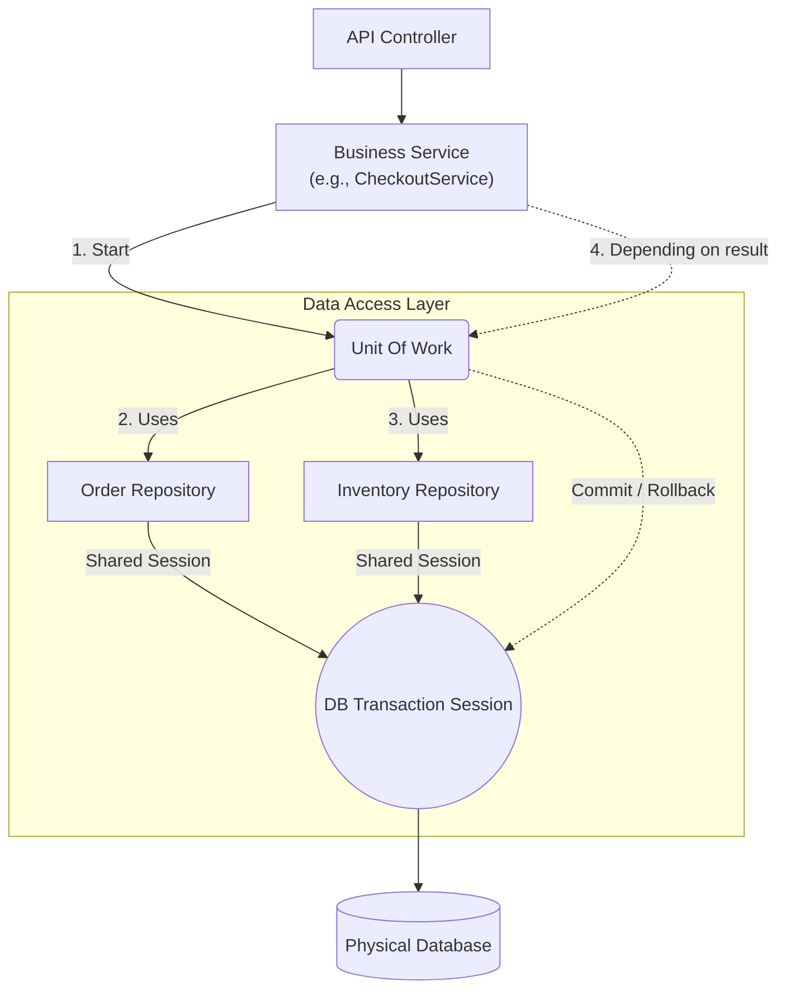

Through the 2 articles on **Repository** and **Unit Of Work**, we have completed the final puzzle piece (the Data Access layer) in the Backend system. This is a critically important boundary that prevents software from being "held hostage" by Database Management System (DBMS) vendors.

## System Interaction at the Data Layer

When combining Repository and UoW, the standard processing flow goes as follows:

In this model, the `Service` only communicates with the Interface. It commands "Do this". As for "How to do it" and "With what SQL/NoSQL commands," that is handled by the Data Access layer.

## Selection Criteria (Decision Matrix)

Besides Repository, the data storage world features other patterns. Here is how you can choose based on project scale:

<table style="width:100%; border-collapse: collapse; margin-bottom: 20px;">
  <thead>
    <tr style="border-bottom: 2px solid #e2e8f0; text-align: left;">
      <th style="padding: 8px;">Problem Specification (Use Case)</th>
      <th style="padding: 8px;">Pattern</th>
      <th style="padding: 8px;">Real-world application example (Backend)</th>
    </tr>
  </thead>
  <tbody>
    <tr style="border-bottom: 1px solid #edf2f7;">
      <td style="padding: 8px;"><strong>Small</strong> project, simple CRUD, prioritize fast coding, Entities can map straight to the Database?</td>
      <td style="padding: 8px;"><strong>Active Record</strong> <em>(Extension)</em></td>
      <td style="padding: 8px;">Projects using Laravel (Eloquent ORM), Ruby on Rails, TypeORM (Active Record mode).</td>
    </tr>
    <tr style="border-bottom: 1px solid #edf2f7;">
      <td style="padding: 8px;"><strong>Complex</strong> project, Domain Driven Design (DDD), need to separate Domain Logic and Database Tables?</td>
      <td style="padding: 8px;"><strong>Repository</strong></td>
      <td style="padding: 8px;">Enterprise Systems, Clean Architecture, TypeORM/MikroORM (Data Mapper mode).</td>
    </tr>
    <tr style="border-bottom: 1px solid #edf2f7;">
      <td style="padding: 8px;">Operations require updating <strong>multiple tables simultaneously</strong>, strict ACID compliance, preventing garbage data?</td>
      <td style="padding: 8px;"><strong>Unit Of Work</strong></td>
      <td style="padding: 8px;">Payments, Banking transfers, Inventory updates with Logs.</td>
    </tr>
    <tr style="border-bottom: 1px solid #edf2f7;">
      <td style="padding: 8px;">Need to directly encapsulate Stored Procedure commands or Map a flat data structure from DB to an object?</td>
      <td style="padding: 8px;"><strong>Data Access Object (DAO)</strong></td>
      <td style="padding: 8px;">Legacy systems using old Java JDBC, complex Report queries bypassing Models.</td>
    </tr>
  </tbody>
</table>

## Best Practices

1. **Not every table needs a Repository:** If you use the Repository Pattern properly according to DDD (Domain Driven Design), you should only create Repositories for **Aggregate Roots**. For example: `Order` is the root, `OrderItem` is the child branch. You only need `OrderRepository`; when saving the Order it will automatically cascade to save OrderItems. Do not create a standalone `OrderItemRepository` to avoid orphaned data.

2. **Avoid excessive "Generic Repositories":** Many developers like to create a `BaseRepository<T>` class packed with find, create, update, delete functions. While it saves initial coding time, in the long run, it defeats the purpose of the Repository (which should contain specific business methods like `findByCustomerAndStatus()`), turning the Repository into a soulless DAO.

3. **Be careful with Unit of Work in Microservices:** UoW only works well within a single physical database. If your system is Microservices (Order in DB 1, Inventory in DB 2), regular UoW will **not** work. At this point, you must switch to Distributed architectural patterns like **Saga Pattern** or **2-Phase Commit**.

We have gone through the 4 main Pattern groups. In the final article of the Series, we will assemble all these concepts into a complete picture!
