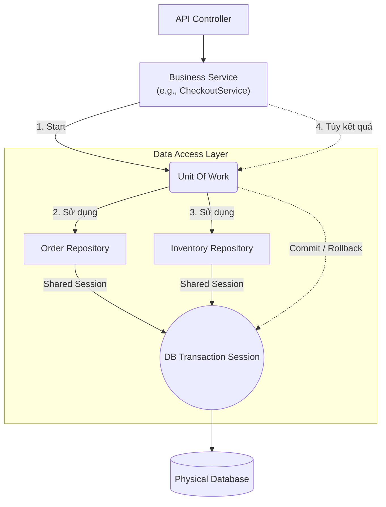

Thông qua 2 bài viết về **Repository** và **Unit Of Work**, chúng ta đã hoàn thiện mảnh ghép cuối cùng (tầng Data Access) trong hệ thống Backend. Đây là ranh giới cực kỳ quan trọng giúp phần mềm không bị "bắt cóc" bởi các nhà cung cấp Hệ quản trị cơ sở dữ liệu (DBMS).

## Tương tác hệ thống ở tầng dữ liệu

Khi kết hợp Repository và UoW, luồng xử lý chuẩn sẽ diễn ra như sau:

Trong mô hình này, `Service` chỉ giao tiếp với Interface. Nó ra lệnh "Hãy làm điều này". Còn việc "Làm thế nào" và "Bằng câu lệnh SQL/NoSQL gì" là do tầng Data Access xử lý.

## Tiêu chí chọn lựa (Decision Matrix)

Bên cạnh Repository, thế giới lưu trữ dữ liệu còn có các pattern khác. Dưới đây là cách để bạn chọn lựa dựa trên quy mô bài toán:

<table style="width:100%; border-collapse: collapse; margin-bottom: 20px;">
  <thead>
    <tr style="border-bottom: 2px solid #e2e8f0; text-align: left;">
      <th style="padding: 8px;">Đặc tả bài toán (Use Case)</th>
      <th style="padding: 8px;">Pattern</th>
      <th style="padding: 8px;">Ví dụ áp dụng thực tế (Backend)</th>
    </tr>
  </thead>
  <tbody>
    <tr style="border-bottom: 1px solid #edf2f7;">
      <td style="padding: 8px;">Dự án <strong>nhỏ</strong>, CRUD đơn giản, ưu tiên code nhanh, Entity có thể tự map thẳng vào Database?</td>
      <td style="padding: 8px;"><strong>Active Record</strong> <em>(Mở rộng)</em></td>
      <td style="padding: 8px;">Các dự án dùng Laravel (Eloquent ORM), Ruby on Rails, TypeORM (chế độ Active Record).</td>
    </tr>
    <tr style="border-bottom: 1px solid #edf2f7;">
      <td style="padding: 8px;">Dự án <strong>phức tạp</strong>, Domain Driven Design (DDD), cần tách biệt Domain Logic và Database Table?</td>
      <td style="padding: 8px;"><strong>Repository</strong></td>
      <td style="padding: 8px;">Các hệ thống Enterprise, Clean Architecture, TypeORM/MikroORM (chế độ Data Mapper).</td>
    </tr>
    <tr style="border-bottom: 1px solid #edf2f7;">
      <td style="padding: 8px;">Thao tác yêu cầu cập nhật <strong>nhiều table cùng lúc</strong>, bắt buộc tính ACID, ngăn chặn dữ liệu rác?</td>
      <td style="padding: 8px;"><strong>Unit Of Work</strong></td>
      <td style="padding: 8px;">Thanh toán (Payment), Chuyển tiền (Banking), Cập nhật Tồn kho kèm Log.</td>
    </tr>
    <tr style="border-bottom: 1px solid #edf2f7;">
      <td style="padding: 8px;">Cần đóng gói trực tiếp các lệnh Stored Procedure hoặc Map một cấu trúc dữ liệu phẳng từ DB lên object?</td>
      <td style="padding: 8px;"><strong>Data Access Object (DAO)</strong></td>
      <td style="padding: 8px;">Các hệ thống Legacy dùng Java JDBC cũ, truy vấn Report phức tạp không qua Model.</td>
    </tr>
  </tbody>
</table>

## Bài học thực chiến (Best Practices)

1. **Không phải mọi bảng đều cần Repository:** Nếu bạn sử dụng Repository Pattern đúng chuẩn DDD (Domain Driven Design), bạn chỉ nên tạo Repository cho các **Aggregate Roots** (Đối tượng gốc). Ví dụ: `Order` là gốc, `OrderItem` là nhánh con. Bạn chỉ cần `OrderRepository`, khi lưu Order nó sẽ tự động cascade để lưu các OrderItem, đừng tạo `OrderItemRepository` độc lập để tránh dữ liệu mồ côi.

2. **Tránh "Generic Repository" quá đà:** Nhiều lập trình viên thích tạo một class `BaseRepository<T>` chứa sẵn hàm find, create, update, delete. Mặc dù nó tiết kiệm code ban đầu, nhưng lâu dài nó làm mất đi ý nghĩa của Repository (chứa các method nghiệp vụ cụ thể như `findByCustomerAndStatus()`), biến Repository thành một DAO vô hồn.

3. **Cẩn trọng với Unit of Work trong Microservices:** UoW chỉ hoạt động tốt trong 1 cơ sở dữ liệu vật lý duy nhất. Nếu hệ thống của bạn là Microservices (Order ở DB 1, Inventory ở DB 2), UoW thông thường sẽ **không** hoạt động. Lúc này, bạn phải chuyển sang các Pattern kiến trúc phân tán như **Saga Pattern** hoặc **2-Phase Commit**.

Chúng ta đã đi qua 4 nhóm Pattern chính. Trong bài viết cuối cùng của Series, chúng ta sẽ lắp ghép toàn bộ các khái niệm này lại thành một bức tranh hoàn chỉnh!
