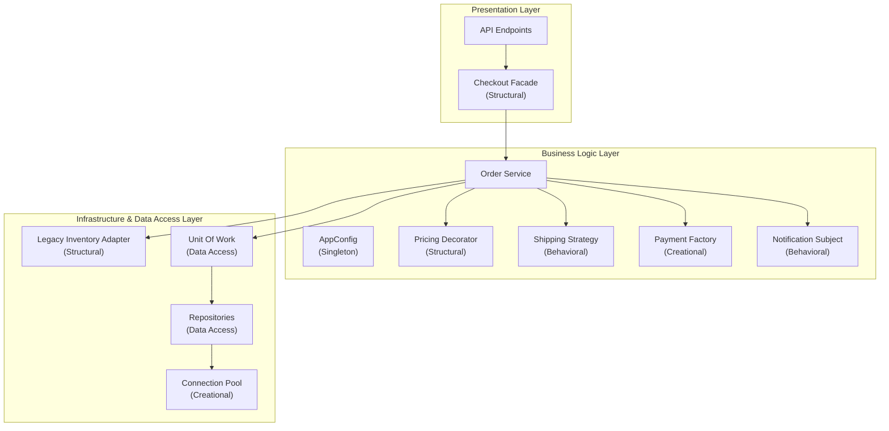

We've come a long way, from initializing the first objects to successfully connecting to the Database. In this article, we will look back at the **Order Processing System** from a panoramic perspective.

Instead of disconnected classes, our system is now a collection of modules standardized through Design Patterns.

## Layered Architecture Diagram

Each Pattern group has excellently solved tasks in its exact Layer:

## Meaning behind the separation

- **Creational (Creation):** `Singleton`, `Object Pool`, and `Factory` help make creating tools (like DB connections, payment gateways) safe, RAM-efficient, and highly reusable.
- **Structural (Assembly):** `Facade`, `Decorator`, and `Adapter` wrap objects together, preventing pricing logic from bloating and allowing the new system to talk to the old one.
- **Behavioral (Behavior):** `Strategy` and `Observer` clearly divide responsibilities—letting those who calculate fees do the math, and those who send emails wait for commands (Event-driven).
- **Data Access (Storage):** `Repository` and `Unit of Work` form a protective shield, guarding Business Logic against crude SQL commands.

In part 2, we will see how a Request from a user travels through these Patterns.
