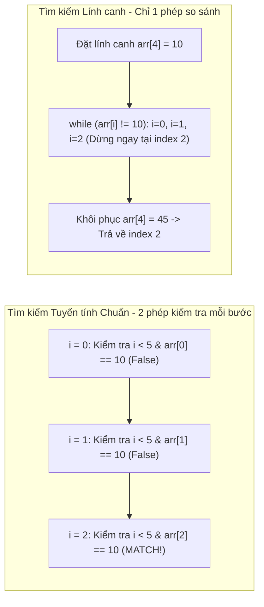

## Mô tả bài toán

Truy xuất dữ liệu là thao tác xuất hiện nhiều nhất trong mọi ứng dụng phần mềm. Đề bài đặt ra: Cho một danh sách `N` phần tử _chưa được sắp xếp_ hoặc một luồng dữ liệu liên kết không hỗ trợ truy xuất ngẫu nhiên (như Single Linked List), hãy tìm vị trí xuất hiện đầu tiên của giá trị `target` hoặc trả về `-1` nếu không tìm thấy.

Tìm kiếm Tuyến tính (Linear Search) là giải pháp tổng quát duy nhất khả thi khi dữ liệu không có bất kỳ cấu trúc bổ trợ hay trật tự sắp xếp nào từ trước.

## Ý tưởng tiếp cận ban đầu

Cách tiếp cận tiêu chuẩn (Standard Loop):

- Sử dụng vòng lặp `for (int i = 0; i < n; ++i)` duyệt tuần tự từ đầu đến cuối mảng.
- _Điểm nghẽn CPU:_ Tại mỗi bước lặp, CPU phải thực hiện **2 phép so sánh**: một phép kiểm tra điều kiện biên `i < n` và một phép kiểm tra giá trị `arr[i] == target`. Trên tập dữ liệu lớn, việc kiểm tra biên chiếm tới 50% thời gian thực thi của vòng lặp.

## Tư duy tối ưu & Cấu trúc thuật toán

Tối ưu hóa bằng Kỹ thuật Phần tử Lính canh (Sentinel Linear Search):

1. **Đặt Lính canh ở cuối mảng:** Lưu tạm phần tử cuối cùng `last = arr[n - 1]`, sau đó gán giá trị `target` vào vị trí cuối `arr[n - 1] = target`.
2. **Loại bỏ hoàn toàn phép kiểm tra biên `i < n`:** Vì chắc chắn `target` sẽ xuất hiện ở cuối mảng, vòng lặp `while (arr[i] != target) ++i;` sẽ không bao giờ bị tràn mảng. Số lượng lệnh so sánh của CPU giảm đúng 50%.
3. **Khôi phục và Xác thực:** Sau khi thoát vòng lặp, khôi phục lại giá trị `arr[n - 1] = last` và kiểm tra xem vị trí `i` tìm thấy là phần tử thật trong mảng hay chính là lính canh.

## Triển khai mã nguồn & Dry Run

Minh họa cơ chế duyệt tuần tự và kỹ thuật lính canh trên mảng `[20, 35, 10, 80, 45]` với `target = 10`:



**Mã nguồn C++ hoàn chỉnh cả 2 phương pháp:**

```c++
#include <iostream>
#include <vector>

// 1. Tìm kiếm Tuyến tính Chuẩn
int linearSearch(const std::vector<int>& arr, int target) {
    int n = static_cast<int>(arr.size());
    for (int i = 0; i < n; ++i) {
        if (arr[i] == target) {
            return i;
        }
    }
    return -1;
}

// 2. Tìm kiếm Tuyến tính với Kỹ thuật Lính canh (Sentinel)
int sentinelLinearSearch(std::vector<int>& arr, int target) {
    int n = static_cast<int>(arr.size());
    if (n == 0) return -1;

    int last = arr[n - 1];
    arr[n - 1] = target; // Đặt lính canh ở cuối

    int i = 0;
    while (arr[i] != target) {
        ++i;
    }

    arr[n - 1] = last; // Khôi phục mảng ban đầu

    if (i < n - 1 || arr[n - 1] == target) {
        return i;
    }
    return -1;
}

int main() {
    std::vector<int> data = {20, 35, 10, 80, 45};
    int target = 10;
    int idx = sentinelLinearSearch(data, target);
    std::cout << "Vị trí của " << target << ": " << idx << std::endl;
    return 0;
}
```

**Phân tích luồng thực thi (Dry Run Trace):**

- _Đầu vào:_ `data = {20, 35, 10, 80, 45}`, `target = 10`.
- _Lính canh:_ Lưu `last = 45`, gán `data[4] = 10`. Mảng tạm thành `{20, 35, 10, 80, 10}`.
- _Vòng lặp:_ `i = 0` (20 != 10) `-> i = 1` (35 != 10) `-> i = 2` (`10 == 10` &rarr; Thoát vòng lặp).
- _Kiểm tra:_ Khôi phục `data[4] = 45`. `i = 2 < 4` `->` Kết luận phần tử nằm tại index `2`.

## Đánh giá độ phức tạp & Ứng dụng thực tế

**Đánh giá Hiệu năng theo Framework Chuẩn:**

1. **Worst-Case Time Complexity (`O`):** `O(N)` khi phần tử nằm ở cuối mảng hoặc không tồn tại.
2. **Best-Case Time Complexity (`Ω`):** `Ω(1)` khi phần tử nằm ngay vị trí đầu tiên (`i = 0`).
3. **Average-Case Time Complexity (`Θ`):** `Θ(N)` (trung bình cần quét `N / 2` phần tử).
4. **Auxiliary Space Complexity:** `O(1)` - Không tốn thêm bộ nhớ phụ trợ.
5. **Ưu thế CPU Cache Locality:** Do mảng được duyệt tuần tự liên tục theo khối nhớ (Sequential Memory Access), Linear Search đạt hiệu suất nạp Cache Line (Spatial Locality) tối đa, thường chạy nhanh hơn cây tìm kiếm với `N <= 64`.

**Ứng dụng thực tế:** Tra cứu trên tập dữ liệu nhỏ chưa sắp xếp, tìm kiếm trên Danh sách liên kết (Linked List), lọc stream dữ liệu thô từ socket mạng.
