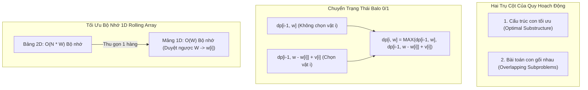

## Mô tả bài toán

Trong khoa học máy tính, nhiều bài toán tối ưu hóa có không gian tìm kiếm bùng nổ theo hàm mũ nếu giải bằng phương pháp vét cạn (Brute Force). Bài toán kinh điển đặt ra: **Bài toán Balo 0/1 (0/1 Knapsack Problem)**.

Cho một chiếc balo có sức chứa trọng lượng tối đa là `W` và một tập hợp gồm `N` đồ vật, mỗi đồ vật `i` có trọng lượng `w[i]` và giá trị sử dụng `v[i]` (với `i = 0, 1, ..., N - 1`). Hãy chọn ra một tập hợp con các đồ vật sao cho tổng trọng lượng không vượt quá `W` và tổng giá trị thu được là cực đại. Mỗi đồ vật chỉ được chọn tối đa một lần (chọn hoặc không chọn, biểu diễn qua giá trị nhị phân 0 hoặc 1).

Nếu dùng vét cạn duyệt qua toàn bộ `2ᴺ` tập con có thể, độ phức tạp thời gian sẽ là `O(2ᴺ)` - một con số bất khả thi khi `N >= 40` (vượt quá 1000 tỷ phép tính). **Thuật toán Quy hoạch động (Dynamic Programming - DP)** được sáng tạo bởi nhà toán học Richard Bellman vào thập niên 1950 chính là chìa khóa phá vỡ sự bùng nổ hàm mũ này, đưa độ phức tạp về thời gian đa thức giả (Pseudo-polynomial time) `O(N x W)`.

## Ý tưởng tiếp cận ban đầu

Cách tiếp cận trực quan ban đầu là sử dụng giải thuật Đệ quy thuần túy (Plain Recursion). Tại mỗi đồ vật thứ `i`, ta có hai nhánh quyết định:

1. **Không chọn đồ vật `i`:** Giá trị tối ưu bằng giá trị tối ưu của bài toán con với `i - 1` đồ vật trước đó và sức chứa giữ nguyên là `w`.
2. **Chọn đồ vật `i` (nếu `w[i] <= w`):** Giá trị tối ưu bằng giá trị của vật `v[i]` cộng với giá trị tối ưu của bài toán con với `i - 1` đồ vật và sức chứa còn lại là `w - w[i]`.

Công thức truy hồi toán học:

```
knapsack(i, w) = max(
    knapsack(i - 1, w),
    v[i] + knapsack(i - 1, w - w[i]) // điều kiện: w[i] <= w
)
```

Cây đệ quy khi thực thi theo cách này gặp phải vấn đề nghiêm trọng: _Bài toán con gối nhau liên tục (Overlapping Subproblems)_. Cùng một trạng thái `(i, w)` bị tính toán lặp đi lặp lại hàng triệu lần trên các nhánh đệ quy độc lập, khiến Call Stack bị nghẽn và thời gian chạy tăng vọt theo cấp số nhân `O(2ᴺ)`.

## Tư duy tối ưu & Cấu trúc thuật toán

Để áp dụng thành công Quy hoạch động, bài toán bắt buộc phải thỏa mãn **hai điều kiện tiên quyết**:

1. **Cấu trúc con tối ưu (Optimal Substructure):** Lời giải tối ưu của bài toán tổng thể kích thước `(N, W)` có thể được kiến tạo trực tiếp từ lời giải tối ưu của các bài toán con cấp thấp hơn `(N - 1, W)` và `(N - 1, W - w[N-1])`.
2. **Bài toán con gối nhau (Overlapping Subproblems):** Không gian trạng thái chứa hữu hạn các bài toán con được tái sử dụng nhiều lần. Bằng cách lưu trữ kết quả của mỗi bài toán con ngay sau lần tính đầu tiên, ta loại bỏ hoàn toàn các nhánh tính toán dư thừa.

Có 2 trường phái hiện thực hóa Quy hoạch động:

- **Top-Down với Kỹ thuật Ghi nhớ (Memoization):** Giữ nguyên khung đệ quy tự nhiên nhưng tra cứu bảng nhớ `memo[i][w]` trước khi tính toán. Nếu trạng thái đã có kết quả thì trả về ngay lập tức với chi phí `O(1)`.
- **Bottom-Up với Bảng quy hoạch (Tabulation):** Khởi tạo bảng 2 chiều `dp[N+1][W+1]`, tính toán tuần tự từ bài toán cơ sở `i = 0` (không có đồ vật) và `w = 0` (sức chứa bằng 0) tiến dần lên kết quả cuối cùng `dp[N][W]`.

**Tối ưu không gian bộ nhớ (Space Optimization):** Quan sát thấy tại bước `i`, ta chỉ cần thông tin từ hàng `i - 1`. Do đó, ta có thể rút gọn bảng 2 chiều kích thước `(N + 1) x (W + 1)` thành mảng 1 chiều kích thước `W + 1`. Lưu ý: Duyệt biến sức chứa `w` theo chiều nghịch từ `W` lùi về `w[i]` để tránh ghi đè dữ liệu của bước trước đó trong cùng một lượt duyệt.

## Triển khai mã nguồn & Dry Run

Sơ đồ chuyển trạng thái trong Quy hoạch động và cây bài toán con gối nhau:



**Mã nguồn C++ hoàn chỉnh (Bottom-Up Tabulation với Tối ưu Bộ nhớ 1D):**

```c++
#include <iostream>
#include <vector>
#include <algorithm>

// 1. Quy hoạch động 2D: Giữ nguyên bảng trạng thái để truy vết đáp án
int knapsack2D(int W, const std::vector<int>& weights, const std::vector<int>& values, int n) {
    std::vector<std::vector<int>> dp(n + 1, std::vector<int>(W + 1, 0));

    for (int i = 1; i <= n; ++i) {
        int currentWeight = weights[i - 1];
        int currentValue = values[i - 1];
        for (int w = 0; w <= W; ++w) {
            if (currentWeight <= w) {
                dp[i][w] = std::max(dp[i - 1][w], currentValue + dp[i - 1][w - currentWeight]);
            } else {
                dp[i][w] = dp[i - 1][w];
            }
        }
    }
    return dp[n][W];
}

// 2. Quy hoạch động Tối ưu Bộ nhớ 1D: Không gian O(W)
int knapsackOptimized(int W, const std::vector<int>& weights, const std::vector<int>& values, int n) {
    std::vector<int> dp(W + 1, 0);

    for (int i = 0; i < n; ++i) {
        int currentWeight = weights[i];
        int currentValue = values[i];
        // Duyệt ngược từ W về currentWeight để bảo toàn dữ liệu trạng thái i - 1
        for (int w = W; w >= currentWeight; --w) {
            dp[w] = std::max(dp[w], currentValue + dp[w - currentWeight]);
        }
    }
    return dp[W];
}

int main() {
    int W = 5; // Sức chứa tối đa của balo
    std::vector<int> weights = {2, 3, 4, 5};
    std::vector<int> values = {3, 4, 5, 8};
    int n = static_cast<int>(weights.size());

    int maxVal2D = knapsack2D(W, weights, values, n);
    int maxVal1D = knapsackOptimized(W, weights, values, n);

    std::cout << "Gia tri lon nhat (Bang 2D): " << maxVal2D << std::endl;
    std::cout << "Gia tri lon nhat (Toi uu 1D): " << maxVal1D << std::endl;

    return 0;
}
```

**Phân tích luồng thực thi chi tiết (Dry Run Trace):**

- _Dữ liệu đầu vào:_ `W = 5`, `weights = {2, 3, 4, 5}`, `values = {3, 4, 5, 8}`, `N = 4`.
- _Khởi tạo:_ Mảng `dp = [0, 0, 0, 0, 0, 0]` (kích thước `W + 1 = 6`).
- _Vật 1 (w=2, v=3):_ Duyệt `w` từ 5 về 2:
  - `w = 5: dp[5] = max(0, 3 + dp[3]) = 3`
  - `w = 4: dp[4] = max(0, 3 + dp[2]) = 3`
  - `w = 3: dp[3] = max(0, 3 + dp[1]) = 3`
  - `w = 2: dp[2] = max(0, 3 + dp[0]) = 3` &rarr; `dp = [0, 0, 3, 3, 3, 3]`
- _Vật 2 (w=3, v=4):_ Duyệt `w` từ 5 về 3:
  - `w = 5: dp[5] = max(3, 4 + dp[2]) = max(3, 4 + 3) = 7` (Chọn vật 1 và vật 2: tổng trọng lượng 5)
  - `w = 4: dp[4] = max(3, 4 + dp[1]) = max(3, 4 + 0) = 4`
  - `w = 3: dp[3] = max(3, 4 + dp[0]) = max(3, 4 + 0) = 4` &rarr; `dp = [0, 0, 3, 4, 4, 7]`
- _Vật 3 (w=4, v=5):_ Duyệt `w` từ 5 về 4:
  - `w = 5: dp[5] = max(7, 5 + dp[1]) = 7`
  - `w = 4: dp[4] = max(4, 5 + dp[0]) = 5` &rarr; `dp = [0, 0, 3, 4, 5, 7]`
- _Vật 4 (w=5, v=8):_ Duyệt `w = 5`:
  - `w = 5: dp[5] = max(7, 8 + dp[0]) = 8` &rarr; Kết quả tối ưu cuối cùng là `8` (Chọn vật 4 có `w=5, v=8`).

## Đánh giá độ phức tạp & Ứng dụng thực tế

Bảng tổng hợp chỉ số hiệu năng theo hệ quy chiếu chuẩn RAM Model:

- **Độ phức tạp Thời gian (Time Complexity):** `Θ(N x W)` trong mọi trường hợp (Best, Average, Worst). Cần duyệt qua `N` đồ vật, mỗi đồ vật cập nhật `W` trạng thái trong bảng quy hoạch.
- **Độ phức tạp Không gian (Space Complexity):**
  - Bảng 2D truyền thống: `O(N x W)` bộ nhớ Heap để lưu trữ toàn bộ ma trận (bắt buộc nếu cần truy vết lại chính xác danh sách đồ vật đã chọn).
  - Tối ưu mảng 1D: `O(W)` bộ nhớ phụ trợ, tiết kiệm đến 95% bộ nhớ khi `N` lớn.
- **Ứng dụng thực tế:**
  - **Hệ thống phân bổ tài nguyên đám mây (Cloud Resource Allocation):** Lựa chọn tổ hợp máy ảo (VM) tối ưu chi phí trong giới hạn ngân sách vCPU/RAM.
  - **Thuật toán đồ thị:** Làm nền tảng cho thuật toán Bellman-Ford và Floyd-Warshall tìm đường đi ngắn nhất.
  - **Tin sinh học (Bioinformatics):** Căn chỉnh chuỗi DNA/Protein bằng thuật toán Needleman-Wunsch và Smith-Waterman.
  - **Xử lý ngôn ngữ tự nhiên (NLP):** Thuật toán Viterbi trong mô hình Hidden Markov Model (HMM) và giải mã mạng nơ-ron sinh từ.
