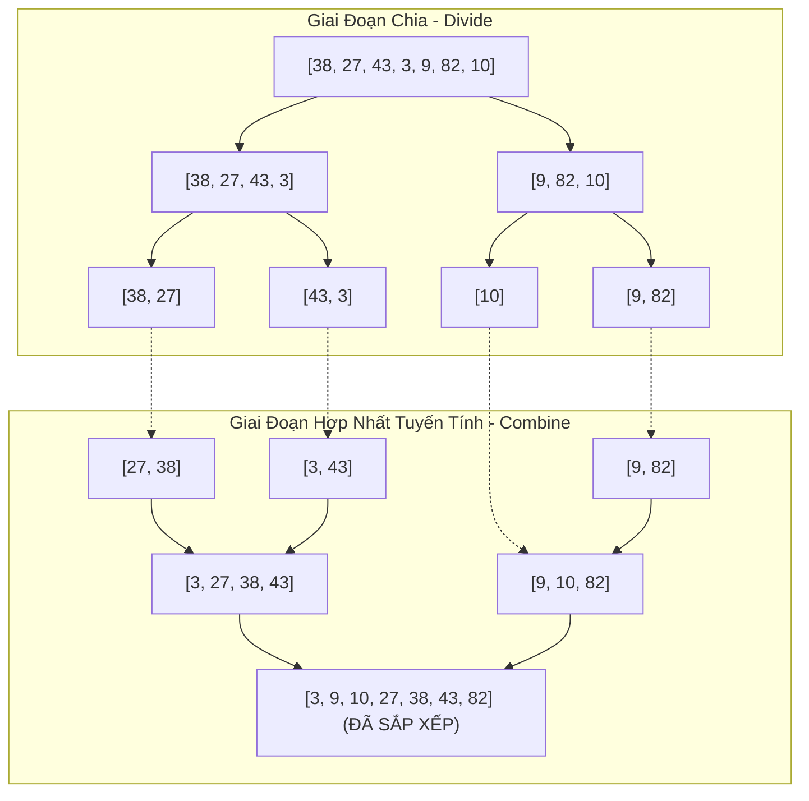

## Mô tả bài toán

Khi đối mặt với các bài toán có quy mô dữ liệu khổng lồ (hàng triệu đến hàng tỷ phần tử), việc xử lý trực tiếp toàn khối dữ liệu thường dẫn đến các giải thuật bậc hai `O(N²)` hoặc hàm mũ. Chiến lược **Chia để trị (Divide and Conquer - D&C)** là một trong những mô hình thiết kế thuật toán quyền năng nhất, dựa trên triết lý phân rã bài toán lớn thành các bài toán con độc lập có cùng cấu trúc nhưng quy mô nhỏ hơn.

Một bài toán mẫu mực cho chiến lược này là **Sắp xếp mảng kích thước lớn (Large-Scale Sorting)**: Cho một mảng gồm `N` phần tử chưa có thứ tự, hãy sắp xếp mảng theo thứ tự không giảm sao cho thời gian thực thi trong mọi kịch bản đều bị chặn trên bởi `O(N \log N)` và đảm bảo _tính ổn định (Stability)_ - bảo toàn thứ tự ban đầu của các phần tử có giá trị tương đương.

## Ý tưởng tiếp cận ban đầu

Các thuật toán sắp xếp cơ bản như Bubble Sort, Selection Sort hay Insertion Sort chỉ thao tác lân cận từng phần tử, dẫn đến chi phí thời gian `O(N²)`. Khi `N = 10⁶`, `N² = 10¹²` phép tính, tiêu tốn hàng nghìn giây xử lý trên CPU hiện đại.

Nếu ta chỉ đơn thuần chia nhỏ mảng mà không có chiến lược kết hợp hiệu quả, thời gian xử lý vẫn không được cải thiện. John von Neumann vào năm 1945 đã đề xuất thuật toán **MergeSort**: Chia đôi mảng thành 2 nửa bằng nhau, sắp xếp đệ quy từng nửa, rồi hợp nhất (Merge) hai dãy đã có thứ tự lại thành một dãy hoàn chỉnh chỉ với chi phí tuyến tính `O(N)`.

## Tư duy tối ưu & Cấu trúc thuật toán

Chiến lược Chia để trị luôn tuân thủ **3 giai đoạn chuẩn mực**:

1. **Chia (Divide):** Phân rã bài toán ban đầu có kích thước `N` thành `a` bài toán con độc lập, mỗi bài toán con có kích thước `N / b`. Trong MergeSort, `a = 2, b = 2` (chia mảng làm 2 nửa đối xứng).
2. **Trị (Conquer):** Giải quyết đệ quy từng bài toán con. Khi quy mô bài toán giảm về trường hợp cơ sở (Base Case: mảng có 0 hoặc 1 phần tử), bài toán tự động được coi là đã giải quyết xong với chi phí `O(1)`.
3. **Kết hợp (Combine):** Hợp nhất lời giải của các bài toán con thành lời giải hoàn chỉnh cho bài toán ban đầu. Trong MergeSort, thủ tục `merge()` dùng 2 con trỏ quét song song qua 2 mảng con đã sắp xếp để ghép vào bộ đệm trong thời gian `O(N)`.

**Công cụ đánh giá: Định lý Thợ (Master Theorem):**

Hầu hết các hệ thức truy hồi dạng Chia để trị đều có dạng: `T(N) = a x T(N / b) + f(N)`, trong đó `f(N) = O(Nᵈ)` là chi phí của giai đoạn Chia và Kết hợp.

- **Trường hợp 1 (Chi phí tập trung ở lá):** Nếu `d < log_b(a)` &rarr; `T(N) = Θ(N^{log_b(a)})`.
- **Trường hợp 2 (Chi phí phân bổ đều mọi tầng):** Nếu `d = log_b(a)` &rarr; `T(N) = Θ(Nᵈ log N)`. Với MergeSort: `a = 2, b = 2, d = 1` &rarr; `log_2(2) = 1 = d` &rarr; `T(N) = Θ(N log N)`.
- **Trường hợp 3 (Chi phí tập trung ở gốc):** Nếu `d > log_b(a)` &rarr; `T(N) = Θ(f(N))`.

## Triển khai mã nguồn & Dry Run

Sơ đồ cây phân rã đệ quy (Divide) và quá trình hợp nhất (Combine) của MergeSort:



**Mã nguồn C++ hoàn chỉnh (MergeSort chuẩn hóa với mảng đệm):**

```c++
#include <iostream>
#include <vector>

// Hàm hợp nhất 2 mảng con đã có thứ tự: arr[left..mid] và arr[mid+1..right]
void merge(std::vector<int>& arr, std::vector<int>& temp, int left, int mid, int right) {
    int i = left;      // Con trỏ duyệt mảng con trái
    int j = mid + 1;   // Con trỏ duyệt mảng con phải
    int k = left;      // Con trỏ ghi dữ liệu vào mảng tạm

    while (i <= mid && j <= right) {
        // Sử dụng <= để đảm bảo tính ổn định (Stable Sort)
        if (arr[i] <= arr[j]) {
            temp[k++] = arr[i++];
        } else {
            temp[k++] = arr[j++];
        }
    }

    // Sao chép các phần tử còn lại của mảng con trái
    while (i <= mid) {
        temp[k++] = arr[i++];
    }

    // Sao chép các phần tử còn lại của mảng con phải
    while (j <= right) {
        temp[k++] = arr[j++];
    }

    // Chuyển dữ liệu đã sắp xếp từ mảng tạm về mảng gốc
    for (int idx = left; idx <= right; ++idx) {
        arr[idx] = temp[idx];
    }
}

// Hàm chia để trị đệ quy
void mergeSortInternal(std::vector<int>& arr, std::vector<int>& temp, int left, int right) {
    if (left >= right) {
        return; // Trường hợp cơ sở: Mảng có 0 hoặc 1 phần tử
    }

    int mid = left + (right - left) / 2; // Tránh tràn số nguyên 32-bit

    // 1. Chia (Divide) và Trị (Conquer)
    mergeSortInternal(arr, temp, left, mid);
    mergeSortInternal(arr, temp, mid + 1, right);

    // 2. Kết hợp (Combine)
    merge(arr, temp, left, mid, right);
}

// Wrapper Interface thân thiện với người dùng
void mergeSort(std::vector<int>& arr) {
    if (arr.empty()) return;
    std::vector<int> temp(arr.size());
    mergeSortInternal(arr, temp, 0, static_cast<int>(arr.size()) - 1);
}

int main() {
    std::vector<int> data = {38, 27, 43, 3, 9, 82, 10};
    mergeSort(data);

    std::cout << "Mang sau khi sap xep MergeSort: ";
    for (int x : data) std::cout << x << " ";
    std::cout << std::endl;

    return 0;
}
```

**Phân tích luồng thực thi chi tiết (Dry Run Trace):**

- _Input:_ `data = {38, 27, 43, 3, 9, 82, 10}` (`N = 7`).
- _Tầng chia 1:_ `left=0, right=6, mid=3` &rarr; Nửa trái `[0..3] = {38, 27, 43, 3}`, Nửa phải `[4..6] = {9, 82, 10}`.
- _Xử lý nửa trái:_
  - Chia `[0..3]` thành `[0..1]={38, 27}` và `[2..3]={43, 3}`.
  - Hợp nhất `{38}` và `{27}` &rarr; `{27, 38}`.
  - Hợp nhất `{43}` và `{3}` &rarr; `{3, 43}`.
  - Hợp nhất `{27, 38}` và `{3, 43}`: So sánh 2 con trỏ &rarr; `{3, 27, 38, 43}`.
- _Xử lý nửa phải:_
  - Chia `[4..6]` thành `[4..5]={9, 82}` và `[6..6]={10}`.
  - Hợp nhất `{9}` và `{82}` &rarr; `{9, 82}`.
  - Hợp nhất `{9, 82}` và `{10}` &rarr; `{9, 10, 82}`.
- _Hợp nhất tầng gốc:_ `merge({3, 27, 38, 43}, {9, 10, 82})`:
  - 3 &lt; 9 &rarr; `[3]`; 27 &gt; 9 &rarr; `[3, 9]`; 27 &gt; 10 &rarr; `[3, 9, 10]`; 27 &lt; 82 &rarr; `[3, 9, 10, 27]`; 38 &lt; 82 &rarr; `[3, 9, 10, 27, 38]`; 43 &lt; 82 &rarr; `[3, 9, 10, 27, 38, 43]`; Chép phần tử còn lại 82 &rarr; Hoàn tất mảng sắp xếp trong đúng `O(N log N)`.

## Đánh giá độ phức tạp & Ứng dụng thực tế

Bảng tổng hợp chỉ số hiệu năng theo hệ quy chiếu chuẩn RAM Model:

- **Độ phức tạp Thời gian (Time Complexity):** `Θ(N log N)` đồng nhất trong cả 3 trường hợp Best, Average, và Worst Case. Thuật toán không bao giờ bị suy biến về `O(N²)` như QuickSort khi gặp dữ liệu phân bố xấu.
- **Độ phức tạp Không gian (Space Complexity):** `O(N)` bộ nhớ phụ trợ (Auxiliary Space) dành cho mảng đệm `temp` và `O(log N)` không gian Call Stack cho các khung đệ quy.
- **Tính ổn định (Stability):** Đảm bảo tuyệt đối (Stable Sort) nhờ điều kiện so sánh `arr[i] <= arr[j]` trong vòng lặp `merge`.
- **Ứng dụng thực tế:**
  - **Sắp xếp ngoài (External Sorting):** Sắp xếp các tệp dữ liệu kích thước hàng Terabyte vượt quá dung lượng RAM vật lý (nguyên lý của giai đoạn Shuffle/Sort trong Apache Spark và Hadoop MapReduce).
  - **Thuật toán Biến đổi Fourier Nhanh (FFT - Fast Fourier Transform):** Phân tích phổ tín hiệu trong viễn thông số và nén âm thanh MP3.
  - **Thuật toán Strassen:** Nhân ma trận nhanh trong đồ họa máy tính và mạng nơ-ron học sâu.
  - **Hình học tính toán (Computational Geometry):** Tìm cặp điểm gần nhau nhất (Closest Pair of Points) trong không gian 2D/3D với chi phí `O(N log N)`.
