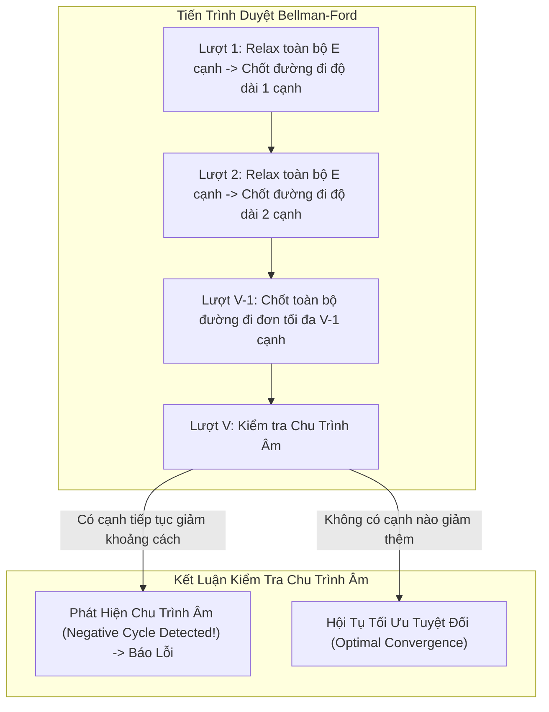

## Mô tả bài toán

Trong thực tế, không phải mọi mạng lưới đều có chi phí dương. Trong thị trường tài chính (giao dịch chênh lệch tỷ giá - Currency Arbitrage) hay các mô hình trao đổi năng lượng tái tạo, các cạnh đồ thị có thể mang **trọng số âm** (thể hiện lợi nhuận thu được khi thực hiện giao dịch).

Đề bài đặt ra: Cho đồ thị có hướng `G = (V, E)` với `V` đỉnh và `E` cạnh, trọng số cạnh có thể nhận giá trị âm bất kỳ. Cho đỉnh nguồn `s`, hãy:

1. Tìm độ dài đường đi ngắn nhất từ `s` đến tất cả các đỉnh còn lại trong đồ thị.
2. Phát hiện xem đồ thị có tồn tại **Chu trình trọng số âm (Negative Cycle)** hay không. Chu trình âm là một vòng khép kín có tổng trọng số &lt; 0. Nếu đi vòng qua chu trình này vô hạn lần, chi phí đường đi sẽ giảm về `-&infin;`, khiến bài toán đường đi ngắn nhất mất nghiệm.

Thuật toán Bellman-Ford (phát triển bởi Richard Bellman và Lester Ford Jr.) là giải thuật chuẩn mực giải quyết trọn vẹn thách thức này.

## Ý tưởng tiếp cận ban đầu

Thuật toán Dijkstra thất bại hoàn toàn trên đồ thị có trọng số âm vì chiến lược Tham lam chốt cố định đỉnh có khoảng cách nhỏ nhất tại mỗi bước. Khi một cạnh âm xuất hiện ở bước sau, khoảng cách đến đỉnh đã chốt có thể bị giảm xuống, nhưng Dijkstra không có cơ chế hoàn tác hoặc cập nhật lại các đỉnh đã bị loại khỏi hàng đợi ưu tiên.

Để đảm bảo tính chính xác tuyệt đối mà không cần giả định tham lam, ta phải chuyển sang tư duy Quy hoạch động: Thực hiện nới lỏng (Relax) trên _toàn bộ danh sách cạnh_ một cách có hệ thống.

## Tư duy tối ưu & Cấu trúc thuật toán

Bản chất toán học của thuật toán Bellman-Ford dựa trên **Nguyên lý đường đi đơn (Simple Path Invariant)**:

1. **Độ dài tối đa của đường đi ngắn nhất:** Trong một đồ thị gồm `V` đỉnh không có chu trình âm, một đường đi đơn ngắn nhất bất kỳ chỉ có thể chứa tối đa `V - 1` cạnh (nếu chứa từ `V` cạnh trở lên, theo nguyên lý Dirichlet phải có ít nhất 1 đỉnh bị lặp lại, tạo thành chu trình).
2. **Quy hoạch động qua `V - 1` lượt duyệt:** Tại lượt thứ `k` (với `k = 1, 2, ..., V - 1`), thuật toán đảm bảo tìm được đường đi ngắn nhất cho tất cả các hành trình sử dụng tối đa `k` cạnh. Sau `V - 1` lượt duyệt qua toàn bộ `E` cạnh, mọi đỉnh đều đạt khoảng cách tối ưu tuyệt đối.
3. **Cơ chế Phát hiện Chu trình Âm (Lượt duyệt thứ `V`):** Thực hiện thêm lượt duyệt thứ `V`. Nếu vẫn tồn tại bất kỳ cạnh `(u, v)` nào thỏa mãn `dist[u] + w < dist[v]`, điều đó chứng tỏ tồn tại một chu trình âm có thể tiếp tục rút ngắn khoảng cách vô hạn lần.
4. **Tối ưu hóa Cờ hiệu Dừng sớm (Early-Exit Flag):** Nếu trong một lượt duyệt mà không có bất kỳ cạnh nào được nới lỏng (`updated = false`), thuật toán có thể dừng ngay lập tức. Điều này giúp Bellman-Ford đạt `O(E)` trong Best-case khi đồ thị có cấu trúc thuận lợi.

## Triển khai mã nguồn & Dry Run

Sơ đồ tiến trình nới lỏng qua các lượt và cơ chế phát hiện chu trình âm:



**Mã nguồn C++ hoàn chỉnh (Bellman-Ford với Tối ưu Dừng sớm & Phát hiện Chu trình âm):**

```c++
#include <iostream>
#include <vector>
#include <algorithm>

const long long INF = 1e18;

struct Edge {
    int from;
    int to;
    long long weight;
};

// Kết quả trả về gồm mảng khoảng cách và cờ báo chu trình âm
struct BellmanFordResult {
    std::vector<long long> dist;
    std::vector<int> parent;
    bool hasNegativeCycle;
};

BellmanFordResult bellmanFord(int startNode, int numVertices, const std::vector<Edge>& edges) {
    std::vector<long long> dist(numVertices, INF);
    std::vector<int> parent(numVertices, -1);
    dist[startNode] = 0;

    // 1. Thực hiện tối đa V - 1 lượt nới lỏng toàn bộ cạnh
    for (int i = 1; i <= numVertices - 1; ++i) {
        bool updated = false;

        for (const auto& edge : edges) {
            if (dist[edge.from] != INF && dist[edge.from] + edge.weight < dist[edge.to]) {
                dist[edge.to] = dist[edge.from] + edge.weight;
                parent[edge.to] = edge.from;
                updated = true;
            }
        }

        // Tối ưu hóa dừng sớm nếu không còn cạnh nào được nới lỏng
        if (!updated) {
            break;
        }
    }

    // 2. Lượt thứ V: Kiểm tra sự tồn tại của Chu trình Âm
    bool hasNegativeCycle = false;
    for (const auto& edge : edges) {
        if (dist[edge.from] != INF && dist[edge.from] + edge.weight < dist[edge.to]) {
            hasNegativeCycle = true;
            break; // Tìm thấy chu trình âm
        }
    }

    return {dist, parent, hasNegativeCycle};
}

int main() {
    int V = 5;
    std::vector<Edge> edges = {
        {0, 1, -1},
        {0, 2, 4},
        {1, 2, 3},
        {1, 3, 2},
        {1, 4, 2},
        {3, 2, 5},
        {3, 1, 1},
        {4, 3, -3}
    };

    auto result = bellmanFord(0, V, edges);

    if (result.hasNegativeCycle) {
        std::cout << "CANH BAO: Do thi ton tai Chu trinh trong so am!" << std::endl;
    } else {
        std::cout << "--- KET QUA BELLMAN-FORD TU DINH 0 ---" << std::endl;
        for (int i = 0; i < V; ++i) {
            std::cout << "Khoang cach den dinh " << i << ": " << result.dist[i] << std::endl;
        }
    }

    return 0;
}
```

**Phân tích luồng thực thi chi tiết (Dry Run Trace):**

- _Khởi tạo:_ `dist = [0, &infin;, &infin;, &infin;, &infin;]`.
- _Lượt 1 (i = 1):_
  - Cạnh `(0->1, w=-1)`: `dist[1] = 0 + (-1) = -1`.
  - Cạnh `(0->2, w=4)`: `dist[2] = 4`.
  - Cạnh `(1->3, w=2)`: `dist[3] = -1 + 2 = 1`.
  - Cạnh `(1->4, w=2)`: `dist[4] = -1 + 2 = 1`.
  - Cạnh `(1->2, w=3)`: `-1 + 3 = 2 < 4` &rarr; `dist[2] = 2`.
  - Kết thúc lượt 1: `dist = [0, -1, 2, 1, 1]`.
- _Lượt 2 (i = 2):_
  - Cạnh `(4->3, w=-3)`: `dist[4] + (-3) = 1 - 3 = -2 < dist[3]=1` &rarr; Nới lỏng! `dist[3] = -2`.
  - Cạnh `(3->1, w=1)`: `dist[3] + 1 = -2 + 1 = -1 == dist[1]` (không đổi).
  - Kết thúc lượt 2: `dist = [0, -1, 2, -2, 1]`.
- _Lượt 3 (i = 3):_ Không còn cạnh nào cải thiện thêm &rarr; Cờ `updated = false` &rarr; Thoát sớm ở lượt 3 thay vì chờ hết 4 lượt.
- _Kiểm tra chu trình âm:_ Duyệt toàn bộ 8 cạnh, không có cạnh nào giảm thêm khoảng cách &rarr; Đồ thị an toàn, kết quả chốt `[0, -1, 2, -2, 1]`.

## Đánh giá độ phức tạp & Ứng dụng thực tế

Bảng tổng hợp chỉ số hiệu năng theo hệ quy chiếu chuẩn RAM Model:

- **Độ phức tạp Thời gian (Time Complexity):**
  - Worst & Average Case: `O(V x E)`. Với đồ thị dày (`E ~ V²`), độ phức tạp tiến đến `O(V³)`.
  - Best Case: `O(E)` khi mảng khoảng cách hội tụ ngay từ lượt đầu tiên nhờ cờ hiệu dừng sớm.
- **Độ phức tạp Không gian (Space Complexity):** `O(V)` cho mảng khoảng cách `dist` và mảng `parent`, cùng `O(E)` để lưu trữ danh sách cạnh rời rạc.
- **Ứng dụng thực tế:**
  - **Giao thức định tuyến RIP (Routing Information Protocol):** Nền tảng của thuật toán Distance-Vector Routing trong mạng viễn thông.
  - **Phát hiện Kinh doanh chênh lệch giá (Currency Arbitrage Detection):** Chuyển đổi ma trận tỷ giá hối đoái bằng phép logarit `-log(rate)` để biến bài toán nhân tỷ giá thành bài toán tìm chu trình âm trong đồ thị.
  - **Lập lịch ràng buộc thời gian (Difference Constraints System):** Giải hệ bất phương trình dạng `x[j] - x[i] <= c` trong biên dịch và quản lý dự án.
