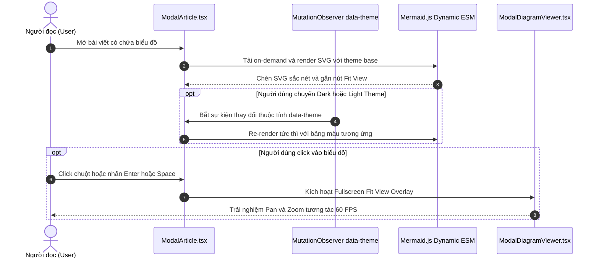

## Mô tả bài toán

Việc nhúng biểu đồ kỹ thuật động (Dynamic Diagramming) vào các trang blog công nghệ hoặc hệ thống quản lý tài liệu (Documentation Portals) mang lại trải nghiệm đọc rất trực quan. Tuy nhiên, khi đưa thư viện `mermaid` vào ứng dụng Single Page Application (SPA) viết bằng React và TypeScript, các kỹ sư frontend thường đối mặt với 4 thách thức kỹ thuật gai góc:

1. **Dung lượng gói phình to (Bundle Size Bloat):** Thư viện Mermaid đóng gói đầy đủ các engine dựng hình (Dagre, Cytoscape, KaTeX, D3) với kích thước vượt trên 1.4MB. Nếu import tĩnh ở đầu trang, thời gian tải trang đầu tiên (First Contentful Paint - FCP) sẽ bị suy giảm nghiêm trọng.
2. **Lỗi tương phản màu trong Dark Mode:** Khi người dùng chuyển sang giao diện tối, màu chữ và nét vẽ mặc định của SVG có thể bị chìm hoàn toàn vào màu nền tối, khiến nội dung không thể đọc được.
3. **Trải nghiệm hạn chế trên màn hình di động:** Các sơ đồ kiến trúc phức tạp với nhiều cột hoặc chuỗi microservices dài thường bị co rút quá nhỏ hoặc tràn khung nhìn gây vỡ giao diện.
4. **Cảm giác 'đóng hộp' thô cứng:** Nếu bọc biểu đồ trong các card có viền và đổ bóng nặng, sơ đồ sẽ tạo cảm giác bị cô lập, tách biệt khỏi mạch văn tự nhiên của bài viết.

## Ý tưởng tiếp cận ban đầu

Cách tiếp cận ngây thơ thường gặp trong các dự án ban đầu:

- Import tĩnh `import mermaid from 'mermaid'` và gọi `mermaid.run()` trực tiếp sau khi component mount.
- Bọc toàn bộ khối sơ đồ trong một thẻ `
` có nền thẻ, viền cứng và đổ bóng.
- Sử dụng theme mặc định `theme: 'default'` mà không đồng bộ với hệ thống Design Tokens của trang.

**Tại sao cách này bộc lộ nhiều điểm nghẽn?** Sơ đồ không thể tự động cập nhật khi người dùng nhấn nút chuyển Dark/Light Mode. Trên mobile, người dùng không thể phóng to để xem chi tiết. Đồng thời, cấu trúc card cứng nhắc làm mất đi tính liền mạch của bài viết chuyên sâu.

## Tư duy tối ưu & Cấu trúc thuật toán

Để giải quyết triệt để các vấn đề trên và mang lại trải nghiệm đọc đỉnh cao, tôi xây dựng một kiến trúc tích hợp toàn diện:

1. **Tải động theo yêu cầu (Dynamic On-Demand Loading):** Chỉ import Mermaid khi trong bài viết thực sự có chứa khối mã `pre.mermaid`, kết hợp cơ chế import đa tầng bền bỉ (resilient fallback).
2. **Đồng bộ hóa bộ biến Theme và CSS Tương phản cao:** Sử dụng chế độ `theme: 'base'` kết hợp bộ biến `themeVariables` chi tiết (đồng bộ mã màu Ruby / Crimson) và quy tắc CSS scoped (`> svg`) để toàn bộ nhãn văn bản luôn đạt độ sáng tương phản `#f8fafc` trong Dark Mode.
3. **Cơ chế Phóng to toàn Viewport (Fit View Modal):** Tích hợp nút micro-pill gọn gàng ở góc trên. Khi click, mở rộng sơ đồ lên toàn bộ viewport (95vw x 86vh), hỗ trợ thao tác kéo rê chuột (Pan) và cuộn chuột thu phóng (Zoom 40% - 350%).
4. **Hòa nhập tự nhiên vào dòng văn bản:** Loại bỏ viền và nền box thô cứng, biến biểu đồ thành hình minh họa vector tự nhiên giữa các đoạn văn.

## Triển khai mã nguồn & Dry Run

Triển khai kiến trúc xử lý trong React component và SCSS:

**Điểm mấu chốt trong mã nguồn:**

- **Giới hạn selector CSS `> svg`:** Đảm bảo các thuộc tính kích thước lớn của sơ đồ không làm vỡ icon `11x11px` bên trong nút Fit View.
- **Bắt sự kiện Theme bằng MutationObserver:** Tự động phát hiện khi `document.documentElement` đổi theme để re-render biểu đồ mượt mà mà không cần reload trang.

## Đánh giá độ phức tạp & Ứng dụng thực tế

- **Hiệu năng dựng hình GPU:** Thao tác Pan & Zoom trong modal viewer sử dụng thuộc tính `transform: translate3d(...) scale(...)` thuần túy, tận dụng tối đa GPU Compositing để đạt độ mượt **60 FPS** tuyệt đối.
- **Giảm tải Bundle ban đầu:** Kỹ thuật lazy-load giúp tiết kiệm hơn **1.4 MB JavaScript** cho các bài viết không chứa sơ đồ.
- **Khả năng ứng dụng rộng rãi:** Giải pháp này là kiến trúc mẫu mực cho các nền tảng kỹ thuật phức tạp như API Documentation, Enterprise Architecture Dashboards, và các Tech Blogs chuyên nghiệp.
