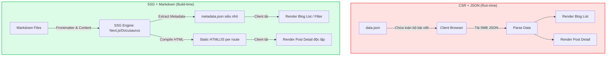

## Bối cảnh & Vấn đề

Khi bắt đầu xây dựng dự án CV tích hợp Blog cá nhân, mục tiêu của tôi là tạo ra một hệ thống gọn nhẹ, không tốn chi phí duy trì server và có thể host trực tiếp trên GitHub Pages.

Phiên bản đầu tiên được thiết kế với tư duy của một Single Page Application (SPA) truyền thống: Toàn bộ bài viết được lưu trữ trong một file `data.json` duy nhất. Frontend (React) sẽ fetch file JSON này về ở chế độ run-time, parse dữ liệu và render ra giao diện.

Tuy nhiên, với mục tiêu viết blog hằng ngày (Daily Blogging), mô hình này nhanh chóng bộc lộ **điểm yếu chí mạng**:

1. **Phình to dữ liệu (Data Bloat):** Khi số lượng bài viết đạt con số hàng trăm, file `data.json` sẽ phình to lên mức vài Megabytes.
2. **Nút thắt băng thông (Bandwidth Bottleneck):** Để đọc một bài viết mới nhất, trình duyệt của người dùng buộc phải tải _toàn bộ_ lịch sử bài viết từ trước đến nay.
3. **Developer Experience (DX) tồi tệ:** Việc viết nội dung dài, chèn code snippet, hay định dạng văn bản bên trong một chuỗi String của JSON là một cơn ác mộng về escaping (`\n`, `\"`).

Giải pháp duy nhất để mở rộng (scale) là thay đổi hoàn toàn cách dữ liệu được lưu trữ và phân phối.

## Yêu cầu hệ thống

Kiến trúc mới cần thoả mãn các ràng buộc khắt khe của một dự án cá nhân:

- **Zero-backend:** Không sử dụng Database Server để tiết kiệm chi phí và công sức bảo trì.
- **Tối ưu TTI (Time to Interactive):** Người dùng vào bài viết nào, chỉ tải đúng lượng dữ liệu của bài viết đó.
- **Bảo toàn tính năng:** Vẫn phải hỗ trợ Lọc (Filter), Tìm kiếm (Search) theo Tag và Category.
- **DX thân thiện:** Hỗ trợ viết bài trơn tru trên IDE, highlight code chuẩn xác và vẽ được biểu đồ kỹ thuật.

## Thiết kế kiến trúc

Để giải quyết bài toán trên, tôi quyết định chuyển đổi từ mô hình **Client-side Rendering (CSR) + JSON** sang mô hình **Static Site Generation (SSG) + Markdown**.

Cốt lõi của sự thay đổi nằm ở việc dời "thời điểm xử lý dữ liệu" từ **Run-time** (lúc người dùng mở web) sang **Build-time** (lúc code được đẩy lên GitHub).

**Cách luồng dữ liệu mới hoạt động:**

1. **Lưu trữ:** Mỗi bài viết là một file `.md` hoặc `.mdx` riêng biệt. Dữ liệu mô tả (Title, Date, Tags) được lưu ở phần đầu file (Frontmatter YAML).
2. **Build-time:** Khi đẩy code lên GitHub, SSG Engine sẽ duyệt qua toàn bộ thư mục bài viết. Nó tách Frontmatter ra tạo thành một file metadata rất nhỏ (chỉ vài chục KB) phục vụ cho trang danh sách. Phần nội dung Markdown được compile thành các trang HTML tĩnh riêng lẻ.
3. **Phân phối:** Khi người dùng truy cập `/blog/my-post`, GitHub Pages chỉ trả về đúng file HTML của bài đó. Tốc độ phản hồi tính bằng mili-giây.

## Phân tích đánh đổi

Mọi quyết định kiến trúc đều là sự đánh đổi (Trade-offs). Dù giải quyết được vấn đề "phình JSON", mô hình mới cũng mang lại một số đặc tả cần cân nhắc:

<table style="width:100%; border-collapse: collapse; margin-bottom: 20px;">
  <thead>
    <tr style="border-bottom: 2px solid #e2e8f0; text-align: left;">
      <th style="padding: 8px;">Tiêu chí</th>
      <th style="padding: 8px;">Mô hình cũ (JSON)</th>
      <th style="padding: 8px;">Mô hình mới (Markdown + SSG)</th>
    </tr>
  </thead>
  <tbody>
    <tr style="border-bottom: 1px solid #edf2f7;">
      <td style="padding: 8px"><b>Tốc độ tải trang chi tiết</b></td>
      <td style="padding: 8px">Chậm (Phải parse cục data lớn)</td>
      <td style="padding: 8px">Cực nhanh (HTML render sẵn)</td>
    </tr>
    <tr style="border-bottom: 1px solid #edf2f7;">
      <td style="padding: 8px"><b>Chi phí bảo trì Content</b></td>
      <td style="padding: 8px">Rất khó (Sửa lỗi syntax JSON)</td>
      <td style="padding: 8px">Rất dễ (Git Version Control, IDE support)</td>
    </tr>
    <tr style="border-bottom: 1px solid #edf2f7;">
      <td style="padding: 8px"><b>Thời gian Build (CI/CD)</b></td>
      <td style="padding: 8px">Nhanh (Chỉ copy file tĩnh)</td>
      <td style="padding: 8px">Tăng dần theo số lượng bài viết (Cần compile MD sang HTML)</td>
    </tr>
    <tr>
      <td style="padding: 8px"><b>Tính năng động (Comments)</b></td>
      <td style="padding: 8px">Có thể tự chế qua API</td>
      <td style="padding: 8px">Phải dựa vào 3rd party (Giscus, Utterances)</td>
    </tr>
  </tbody>
</table>

Đối với một Blog cá nhân, việc thời gian build trên GitHub Actions tăng thêm 1-2 phút là một cái giá quá rẻ để đổi lấy hiệu năng frontend tuyệt đối và trải nghiệm viết lách mượt mà.

## Bài học thực tế & Best Practices

Qua quá trình chuyển đổi, đây là những thực hành tốt nhất (Best Practices) mà tôi đúc kết được để duy trì hệ thống SSG lâu dài:

1. **Chuẩn hoá Frontmatter ngay từ đầu:** Việc định nghĩa Schema rõ ràng cho metadata (ví dụ bắt buộc phải có `date` định dạng `YYYY-MM-DD`, `tags` dạng array) sẽ giúp tránh lỗi lúc build-time.
2. **Tuyệt đối không load Content vào trang danh sách (List Page):** Khi xử lý dữ liệu lúc build, chỉ trích xuất các trường Frontmatter để tạo bộ lọc. Đừng mang cả nội dung bài viết (body text) vào mảng metadata, nếu không bạn sẽ lại lặp lại lỗi "phình JSON" phiên bản SSG.
3. **Tận dụng MDX:** Trong hệ sinh thái React, sử dụng MDX (`.mdx`) cho phép nhúng trực tiếp các React Component (như biểu đồ Mermaid, nút tương tác, bảng tính) ngay giữa lòng bài viết Markdown, xoá nhoà ranh giới giữa nội dung tĩnh và ứng dụng động.
4. **Tự động hoá với GitHub Actions:**Thiết lập một workflow để mỗi khi có commit mới vào nhánh `main`, hệ thống sẽ tự động gõ lệnh `npm run build` và deploy thẳng thư mục `dist` lên nhánh `gh-pages`. Bạn chỉ việc viết bài, việc còn lại để máy móc lo.

Kiến trúc tốt không phải là kiến trúc phức tạp nhất, mà là kiến trúc phù hợp nhất với nguồn lực và đặc thù của dự án ở thời điểm hiện tại.
