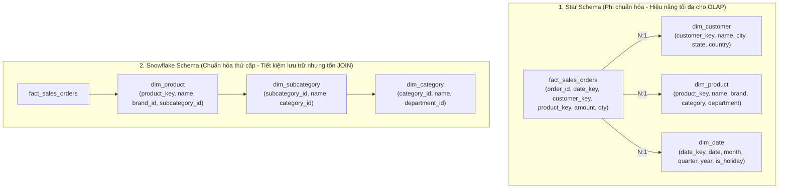
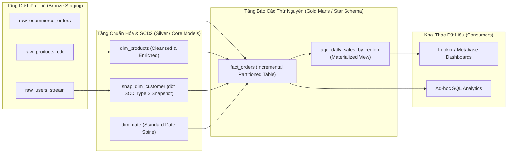

## Đề bài kinh doanh / Yêu cầu dữ liệu

Trong kỷ nguyên số, mọi quyết định kinh doanh chiến lược đều cần được dẫn dắt bởi dữ liệu thực chứng (Data-Driven Decision Making). Tuy nhiên, một trong những sai lầm phổ biến nhất của các doanh nghiệp giai đoạn đầu là: **Cho phép các công cụ Báo cáo (BI/Dashboard) và Data Analyst truy vấn trực tiếp vào Cơ sở dữ liệu Giao dịch (OLTP Databases như PostgreSQL, MySQL)**.

Hành vi này nhanh chóng dẫn đến thảm họa kép:

1. **Làm tê liệt hệ thống vận hành trực tiếp (OLTP Downtime):** Các câu lệnh phân tích quét hàng triệu bản ghi cùng lúc với các phép tính tổng hợp (`SUM`, `AVG`, `COUNT DISTINCT`) và nhiều phép `JOIN` phức tạp sẽ chiếm dụng toàn bộ CPU/RAM, gây khóa bảng (Table Locks) và làm sập API phục vụ khách hàng.
2. **Cấu trúc Dữ liệu 3NF Phân mảnh & Thiếu Ngữ cảnh:** Cơ sở dữ liệu ứng dụng được chuẩn hóa cao độ (3NF) để tối ưu hóa việc ghi dữ liệu (INSERT/UPDATE), khiến dữ liệu một đơn hàng bị phân rã ra hàng chục bảng nhỏ. Để trả lời một câu hỏi kinh doanh đơn giản (ví dụ: _'Doanh thu theo vùng miền và nhóm sản phẩm quý vừa qua là bao nhiêu?'_), chuyên viên phân tích phải viết câu lệnh SQL dài hàng trăm dòng với hơn 15 phép JOIN, dẫn đến tốc độ truy vấn chậm chạp và tỷ lệ sai lệch số liệu cực cao.
3. **Mất dấu Lịch sử Biến động (No Historical Traceability):** CSDL giao dịch chỉ lưu trạng thái hiện tại (Current State). Khi khách hàng đổi địa chỉ giao hàng hoặc sản phẩm đổi phân loại, thông tin cũ bị ghi đè, làm sai lệch hoàn toàn các báo cáo lịch sử trong quá khứ.

**Yêu cầu cốt lõi của một Hệ thống Kho Dữ liệu (Data Warehouse):**

- **Tách biệt Tải xử lý (Workload Isolation):** Tách biệt hoàn toàn khối lượng công việc phân tích (OLAP) ra khỏi hệ thống vận hành giao dịch (OLTP).
- **Hợp nhất Nguồn Dữ liệu Phân mảnh (Data Integration):** Thu thập và đồng nhất dữ liệu từ hàng chục hệ thống rời rạc (CRM, ERP, Payment Gateways, Web Clickstreams) về một nguồn chân lý duy nhất (Single Source of Truth).
- **Tối ưu hóa Tốc độ Phân tích Đa chiều (Dimensional Slicing & Dicing):** Mô hình hóa dữ liệu sao cho các nhà phân tích có thể dễ dàng cắt lát, khoan sâu (Drill-Down) và tổng hợp số liệu với thời gian phản hồi dưới 1 giây.
- **Lưu vết Lịch sử Toàn diện (Time-Travel & Auditability):** Bảo toàn nguyên vẹn mọi trạng thái biến đổi của dữ liệu theo từng thời điểm trong quá khứ.

## Mô hình hóa dữ liệu

Để xây dựng một Kho Dữ liệu mạnh mẽ, các kỹ sư dữ liệu cần nắm vững 3 trường phái kiến trúc kinh điển và các kỹ thuật mô hình hóa dữ liệu cốt lõi.

**1. Ba Trường phái Kiến trúc Kho Dữ liệu Kinh điển:**

<table style="width:100%; border-collapse: collapse; margin-bottom: 20px;">
  <thead>
    <tr style="border-bottom: 2px solid #e2e8f0; text-align: left;">
      <th style="padding: 8px;">Tiêu chí</th>
      <th style="padding: 8px;">Bill Inmon (Corporate Information Factory)</th>
      <th style="padding: 8px;">Ralph Kimball (Dimensional Modeling)</th>
      <th style="padding: 8px;">Dan Linstedt (Data Vault 2.0)</th>
    </tr>
  </thead>
  <tbody>
    <tr style="border-bottom: 1px solid #edf2f7;">
      <td style="padding: 8px; font-weight: bold">Triết lý Thiết kế</td>
      <td style="padding: 8px;">Top-Down: Xây dựng kho trung tâm 3NF trước, sau đó tạo Data Marts</td>
      <td style="padding: 8px;">Bottom-Up: Xây dựng trực tiếp các Data Marts dạng Thứ nguyên (Star Schema)</td>
      <td style="padding: 8px;">Hybrid: Tách biệt Khóa (Hubs), Quan hệ (Links) và Thuộc tính (Satellites)</td>
    </tr>
    <tr style="border-bottom: 1px solid #edf2f7;">
      <td style="padding: 8px; font-weight: bold">Cấu trúc Dữ liệu</td>
      <td style="padding: 8px;">Chuẩn hóa cao (3NF - Third Normal Form)</td>
      <td style="padding: 8px;">Phi chuẩn hóa (Denormalized - Fact & Dimension Tables)</td>
      <td style="padding: 8px;">Cực chuẩn hóa & Phân rã (Hub, Link, Satellite)</td>
    </tr>
    <tr style="border-bottom: 1px solid #edf2f7;">
      <td style="padding: 8px; font-weight: bold">Khả năng Phục vụ BI/Analyst</td>
      <td style="padding: 8px;">Gián tiếp (Phải qua tầng Data Mart trung gian)</td>
      <td style="padding: 8px;">Trực tiếp (Cực kỳ trực quan, dễ viết SQL cho Analyst)</td>
      <td style="padding: 8px;">Gián tiếp (Phải tạo tầng Information Marts / Views)</td>
    </tr>
    <tr style="border-bottom: 1px solid #edf2f7;">
      <td style="padding: 8px; font-weight: bold">Khả năng Mở rộng & Tự động hóa</td>
      <td style="padding: 8px;">Khó khăn khi schema nguồn thay đổi thường xuyên</td>
      <td style="padding: 8px;">Tốt, quản lý qua Conformed Dimensions</td>
      <td style="padding: 8px;">Tuyệt đối (Hỗ trợ nạp song song 100%, linh hoạt tuyệt đối)</td>
    </tr>
  </tbody>
</table>

**2. Đi sâu vào Mô hình Thứ nguyên Kimball (Kimball Dimensional Modeling):**

Mô hình của Ralph Kimball là tiêu chuẩn vàng được áp dụng rộng rãi nhất trong các hệ thống Modern Data Warehouse ngày nay nhờ tính trực quan và hiệu năng truy vấn siêu tốc. Mô hình chia dữ liệu thành 2 loại bảng cốt lõi:

1. **Fact Tables (Bảng Sự kiện / Đo lường):** Chứa các chỉ số định lượng nghiệp vụ (Metrics / Measures như: `quantity`, `amount`, `discount_value`) và các khóa ngoại liên kết tới các bảng Chiều.

- _Transaction Fact:_ Ghi lại từng sự kiện nguyên tử tại một thời điểm (ví dụ: Mỗi lần quẹt thẻ, mỗi dòng đơn hàng).
- _Periodic Snapshot Fact:_ Chụp ảnh trạng thái tích lũy định kỳ (ví dụ: Số dư tài khoản cuối ngày, Tồn kho cuối tháng).
- _Accumulating Snapshot Fact:_ Theo dõi toàn bộ vòng đời của quy trình có nhiều mốc thời gian (Đơn đặt hàng &rarr; Thanh toán &rarr; Xuất kho &rarr; Giao hàng &rarr; Đóng đơn).

2. **Dimension Tables (Bảng Chiều / Ngữ cảnh):** Chứa các thuộc tính văn bản dùng để lọc, nhóm và cắt lát dữ liệu (ví dụ: `dim_customer`, `dim_product`, `dim_date`, `dim_store`).

**Kỹ thuật Quản lý Chiều Biến đổi Chậm (Slowly Changing Dimensions - SCD):**

- **SCD Type 1 (Ghi đè - Overwrite):** Cập nhật trực tiếp giá trị mới vào dòng hiện tại. _Hậu quả:_ Mất dấu toàn bộ dữ liệu lịch sử.
- **SCD Type 2 (Thêm dòng mới - Row Versioning):** Tạo một dòng bản ghi mới khi có sự thay đổi, đi kèm các cột quản lý phiên bản: `is_current (BOOLEAN)`, `valid_from (TIMESTAMP)`, `valid_to (TIMESTAMP)`. _Đây là chuẩn mực vàng để lưu vết lịch sử trong Data Warehouse_.
- **SCD Type 3 (Thêm cột lịch sử):** Thêm cột `previous_value` để lưu giá trị cũ gần nhất.
- **SCD Type 6 (Hybrid 1 + 2 + 3):** Kết hợp cả việc thêm dòng mới (Type 2) và cập nhật cột giá trị hiện tại trên tất cả các dòng cũ (Type 1).

**Sơ đồ Đối chiếu Kiến trúc: Star Schema vs Snowflake Schema:**



_Khuyến nghị kiến trúc:_ Trên các Cloud Data Warehouses hiện đại (Snowflake, BigQuery, ClickHouse) với kiến trúc tính toán phân tán MPP và lưu trữ dạng cột (Columnar Storage), **Star Schema luôn vượt trội hơn Snowflake Schema** vì nó loại bỏ các phép JOIN đa tầng không cần thiết.

## Xây dựng Pipeline / Script xử lý

Để hiện thực hóa mô hình Kimball trong môi trường thực tế, công cụ chuyển đổi hiện đại **dbt (data build tool)** kết hợp với Cloud Data Warehouse là tiêu chuẩn công nghiệp phổ biến nhất.

**Kiến trúc Luồng Dữ liệu Tổng thể (Medallion DWH Architecture):**



**1. Triển khai dbt Snapshot để Tự động Quản lý Chiều Biến đổi Chậm SCD Type 2:**

```sql
-- snapshots/snap_dim_customer.sql


{{
    config(
        target_schema='silver_core',
        unique_key='customer_id',
        strategy='check',
        check_cols=['email', 'address', 'city', 'phone_number', 'loyalty_tier'],
        invalidate_hard_deletes=True
    )
}}

SELECT
    customer_id,
    first_name || ' ' || last_name AS full_name,
    email,
    address,
    city,
    phone_number,
    loyalty_tier,
    updated_at
FROM {{ source('raw_oltp', 'customers') }}


```

**2. Triển khai Model Fact Table theo Cơ chế Incremental (Tăng dần) với Hash Surrogate Keys:**

```sql
-- models/gold/marts/fact_orders.sql
{{
    config(
        materialized='incremental',
        unique_key='order_item_key',
        cluster_by=['order_date', 'customer_key'],
        partition_by={
            "field": "order_date",
            "data_type": "date",
            "granularity": "month"
        }
    )
}}

WITH raw_orders AS (
    SELECT * FROM {{ ref('stg_ecommerce_orders') }}
    
        -- Chỉ xử lý dữ liệu mới phát sinh trong 3 ngày gần nhất (hỗ trợ late-arriving events)
        WHERE order_timestamp >= DATEADD('day', -3, CURRENT_DATE())
    
),

dim_customers AS (
    SELECT * FROM {{ ref('snap_dim_customer') }}
    WHERE dbt_valid_to IS NULL -- Lấy phiên bản active hiện tại của khách hàng
),

dim_products AS (
    SELECT * FROM {{ ref('dim_products') }}
)

SELECT
    -- Tạo Surrogate Key bằng thuật toán Hash MD5 bảo đảm tính duy nhất tuyệt đối
    MD5(o.order_id || '-' || o.product_id) AS order_item_key,
    o.order_id,
    CAST(o.order_timestamp AS DATE) AS order_date,

    -- Khóa ngoại liên kết chiều
    c.customer_id AS customer_key,
    p.product_id AS product_key,
    o.store_id AS store_key,

    -- Các chỉ số đo lường nghiệp vụ (Fact Metrics)
    o.quantity,
    o.unit_price,
    o.discount_amount,
    (o.quantity * o.unit_price) - o.discount_amount AS net_amount,
    o.tax_amount,

    -- Thuộc tính suy biến (Degenerate Dimension)
    o.payment_method,
    o.order_status,

    CURRENT_TIMESTAMP() AS dwh_inserted_at
FROM raw_orders o
INNER JOIN dim_customers c ON o.customer_id = c.customer_id
INNER JOIN dim_products p ON o.product_id = p.product_id;
```

**3. Sức mạnh của Star Schema trong Truy vấn Phân tích Nâng cao (MoM & YoY Growth):**

```sql
-- Truy vấn phân tích tốc độ tăng trưởng doanh thu theo tháng (Month-over-Month Growth)
WITH monthly_metrics AS (
    SELECT
        d.year,
        d.month_number,
        d.month_name,
        p.category_name,
        SUM(f.net_amount) AS total_revenue,
        COUNT(DISTINCT f.order_id) AS total_orders
    FROM fact_orders f
    INNER JOIN dim_date d ON f.order_date = d.date_actual
    INNER JOIN dim_products p ON f.product_key = p.product_key
    GROUP BY d.year, d.month_number, d.month_name, p.category_name
)
SELECT
    year,
    month_name,
    category_name,
    total_revenue,
    -- Window Function tính doanh thu tháng trước cùng năm
    LAG(total_revenue, 1) OVER (PARTITION BY category_name ORDER BY year, month_number) AS prev_month_revenue,
    -- Tính phần trăm tăng trưởng MoM
    ROUND(
        (total_revenue - LAG(total_revenue, 1) OVER (PARTITION BY category_name ORDER BY year, month_number))
        / NULLIF(LAG(total_revenue, 1) OVER (PARTITION BY category_name ORDER BY year, month_number), 0) * 100,
        2
    ) AS mom_growth_pct
FROM monthly_metrics
ORDER BY category_name, year, month_number;
```

## Kiểm thử dữ liệu & Tối ưu hiệu năng

Để duy trì một Data Warehouse vận hành ổn định ở quy mô hàng tỷ bản ghi với chi phí điện toán đám mây tối ưu, Data Engineer cần thiết lập các nguyên tắc kiểm thử và kỹ thuật tối ưu hóa sau:

**1. Kỹ thuật Tối ưu hóa Lưu trữ & Tính toán trên Cloud MPP Data Warehouses:**

- **Partitioning & Clustering Keys:** Chia vùng bảng theo thời gian (`order_date`) và thiết lập Clustering Key theo các cột lọc thường xuyên (`customer_region`, `category_id`). Điều này kích hoạt cơ chế _Partition Pruning / MinMax Metadata Elimination_, giúp loại bỏ tới 95-99% khối lượng dữ liệu quét đĩa (Disk Scan), giảm thời gian truy vấn từ vài phút xuống vài mili-giây.
- **Surrogate Keys thay vì Business Natural Keys:** Luôn sử dụng Khóa thay thế (Surrogate Key - Integer Auto-increment hoặc Hash MD5) cho các bảng Chiều để tránh rủi ro khi hệ thống nguồn thay đổi cấu trúc khóa chính, đồng thời tối ưu hóa tốc độ Join trên bộ nhớ.
- **Degenerate Dimensions (Chiều suy biến):** Các thuộc tính định danh không có bảng chiều riêng (như `order_number`, `invoice_code`, `tracking_number`) nên được lưu trực tiếp trong bảng Fact để tránh tạo thêm các bảng chiều rác không cần thiết.
- **Junk Dimensions (Chiều gom rác):** Gom tất cả các cờ logic (Flags) hoặc trạng thái nhỏ lẻ (`is_gift`, `is_promo_applied`, `delivery_type`) thành một bảng chiều duy nhất để giảm độ rộng bảng Fact.

**2. Rào chắn Kiểm thử Tự động Chất lượng Dữ liệu (Data Quality Testing):**

- Áp dụng kiểm thử tự động hàng ngày bằng `dbt test` hoặc `Great Expectations`:
  - **Tính Duy nhất & Không Rỗng (Uniqueness & Non-null):** Đảm bảo tất cả Surrogate Keys không bao giờ bị trùng lặp hoặc `NULL`.
  - **Toàn vẹn Tham chiếu (Referential Integrity):** Mọi `customer_key` hoặc `product_key` trong Fact Table bắt buộc phải tồn tại trong bảng Dimension tương ứng (xử lý bản ghi mồ côi bằng kỹ thuật Late-Arriving Dimensions / Default 'Unknown' Key `-1`).
  - **Kiểm tra Ràng buộc Nghiệp vụ (Business Rules):** `net_amount >= 0`, `valid_to >= valid_from`, `discount_amount <= unit_price * quantity`.

**3. Bảng So sánh Hiệu năng Thực tế (Benchmark Query Performance trên 100M Rows):**

<table style="width:100%; border-collapse: collapse; margin-bottom: 20px;">
  <thead>
    <tr style="border-bottom: 2px solid #e2e8f0; text-align: left;">
      <th style="padding: 8px;">Mô hình & Nền tảng Thực thi</th>
      <th style="padding: 8px;">Thời gian Chạy Báo cáo Doanh thu</th>
      <th style="padding: 8px;">Dung lượng Dữ liệu Quét</th>
      <th style="padding: 8px;">Mức độ Ảnh hưởng Hệ thống</th>
    </tr>
  </thead>
  <tbody>
    <tr style="border-bottom: 1px solid #edf2f7;">
      <td style="padding: 8px; font-weight: bold">Truy vấn trực tiếp 3NF OLTP (PostgreSQL)</td>
      <td style="padding: 8px;">32,500ms (Hơn 32 giây)</td>
      <td style="padding: 8px;">18.5 GB (Quét toàn bộ hàng)</td>
      <td style="padding: 8px;">Gây nghẽn CPU 98%, rủi ro khóa bảng OLTP</td>
    </tr>
    <tr style="border-bottom: 1px solid #edf2f7;">
      <td style="padding: 8px; font-weight: bold">Snowflake Schema (3 tầng JOIN trên Cloud DW)</td>
      <td style="padding: 8px;">1,240ms</td>
      <td style="padding: 8px;">850 MB</td>
      <td style="padding: 8px;">Không ảnh hưởng OLTP, tốn chi phí Shuffle JOIN</td>
    </tr>
    <tr style="border-bottom: 1px solid #edf2f7;">
      <td style="padding: 8px; font-weight: bold">Kimball Star Schema (Partitioned & Clustered)</td>
      <td style="padding: 8px; font-weight: bold">38ms</td>
      <td style="padding: 8px; font-weight: bold">12 MB** (Nhờ Partition Pruning)</td>
      <td style="padding: 8px;">Hoàn hảo, chi phí điện toán gần như bằng 0</td>
    </tr>
  </tbody>
</table>

## Tổng kết & Khuyến nghị

Thiết kế Kho Dữ liệu không đơn thuần là việc tạo bảng trong database, mà là nghệ thuật cấu trúc hóa thông tin doanh nghiệp để biến dữ liệu thô thành tài sản chiến lược.

**Khuyến nghị Hành động Dành cho Data Engineers & Data Architects:**

1. **Kimball Star Schema là Lựa chọn Mặc định cho Tầng Phục vụ (Serving / Gold Layer):** Hãy luôn mô hình hóa các Data Marts phục vụ BI và Data Analyst theo cấu trúc Star Schema. Tránh lạm dụng Snowflake Schema trừ khi kích thước bảng chiều quá khổng lồ và biến động độc lập.
2. **Áp dụng SCD Type 2 cho Mọi Chiều Dữ liệu Cốt lõi:** Đảm bảo hệ thống luôn có khả năng 'du hành thời gian' (Time-Travel) để tái hiện chính xác bối cảnh lịch sử tại bất kỳ thời điểm nào trong quá khứ.
3. **Sử dụng dbt làm Tiêu chuẩn Chuyển đổi Dữ liệu (Transformations as Code):** Quản lý toàn bộ models, tests, tài liệu hóa (documentation) và sơ đồ nguồn gốc dữ liệu (Data Lineage) thông qua mã nguồn kiểm soát phiên bản (Git).
4. **Tách biệt Rõ ràng giữa Tầng Chuẩn hóa (Silver) và Tầng Thứ nguyên (Gold):** Có thể áp dụng Data Vault 2.0 hoặc 3NF ở tầng tích hợp Silver để tối đa hóa tính linh hoạt của kỹ sư dữ liệu, nhưng luôn chuyển đổi sang Kimball Star Schema ở tầng Gold để mang lại trải nghiệm truy vấn tốt nhất cho người dùng cuối.

> **Lời kết:** _Một kiến trúc Data Warehouse xuất sắc là khi một chuyên viên phân tích mới vào công ty có thể nhìn vào sơ đồ Star Schema và hiểu ngay lập tức toàn bộ bức tranh hoạt động kinh doanh mà không cần đọc một trang tài liệu giải thích nào!_
