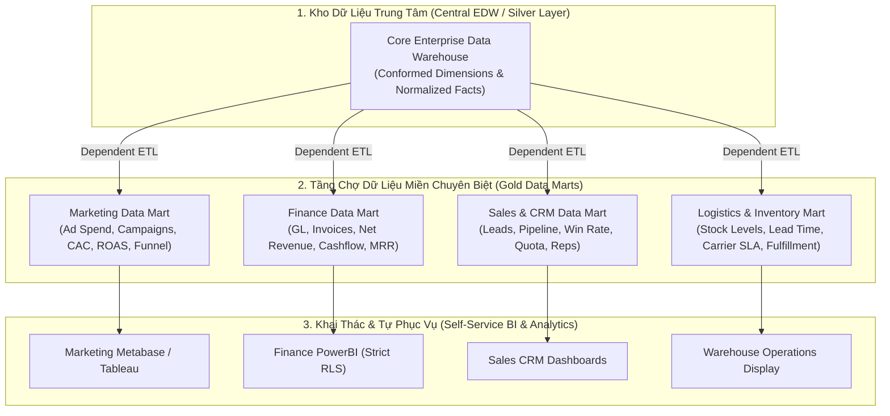

## Đề bài kinh doanh / Yêu cầu dữ liệu

Khi doanh nghiệp phát triển vượt qua quy mô ban đầu, Kho dữ liệu doanh nghiệp trung tâm (Enterprise Data Warehouse - EDW) bắt đầu bộc lộ những rào cản nghiêm trọng về mặt tổ chức và vận hành:

1. **Hiện tượng Nghẽn cổ chai Đội Dữ liệu Tập trung (Centralized Team Bottleneck):** Toàn bộ các phòng ban nghiệp vụ (Marketing, Tài chính, Bán hàng, Chuỗi cung ứng, Nhân sự) đều xếp hàng gửi yêu cầu thay đổi báo cáo về cho một đội Data Engineer duy nhất. Chu kỳ triển khai một chỉ số mới kéo dài từ vài tuần đến vài tháng, làm chậm nhịp độ ra quyết định kinh doanh.
2. **Sự Bất đồng Ngữ nghĩa Chỉ số (Metric Discrepancy & Conflict):** Phòng Marketing tính Doanh thu dựa trên tổng giá trị đơn hàng được đặt (Gross Merchandise Value - GMV); Phòng Bán hàng tính theo đơn hàng đã giao thành công; Phòng Tài chính tính theo dòng tiền thực tế đã ghi nhận qua cổng thanh toán sau khi trừ chiết khấu và hoàn tiền. Kết quả là các giám đốc bộ phận bước vào phòng họp với những con số báo cáo hoàn toàn mâu thuẫn.
3. **Khủng hoảng Phân quyền & Bảo mật Dữ liệu Nhạy cảm (Data Governance & RBAC):** Dữ liệu lương thưởng của phòng Nhân sự hoặc báo cáo lãi lỗ chi tiết của phòng Tài chính không thể mở quyền truy cập chung trên toàn bộ kho EDW, đòi hỏi cơ chế kiểm soát truy cập phân tầng nghiêm ngặt theo từng miền nghiệp vụ (Domain-based Access Control).
4. **Hiệu năng Truy vấn Suy giảm trên Kho Dữ liệu Khổng lồ:** Việc quét qua toàn bộ các bảng Fact tổng hợp hàng tỷ dòng của toàn công ty chỉ để phục vụ một báo cáo hiệu quả chiến dịch quảng cáo cục bộ gây lãng phí chi phí điện toán đám mây và làm tăng độ trễ truy vấn.

**Khái niệm & Mục tiêu Cốt lõi của Data Mart:**

**Data Mart (Chợ Dữ liệu)** là một phân vùng hoặc một cơ sở dữ liệu chuyên biệt được trích xuất, tối ưu hóa và tổ chức riêng cho một phòng ban hoặc một quy trình nghiệp vụ cụ thể. Mục tiêu hàng đầu của Data Mart là mang lại _dữ liệu sạch, sẵn sàng khai thác (Curated & Analytics-Ready)_, bảo đảm tính tự phục vụ (Self-Service Analytics) cho các nhà phân tích dữ liệu miền (Domain Data Analysts) với tốc độ phản hồi tính bằng mili-giây.

## Mô hình hóa dữ liệu

Để thiết kế Data Mart thành công, kỹ sư dữ liệu cần nắm vững 3 mô hình kiến trúc cốt lõi và lựa chọn cấu trúc bảng phù hợp cho từng mục đích sử dụng.

**1. Ba Mô hình Kiến trúc Data Mart Kinh điển:**

<table style="width:100%; border-collapse: collapse; margin-bottom: 20px;">
  <thead>
    <tr style="border-bottom: 2px solid #e2e8f0; text-align: left;">
      <th style="padding: 8px;">Loại Data Mart</th>
      <th style="padding: 8px;">Nguồn Dữ Liệu</th>
      <th style="padding: 8px;">Ưu Điểm Cốt Lõi</th>
      <th style="padding: 8px;">Rủi Ro & Hạn Chế</th>
    </tr>
  </thead>
  <tbody>
    <tr style="border-bottom: 1px solid #edf2f7;">
      <td style="padding: 8px; font-weight: bold;">Dependent Data Mart (Phụ thuộc)</td>
      <td style="padding: 8px;">Trích xuất 100% từ Enterprise Data Warehouse (EDW) trung tâm</td>
      <td style="padding: 8px;">Đảm bảo tính nhất quán tuyệt đối, một nguồn chân lý (Single Source of Truth), quản trị dữ liệu chặt chẽ</td>
      <td style="padding: 8px;">Phụ thuộc vào tiến độ xây dựng kho EDW, chi phí vận hành cao hơn</td>
    </tr>
    <tr style="border-bottom: 1px solid #edf2f7;">
      <td style="padding: 8px; font-weight: bold">Independent Data Mart (Độc lập)</td>
      <td style="padding: 8px;">Nạp trực tiếp từ các CSDL ứng dụng nguồn (OLTP, CRM, APIs)</td>
      <td style="padding: 8px;">Triển khai siêu nhanh, độc lập hoàn toàn, giải quyết tức thì nhu cầu cấp bách của phòng ban</td>
      <td style="padding: 8px;">Tạo ra các 'ốc đảo dữ liệu' (Data Silos), xung đột định nghĩa chỉ số, bảo trì pipeline phức tạp hình mạng nhện</td>
    </tr>
    <tr style="border-bottom: 1px solid #edf2f7;">
      <td style="padding: 8px; font-weight: bold">Hybrid Data Mart (Lai)</td>
      <td style="padding: 8px;">Kết hợp giữa kho EDW trung tâm và các nguồn dữ liệu bổ trợ ngoài (External Ad-hoc Data)</td>
      <td style="padding: 8px;">Cân bằng hoàn hảo giữa tính nhất quán chuẩn mực và độ linh hoạt thích ứng nhanh với dữ liệu mới</td>
      <td style="padding: 8px;">Đòi hỏi thiết lập quy trình kiểm thử và hòa giải dữ liệu (Data Reconciliation) tự động</td>
    </tr>
  </tbody>
</table>

**2. Sơ đồ Kiến trúc Phân phối Data Marts Chuẩn mực (Kimball Bus & Medallion Architecture):**



**3. Lựa chọn Mô hình Bảng trong Data Mart: Star Schema vs One Big Table (OBT):**

- **Mô hình Star Schema:** Gồm Bảng Fact ở giữa nối với các Bảng Conformed Dimension (như `dim_date`, `dim_customer`). _Phù hợp khi:_ Data Mart cần phục vụ nhiều góc nhìn phân tích linh hoạt và tái sử dụng các chiều dữ liệu chung trên toàn công ty.
- **Mô hình One Big Table (OBT - Bảng Phẳng Siêu Rộng):** Thực hiện denormalize toàn bộ Fact và Dimension thành một bảng duy nhất chứa từ 50 đến 200 cột. _Phù hợp khi:_ Data Mart phục vụ trực tiếp cho các công cụ BI hiện đại (PowerBI DirectQuery, ClickHouse, Apache Superset) để đạt tốc độ truy vấn tức thì mà không cần bất kỳ phép JOIN nào trong thời gian chạy.

## Xây dựng Pipeline / Script xử lý

Để minh họa cách xây dựng một Data Mart theo chuẩn hiện đại, dưới đây là mã nguồn **dbt (data build tool)** xây dựng **Marketing Performance Data Mart** kết hợp dữ liệu chi phí quảng cáo (Google/Facebook Ads) với dữ liệu chuyển đổi đơn hàng từ kho trung tâm để tự động tính toán các chỉ số cốt lõi: Chi phí thu hút khách hàng (CAC), Lợi tức trên chi phí quảng cáo (ROAS) và Tỷ lệ chuyển đổi phễu.

**1. dbt Model: Xây dựng Marketing Performance Data Mart (`marts_marketing_roi.sql`):**

```sql
-- models/gold/marts/marketing/marts_marketing_roi.sql
{{
    config(
        materialized='table',
        schema='marketing_mart',
        cluster_by=['campaign_date', 'channel'],
        tags=['marketing', 'daily_marts']
    )
}}

WITH daily_ad_spend AS (
    -- Dữ liệu chi phí quảng cáo theo kênh từ Staging
    SELECT
        ad_date AS campaign_date,
        channel, -- 'google_ads', 'facebook_ads', 'tiktok_ads'
        campaign_id,
        campaign_name,
        SUM(spend_amount) AS total_spend,
        SUM(impressions) AS total_impressions,
        SUM(clicks) AS total_clicks
    FROM {{ ref('stg_marketing_ad_spend') }}
    GROUP BY ad_date, channel, campaign_id, campaign_name
),

daily_orders_attributed AS (
    -- Dữ liệu doanh thu và khách hàng mới từ Fact Orders trung tâm
    SELECT
        CAST(f.order_timestamp AS DATE) AS campaign_date,
        f.utm_channel AS channel,
        f.utm_campaign_id AS campaign_id,
        COUNT(DISTINCT f.order_id) AS attributed_orders,
        COUNT(DISTINCT CASE WHEN c.is_first_order = TRUE THEN f.customer_key END) AS new_customers_acquired,
        SUM(f.net_amount) AS attributed_revenue
    FROM {{ ref('fact_orders') }} f
    INNER JOIN {{ ref('dim_customers') }} c ON f.customer_key = c.customer_key
    WHERE f.order_status = 'COMPLETED'
    GROUP BY CAST(f.order_timestamp AS DATE), f.utm_channel, f.utm_campaign_id
)

SELECT
    -- Khóa định danh dòng Data Mart
    MD5(s.campaign_date || '-' || s.channel || '-' || s.campaign_id) AS marketing_mart_key,
    s.campaign_date,
    s.channel,
    s.campaign_id,
    s.campaign_name,

    -- Các chỉ số đầu vào (Inputs)
    s.total_spend,
    s.total_impressions,
    s.total_clicks,
    COALESCE(o.attributed_orders, 0) AS attributed_orders,
    COALESCE(o.new_customers_acquired, 0) AS new_customers_acquired,
    COALESCE(o.attributed_revenue, 0) AS attributed_revenue,

    -- Các chỉ số nghiệp vụ tính toán sẵn (Pre-computed Semantic KPIs)
    ROUND(s.total_clicks / NULLIF(s.total_impressions, 0) * 100, 2) AS ctr_pct, -- Click-Through Rate
    ROUND(s.total_spend / NULLIF(s.total_clicks, 0), 2) AS cpc_amount, -- Cost Per Click
    ROUND(s.total_spend / NULLIF(o.new_customers_acquired, 0), 2) AS cac_amount, -- Customer Acquisition Cost
    ROUND(COALESCE(o.attributed_revenue, 0) / NULLIF(s.total_spend, 0), 2) AS roas_ratio -- Return On Ad Spend
FROM daily_ad_spend s
LEFT JOIN daily_orders_attributed o
    ON s.campaign_date = o.campaign_date
    AND s.channel = o.channel
    AND s.campaign_id = o.campaign_id;
```

**2. Thiết lập Bảo mật Cấp dòng (Row-Level Security - RLS) trên Data Mart Tài chính:**

Đảm bảo quản lý chi nhánh chỉ được xem số liệu thuộc vùng của mình, trong khi Giám đốc Tài chính (CFO) xem được toàn quốc:

```sql
-- Tạo chính sách bảo mật Row-Level Security trên Snowflake Data Mart
CREATE OR REPLACE ROW ACCESS POLICY finance_region_policy
AS (region_name VARCHAR) RETURNS BOOLEAN ->
  CURRENT_ROLE() IN ('FINANCE_CFO_ROLE', 'EXECUTIVE_ADMIN')
  OR (CURRENT_ROLE() = 'NORTH_MANAGER_ROLE' AND region_name = 'NORTH')
  OR (CURRENT_ROLE() = 'SOUTH_MANAGER_ROLE' AND region_name = 'SOUTH');

-- Áp dụng chính sách lên bảng Data Mart Tài chính
ALTER TABLE finance_mart.marts_branch_pnl
ADD ROW ACCESS POLICY finance_region_policy ON (region_code);
```

## Kiểm thử dữ liệu & Tối ưu hiệu năng

Để đảm bảo các Data Mart hoạt động chuẩn xác, không bị 'lệch pha' số liệu với Kho trung tâm và đạt hiệu năng tối đa, Data Engineer cần triển khai các chiến lược sau:

**1. Kiểm thử Hòa giải Dữ liệu Liên Data Mart (Cross-Mart Reconciliation Testing):**

- Một trong những lỗi nghiêm trọng nhất là tổng doanh thu trên Finance Data Mart bị lệch so với Sales Data Mart. Ta thiết lập bài kiểm thử tự động (Reconciliation Assertions) chạy hàng ngày:

```sql
-- tests/reconciliation_finance_vs_sales_revenue.sql
-- Bài kiểm thử trả về 0 dòng nếu số liệu khớp hoàn toàn
WITH fin_rev AS (
    SELECT SUM(net_revenue) AS total_fin FROM {{ ref('marts_finance_revenue') }}
    WHERE report_date = CURRENT_DATE() - 1
),
sales_rev AS (
    SELECT SUM(gross_amount - discount_amount) AS total_sales FROM {{ ref('marts_sales_orders') }}
    WHERE order_date = CURRENT_DATE() - 1
)
SELECT
    f.total_fin,
    s.total_sales,
    ABS(f.total_fin - s.total_sales) AS discrepancy
FROM fin_rev f, sales_rev s
WHERE ABS(f.total_fin - s.total_sales) > 0.01; -- Báo động đỏ nếu lệch quá 1 cent
```

**2. Kỹ thuật Tối ưu hóa Hiệu năng Truy vấn Cho Tự phục vụ (Self-Service BI):**

- **Tạo sẵn Bảng Tóm tắt Tổng hợp (Aggregate Tables / Materialized Views):** Đối với các dashboard điều hành chỉ xem số liệu theo tháng hoặc theo năm, tạo các bảng Pre-aggregated Marts giúp giảm 99% thời gian truy vấn so với quét bảng chi tiết hàng ngày.
- **Tận dụng Cơ chế Caching & Semantic Layer:** Sử dụng các công cụ như _Cube.js_ hoặc _dbt Semantic Layer_ ở phía trước Data Mart để lưu kết quả truy vấn vào bộ nhớ đệm (In-memory Cache), giúp các Dashboard tải tức thì dưới 100ms.

**3. Bảng Ma trận So sánh Hiệu năng & Chi phí Vận hành:**

<table style="width:100%; border-collapse: collapse; margin-bottom: 20px;">
  <thead>
    <tr style="border-bottom: 2px solid #e2e8f0; text-align: left;">
      <th style="padding: 8px;">Phương Pháp Khai Thác</th>
      <th style="padding: 8px;">Thời Gian Tải Dashboard (p95)</th>
      <th style="padding: 8px;">Mức Độ Nhất Quán Dữ Liệu</th>
      <th style="padding: 8px;">Mức Độ Tự Phục Vụ (Self-Service)</th>
    </tr>
  </thead>
  <tbody>
    <tr style="border-bottom: 1px solid #edf2f7;">
      <td style="padding: 8px; font-weight: bold">Truy vấn Trực tiếp vào Kho EDW Thô</td>
      <td style="padding: 8px;">18,400ms (18.4s)</td>
      <td style="padding: 8px;">Cao nhưng truy vấn rất phức tạp</td>
      <td style="padding: 8px;">Rất thấp (Bắt buộc phải có Data Engineer hỗ trợ)</td>
    </tr>
    <tr style="border-bottom: 1px solid #edf2f7;">
      <td style="padding: 8px; font-weight: bold">Independent Data Marts (Ốc đảo)</td>
      <td style="padding: 8px;">650ms</td>
      <td style="padding: 8px;">Rất thấp (Xung đột định nghĩa số liệu)</td>
      <td style="padding: 8px;">Trung bình (Mỗi team tự làm theo cách riêng)</td>
    </tr>
    <tr style="border-bottom: 1px solid #edf2f7;">
      <td style="padding: 8px; font-weight: bold">Dependent Star / OBT Data Marts</td>
      <td style="padding: 8px; font-weight: bold">45ms</td>
      <td style="padding: 8px;"><span style="font-weight: bold">Tuyệt đối 100%</span> (Single Source of Truth)</td>
      <td style="padding: 8px;"><span style="font-weight: bold">Rất cao</span> (Data Analyst tự kéo thả báo cáo)</td>
    </tr>
  </tbody>
</table>

## Tổng kết & Khuyến nghị

Data Mart là cây cầu nối thiết yếu giúp chuyển hóa sức mạnh tính toán đồ sộ của Kho dữ liệu thành giá trị nghiệp vụ thực tế cho từng phòng ban.

**Khuyến nghị Hành động Dành cho Đội ngũ Dữ liệu Doanh nghiệp:**

1. **Tuyệt đối Ưu tiên Kiến trúc Dependent Data Mart:** Luôn xây dựng Data Mart xuất phát từ tầng dữ liệu đã được chuẩn hóa (Conformed Silver/EDW). Tránh xa cám dỗ xây dựng Independent Data Marts chắp vá dẫn đến thảm họa xung đột số liệu về sau.
2. **Định nghĩa Thống nhất Chỉ số tại Tầng Semantic Layer:** Không để logic tính toán (ví dụ: công thức tính CAC, LTV, Churn) nằm rải rác trong từng báo cáo BI của từng cá nhân. Hãy đóng gói chúng vào code dbt hoặc Semantic Layer chung.
3. **Phân quyền Theo Miền Nghiệp vụ (Data Mesh Mindset):** Trao quyền sở hữu và khai thác Data Mart cho các Domain Data Analysts của từng phòng ban, trong khi đội ngũ Data Engineer trung tâm tập trung vào việc bảo đảm hạ tầng, chất lượng dữ liệu nền tảng và SLA pipeline.
4. **Tự động hóa Kiểm thử Đối soát Hàng ngày:** Luôn cài đặt các bài test đối soát số liệu chéo (Cross-mart reconciliation tests) để phát hiện sớm mọi sự sai lệch trước khi dữ liệu xuất hiện trên bàn của ban điều hành.

**Lời kết:** _Một hệ thống Data Mart thành công là khi các nhà phân tích nghiệp vụ có thể tự tin tạo ra các báo cáo chính xác chỉ trong vài phút, còn các lãnh đạo doanh nghiệp có thể hoàn toàn tin tưởng vào từng con số được trình bày!_
