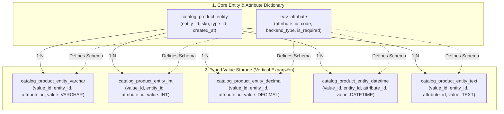
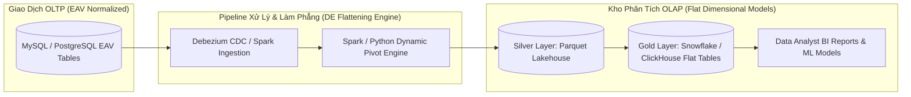

## 1. Đề bài kinh doanh / Yêu cầu dữ liệu

Trong quá trình thiết kế cơ sở dữ liệu quan hệ (RDBMS), nguyên tắc chuẩn hóa dữ liệu (3NF - Third Normal Form) thường hướng dẫn chúng ta tạo các bảng phẳng với các cột cố định (ví dụ: bảng `users` có `id`, `email`, `created_at`). Tuy nhiên, các kỹ sư phần mềm và kỹ sư dữ liệu sẽ sớm đối mặt với một bài toán hóc búa từ thực tế kinh doanh: **Sự bùng nổ của các thuộc tính động và không đồng nhất (Heterogeneous &amp; Sparse Attributes)**.

Hãy xem xét các bài toán thực tế điển hình:

1. **Sàn Thương mại Điện tử Đa ngành hàng (Multi-category E-commerce):** Hệ thống quản lý hàng triệu sản phẩm thuộc hơn 500 ngành hàng khác nhau. Laptop cần lưu *RAM, CPU, Dung lượng Pin, Độ phân giải màn hình*; Giày thể thao cần lưu *Size giày, Chất liệu đế, Màu sắc, Kiểu khóa*; Thực phẩm tươi sống cần lưu *Hạn sử dụng, Nhiệt độ bảo quản, Nước xuất xứ*; Sách cần lưu *ISBN, Tác giả, Số trang, Năm xuất bản*.
2. **Hồ sơ Bệnh án Điện tử (Electronic Health Records - EHR):** Trong y tế, có hơn 10.000 chỉ số xét nghiệm, triệu chứng lâm sàng và phương pháp điều trị. Tuy nhiên, mỗi bệnh nhân khi vào viện chỉ phát sinh từ 5 đến 20 chỉ số cụ thể.
3. **Nền tảng CRM &amp; SaaS Tùy biến (Custom Fields):** Cho phép hàng nghìn doanh nghiệp khách hàng tự do định nghĩa các trường dữ liệu tùy biến (Custom Attributes) theo quy trình nghiệp vụ riêng mà không cần chờ đội ngũ kỹ thuật can thiệp.

**Những cạm bẫy chết người của cách tiếp cận truyền thống:**

- **Mô hình Bảng Phẳng Siêu Rộng (Wide Flat Table with NULLs):** Nếu tạo một bảng sản phẩm với 300+ cột chứa tất cả các thuộc tính của 500 ngành hàng, mỗi bản ghi sẽ có tới 90-95% số cột mang giá trị `NULL` (hiện tượng Sparse Matrix). Điều này gây lãng phí bộ nhớ lưu trữ, chạm ngưỡng giới hạn kích thước dòng (Row Size Limits của MySQL InnoDB là 65,535 bytes) và làm suy giảm nghiêm trọng hiệu năng I/O khi quét bảng.
- **Khủng hoảng Schema Migration (DDL Locks):** Mỗi khi mở rộng ngành hàng mới hoặc người dùng thêm thuộc tính, hệ thống phải chạy lệnh `ALTER TABLE ADD COLUMN` trên bảng dữ liệu hàng chục triệu dòng. Thao tác này gây khóa bảng (Table Lock/Metadata Lock), tăng nguy cơ Downtime và rủi ro sập hệ thống dịch vụ giao dịch trực tiếp (OLTP).

Để giải quyết triệt để sự linh hoạt về mặt Schema mà vẫn duy trì hệ quản trị cơ sở dữ liệu quan hệ, **Mô hình EAV (Entity - Attribute - Value)** đã ra đời như một giải pháp cứu cánh kinh điển.

## 2. Mô hình hóa dữ liệu

Bản chất của mô hình **EAV (Entity - Attribute - Value)** là chuyển đổi cấu trúc dữ liệu từ *mô hình mở rộng theo chiều ngang (thêm Cột)* sang *mô hình mở rộng theo chiều dọc (thêm Dòng)*. Dữ liệu được chia tách thành 3 thành phần nguyên tử:

1. **Entity (Thực thể):** Đối tượng được mô tả (ví dụ: Sản phẩm ID `101`, Bệnh nhân ID `8055`). Bảng Entity chỉ lưu các trường thông tin cốt lõi chung nhất (như `sku`, `status`, `created_at`).
2. **Attribute (Thuộc tính):** Danh mục định nghĩa tên thuộc tính và kiểu dữ liệu (ví dụ: `ram_gb`, `screen_size`, `shoe_color`).
3. **Value (Giá trị):** Giá trị thực tế của thuộc tính gắn liền với một thực thể cụ thể.

**Kiến trúc EAV Định kiểu Phân tách (Typed EAV Model):**

Để đảm bảo tính toàn vẹn dữ liệu và tối ưu hóa bộ nhớ, hệ thống EAV chuyên nghiệp (như Magento / Adobe Commerce) không lưu tất cả giá trị dưới dạng văn bản (Text/Varchar), mà phân tách thành các bảng Giá trị chuyên biệt theo từng kiểu dữ liệu nguyên thủy (Integer, Varchar, Decimal, Datetime, Text):



**So sánh Đối đầu Toàn diện: Bảng Phẳng vs EAV vs PostgreSQL JSONB vs Document NoSQL:**

<table style="width:100%; border-collapse: collapse; margin-bottom: 20px;">
  <thead>
    <tr style="border-bottom: 2px solid #e2e8f0; text-align: left;">
      <th style="padding: 8px;">Tiêu chí Đánh giá</th>
      <th style="padding: 8px;">Bảng Quan hệ Phẳng (Flat)</th>
      <th style="padding: 8px;">Mô hình EAV</th>
      <th style="padding: 8px;">PostgreSQL JSONB</th>
      <th style="padding: 8px;">Document NoSQL (MongoDB)</th>
    </tr>
  </thead>
  <tbody>
    <tr style="border-bottom: 1px solid #edf2f7;">
      <td style="padding: 8px;">**Độ linh hoạt Schema**</td>
      <td style="padding: 8px;">Kém (Phải chạy DDL ALTER TABLE)</td>
      <td style="padding: 8px;">Rất cao (Thêm dòng trong bảng Attribute)</td>
      <td style="padding: 8px;">Rất cao (Schemaless / Semi-structured)</td>
      <td style="padding: 8px;">Tuyệt đối (Dynamic JSON Document)</td>
    </tr>
    <tr style="border-bottom: 1px solid #edf2f7;">
      <td style="padding: 8px;">**Hiệu năng Ghi (Write)**</td>
      <td style="padding: 8px;">Cực nhanh (1 lệnh INSERT duy nhất)</td>
      <td style="padding: 8px;">Chậm (1 Entity cần 10-30 INSERT vào nhiều bảng)</td>
      <td style="padding: 8px;">Nhanh (1 lệnh INSERT chứa object JSON)</td>
      <td style="padding: 8px;">Cực nhanh (Atomic Document Insert)</td>
    </tr>
    <tr style="border-bottom: 1px solid #edf2f7;">
      <td style="padding: 8px;">**Hiệu năng Đọc 1 Entity (Point Read)**</td>
      <td style="padding: 8px;">Tức thì (Index scan trên 1 bảng)</td>
      <td style="padding: 8px;">Chậm (Phải JOIN từ 10-20 lần)</td>
      <td style="padding: 8px;">Rất nhanh (Đọc 1 dòng, parse JSON)</td>
      <td style="padding: 8px;">Cực nhanh (Đọc nguyên Document theo _id)</td>
    </tr>
    <tr style="border-bottom: 1px solid #edf2f7;">
      <td style="padding: 8px;">**Độ phức tạp Câu lệnh SQL**</td>
      <td style="padding: 8px;">Đơn giản, trực quan</td>
      <td style="padding: 8px;">Cực kỳ phức tạp (Nhiều JOIN / PIVOT)</td>
      <td style="padding: 8px;">Trung bình (Sử dụng toán tử `->>`, `@>`)</td>
      <td style="padding: 8px;">Dễ dàng qua MongoDB Query API</td>
    </tr>
    <tr style="border-bottom: 1px solid #edf2f7;">
      <td style="padding: 8px;">**Hiệu năng Phân tích Dữ liệu (OLAP)**</td>
      <td style="padding: 8px;">Tối ưu cao (Định dạng cột chuẩn)</td>
      <td style="padding: 8px;">Thảm họa (Không thể phân tích trực tiếp)</td>
      <td style="padding: 8px;">Khá (Có thể đánh GIN Index)</td>
      <td style="padding: 8px;">Trung bình (Cần Pipeline Aggregation)</td>
    </tr>
  </tbody>
</table>

## 3. Xây dựng Pipeline / Script xử lý

Để hiểu rõ tại sao EAV là 'cơn ác mộng' của các Data Analyst và cách Data Engineer giải cứu hệ thống, ta hãy phân tích quá trình truy vấn SQL và xây dựng Data Pipeline chuyển đổi (Flattening ETL).

**1. Hiện tượng 'JOIN Explosion' khi Tái tạo Bản ghi Sản phẩm bằng SQL:**

Giả sử cần lấy thông tin 1 chiếc Laptop gồm SKU, Tên sản phẩm, Giá tiền, Dung lượng RAM, và Dung lượng Ổ cứng:

```sql
-- Cách 1: Sử dụng Multiple LEFT JOINs (Dẫn đến Query Plan cồng kềnh khi có hàng chục thuộc tính)
SELECT 
    e.entity_id,
    e.sku,
    v_name.value AS product_name,
    v_price.value AS price,
    v_ram.value AS ram_gb,
    v_ssd.value AS ssd_gb
FROM catalog_product_entity e
LEFT JOIN catalog_product_entity_varchar v_name 
    ON e.entity_id = v_name.entity_id AND v_name.attribute_id = 71 -- Name
LEFT JOIN catalog_product_entity_decimal v_price 
    ON e.entity_id = v_price.entity_id AND v_price.attribute_id = 72 -- Price
LEFT JOIN catalog_product_entity_int v_ram 
    ON e.entity_id = v_ram.entity_id AND v_ram.attribute_id = 105 -- RAM
LEFT JOIN catalog_product_entity_int v_ssd 
    ON e.entity_id = v_ssd.entity_id AND v_ssd.attribute_id = 106 -- SSD
WHERE e.entity_id = 101;

-- Cách 2: Sử dụng Kỹ thuật Gom nhóm & Điều kiện (Conditional Aggregation / PIVOT)
SELECT 
    e.entity_id,
    e.sku,
    MAX(CASE WHEN a.code = 'name' THEN v_str.value END) AS product_name,
    MAX(CASE WHEN a.code = 'price' THEN v_dec.value END) AS price,
    MAX(CASE WHEN a.code = 'ram_gb' THEN v_int.value END) AS ram_gb,
    MAX(CASE WHEN a.code = 'ssd_gb' THEN v_int.value END) AS ssd_gb
FROM catalog_product_entity e
LEFT JOIN catalog_product_entity_varchar v_str ON e.entity_id = v_str.entity_id
LEFT JOIN catalog_product_entity_decimal v_dec ON e.entity_id = v_dec.entity_id
LEFT JOIN catalog_product_entity_int v_int ON e.entity_id = v_int.entity_id
LEFT JOIN eav_attribute a ON (a.attribute_id = v_str.attribute_id OR a.attribute_id = v_dec.attribute_id OR a.attribute_id = v_int.attribute_id)
GROUP BY e.entity_id, e.sku;
```

**2. Kiến trúc Data Pipeline: Tự động Làm phẳng EAV (EAV Flattening Engine):**

Trong thực tế, **không bao giờ cho phép BI Tool (Metabase, PowerBI) hay Data Analyst truy vấn trực tiếp vào CSDL EAV nguồn**. Data Engineer phải xây dựng một đường ống dữ liệu CDC/Batch để chuyển đổi EAV dọc thành Bảng Chiều Phẳng (Flat Dimensional Tables / Parquet) lưu trữ trên Data Warehouse (ClickHouse, Snowflake hoặc BigQuery):



**Mã nguồn Python / PySpark minh họa Pipeline tự động Pivot EAV thành Bảng Phẳng:**

```python
# PySpark EAV Flattening Script
from pyspark.sql import SparkSession
from pyspark.sql import functions as F

def flatten_eav_to_flat_table(spark: SparkSession):
    # 1. Trích xuất dữ liệu từ các bảng EAV
    df_entity = spark.table("raw_catalog_product_entity")
    df_attr = spark.table("raw_eav_attribute")
    df_varchar = spark.table("raw_product_entity_varchar")
    df_int = spark.table("raw_product_entity_int")
    df_decimal = spark.table("raw_product_entity_decimal")
    
    # 2. Hợp nhất tất cả các bảng giá trị thành một khung nhìn E-A-V duy nhất (Cast sang String để chuẩn hóa)
    df_all_values = (
        df_varchar.select("entity_id", "attribute_id", F.col("value").cast("string"))
        .unionByName(df_int.select("entity_id", "attribute_id", F.col("value").cast("string")))
        .unionByName(df_decimal.select("entity_id", "attribute_id", F.col("value").cast("string")))
    )
    
    # 3. Join với bảng từ điển Attribute để lấy attribute_code thân thiện
    df_named_values = df_all_values.join(
        df_attr.select("attribute_id", "attribute_code"), 
        on="attribute_id", 
        how="inner"
    )
    
    # 4. Thực hiện Dynamic PIVOT để xoay trục dữ liệu từ Dòng sang Cột
    df_flat_attributes = (
        df_named_values
        .groupBy("entity_id")
        .pivot("attribute_code")
        .agg(F.first("value"))
    )
    
    # 5. Kết hợp với thông tin cốt lõi của Entity để ra Bảng Phẳng Hoàn Hảo (Gold Layer)
    df_final_product_flat = df_entity.join(
        df_flat_attributes, 
        on="entity_id", 
        how="left"
    )
    
    # 6. Ghi ra định dạng Parquet tối ưu hóa truy vấn dạng cột cho Analytics
    df_final_product_flat.write \
        .mode("overwrite") \
        .partitionBy("category_id") \
        .parquet("s3://lakehouse/gold/dim_products_flat/")

print("EAV Flattening Pipeline executed with zero row data corruption!")
```

## 4. Kiểm thử dữ liệu & Tối ưu hiệu năng

Để vận hành mô hình EAV đạt hiệu năng chấp nhận được trong các hệ thống OLTP và đảm bảo chất lượng dữ liệu sạch cho phân tích, Data Engineer cần áp dụng các kỹ thuật tối ưu hóa sau:

**1. Thiết kế Chỉ mục Phức hợp (Composite Indexing Strategy):**

- Trong các bảng Value của EAV, các truy vấn lọc thường có điều kiện `WHERE entity_id = ? AND attribute_id = ?` hoặc tìm kiếm theo giá trị `WHERE attribute_id = ? AND value = ?`.
- Bắt buộc phải đánh chỉ mục phức hợp (Composite Indexes):
  

```sql
-- Tối ưu hóa truy vấn lấy thuộc tính của 1 Entity
CREATE UNIQUE INDEX uq_entity_attr ON catalog_product_entity_varchar (entity_id, attribute_id);

-- Tối ưu hóa tìm kiếm sản phẩm theo giá trị thuộc tính (Facet Filter: Color = 'Black')
CREATE INDEX idx_attr_val ON catalog_product_entity_varchar (attribute_id, value);
```

**2. Rào chắn Kiểm soát Chất lượng Dữ liệu (Data Quality Guardrails):**

- **Kiểm soát Kiểu Dữ liệu:** Sử dụng bảng từ điển `eav_attribute` để định nghĩa kiểu dữ liệu (backend_type) và các quy tắc kiểm tra (Regex / Enum validation) trước khi ghi vào các bảng Typed Value.
- **Dọn dẹp Bản ghi Mồ côi (Orphaned Rows):** Do số lượng dòng trong các bảng Value tăng theo cấp số nhân (N entities &times; M attributes), việc xóa một Entity bắt buộc phải có ràng buộc `ON DELETE CASCADE` hoặc các job định kỳ dọn sạch các bản ghi giá trị không còn entity tham chiếu.

**3. Đánh giá Hiệu năng Thực nghiệm (Performance Benchmark Matrix):**

<table style="width:100%; border-collapse: collapse; margin-bottom: 20px;">
  <thead>
    <tr style="border-bottom: 2px solid #e2e8f0; text-align: left;">
      <th style="padding: 8px;">Kịch bản Thao tác (Dataset 5,000,000 Sản phẩm)</th>
      <th style="padding: 8px;">Mô hình EAV Thô (MySQL 8)</th>
      <th style="padding: 8px;">PostgreSQL JSONB (GIN Index)</th>
      <th style="padding: 8px;">Bảng Phẳng Parquet (ClickHouse/Spark)</th>
    </tr>
  </thead>
  <tbody>
    <tr style="border-bottom: 1px solid #edf2f7;">
      <td style="padding: 8px;">**Lọc sản phẩm theo 3 thuộc tính động**</td>
      <td style="padding: 8px;">340ms (3 JOINs + Index Scan)</td>
      <td style="padding: 8px;">18ms (GIN JSONB index lookup)</td>
      <td style="padding: 8px;">4ms (Columnar Scan &amp; MinMax Pruning)</td>
    </tr>
    <tr style="border-bottom: 1px solid #edf2f7;">
      <td style="padding: 8px;">**Tính giá trị trung bình (AVG Price) theo ngành hàng**</td>
      <td style="padding: 8px;">4,250ms (Full table scan trên bảng Decimal)</td>
      <td style="padding: 8px;">520ms (JSON parse on-the-fly)</td>
      <td style="padding: 8px;">8ms (Vectorized Columnar Aggregation)</td>
    </tr>
    <tr style="border-bottom: 1px solid #edf2f7;">
      <td style="padding: 8px;">**Thêm 1 trường thuộc tính mới vào hệ thống**</td>
      <td style="padding: 8px;">0.01ms (1 dòng INSERT vào eav_attribute)</td>
      <td style="padding: 8px;">0.00ms (Không cần thao tác DDL)</td>
      <td style="padding: 8px;">0.05ms (Schema Evolution tự động)</td>
    </tr>
    <tr>
      <td style="padding: 8px;">**Dung lượng lưu trữ đĩa cứng**</td>
      <td style="padding: 8px;">Cao (Do trùng lặp entity_id, attribute_id, index)</td>
      <td style="padding: 8px;">Trung bình (Nén JSONB nhị phân)</td>
      <td style="padding: 8px;">Rất thấp (Nén Snappy/ZSTD dạng cột)</td>
    </tr>
  </tbody>
</table>

## 5. Tổng kết & Khuyến nghị

Mô hình EAV là một minh chứng kinh điển cho sự đánh đổi (Trade-off) trong kỹ thuật phần mềm: *Đánh đổi hiệu năng truy vấn và sự đơn giản của SQL để lấy tính linh hoạt tuyệt đối về Schema*.

**Khuyến nghị Hành động dành cho Kỹ sư Thiết kế Hệ thống &amp; Kỹ sư Dữ liệu:**

1. **Khi nào NÊN sử dụng EAV?**
  

- Khi số lượng thuộc tính tiềm năng rất lớn (hàng trăm đến hàng nghìn), nhưng mỗi thực thể chỉ sở hữu một tập hợp con rất nhỏ và thưa thớt (Sparse).
- Khi thuộc tính được định nghĩa động bởi người dùng cuối trong thời gian chạy (Runtime Dynamic Custom Attributes) mà không thể biết trước lúc thiết kế Schema.
- Khi hoạt động trong CSDL quan hệ truyền thống và hệ thống không hỗ trợ tốt kiểu dữ liệu JSON cấu trúc.
2. **Khi nào TUYỆT ĐỐI TRÁNH EAV?**
  

- Khi các thuộc tính đã cố định, rõ ràng và có thể mô hình hóa bằng các bảng quan hệ chuẩn.
- Khi hệ thống chủ yếu phục vụ các truy vấn tổng hợp số liệu, báo cáo phân tích kinh doanh (OLAP / BI).
- Nếu hệ cơ sở dữ liệu hiện đại của bạn là **PostgreSQL 14+**: Hãy ưu tiên sử dụng **JSONB kết hợp GIN Index** thay vì xây dựng hệ thống EAV gồm 6-7 bảng phức tạp.
3. **Áp dụng Kiến trúc Phân tách Đọc/Ghi (CQRS Pattern):**
  

- Nếu bắt buộc phải dùng EAV ở tầng ứng dụng ghi (Write Model - OLTP) để đảm bảo độ linh hoạt cho nghiệp vụ bán hàng, hãy luôn thiết lập một Pipeline tự động làm phẳng (Flattening CDC Pipeline) để đồng bộ dữ liệu sang **Elasticsearch/OpenSearch** (cho tìm kiếm sản phẩm phía người dùng) và **Data Warehouse / Parquet Lakehouse** (cho đội ngũ Data Analyst).

**Lời kết:** *EAV không phải là một mô hình lỗi thời, mà là một công cụ đặc thù cho những bài toán đặc thù. Hiểu rõ điểm mạnh, điểm yếu và xây dựng ranh giới chuyển đổi phù hợp giữa OLTP và OLAP chính là thước đo bản lĩnh của một Data Engineer xuất sắc!*
