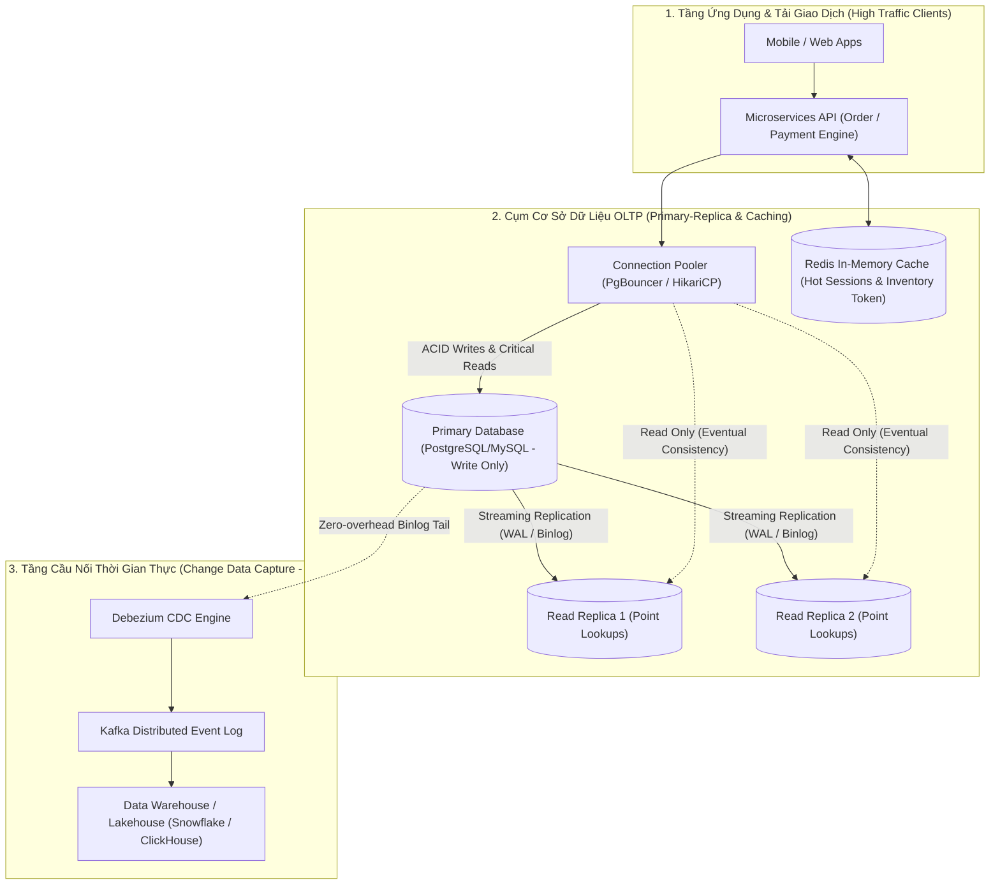

## Đề bài kinh doanh / Yêu cầu dữ liệu

Trong mọi hệ thống phần mềm hướng người dùng (User-Facing Applications) như Sàn thương mại điện tử, Ứng dụng ngân hàng số, Cổng thanh toán hay Nền tảng đặt xe công nghệ, **Cơ sở dữ liệu Xử lý Giao dịch Trực tuyến (OLTP - Online Transaction Processing)** chính là 'trái tim' quyết định sự sống còn của doanh nghiệp.

Hãy xem xét những thách thức kinh doanh và kỹ thuật khốc liệt mà một hệ thống OLTP phải đối mặt hàng ngày:

1. **Đảm bảo Tính Toàn vẹn Tuyệt đối của Tiền tệ & Tồn kho (Data Integrity):** Khi hàng nghìn người dùng cùng nhấn nút 'Đặt mua' một món hàng Flash Sale chỉ còn 1 sản phẩm duy nhất trong kho, hoặc khi thực hiện giao dịch chuyển tiền giữa 2 tài khoản ngân hàng, hệ thống tuyệt đối không được phép xảy ra hiện tượng _Bán quá số lượng (Overselling)_ hay _Tiền đã trừ ở người gửi nhưng chưa cộng vào người nhận_.
2. **Độ trễ Siêu thấp (Sub-millisecond / Low-Latency SLA):** Người dùng không thể chờ đợi quá 100ms cho một thao tác thêm vào giỏ hàng hoặc xác thực đơn hàng. Hệ thống phải phục vụ hàng chục nghìn truy vấn đọc/ghi mỗi giây (High QPS/TPS) với độ trễ p99 dưới 10ms.
3. **Khả năng Sẵn sàng 24/7 (High Availability & Zero Data Loss):** Bất kỳ sự cố sập nguồn hoặc lỗi phần cứng nào trên máy chủ cơ sở dữ liệu cũng không được làm mất các giao dịch đã cam kết thành công (RPO = 0, RTO tính bằng giây).

**Cạm bẫy của việc Nhầm lẫn giữa OLTP và OLAP:**

Cơ sở dữ liệu OLTP được thiết kế tối ưu cho các thao tác CRUD (Create, Read, Update, Delete) trên từng bản ghi đơn lẻ thông qua khóa chính (Primary Key). Nếu cố tình chạy các câu lệnh báo cáo tổng hợp (`SELECT COUNT(*)`, `GROUP BY` trên hàng chục triệu dòng) trực tiếp trên máy chủ OLTP, hệ thống sẽ bị nghẽn I/O, cạn kiệt Connection Pool và gây sập toàn bộ dịch vụ thanh toán của khách hàng.

## Mô hình hóa dữ liệu

Để đạt được sự cân bằng giữa tính toàn vẹn dữ liệu tuyệt đối và hiệu năng ghi siêu tốc, kỹ sư dữ liệu và kỹ sư hệ thống cần nắm vững 3 trụ cột thiết kế OLTP:

**1. Bốn Thuộc tính Vàng ACID (Atomicity, Consistency, Isolation, Durability):**

- **Atomicity (Nguyên tử):** Quy tắc 'Tất cả hoặc Không có gì' (All-or-Nothing). Mọi câu lệnh trong một Transaction phải cùng thành công (COMMIT) hoặc cùng bị hủy bỏ (ROLLBACK) khi có lỗi.
- **Consistency (Nhất quán):** Dữ liệu trước và sau giao dịch phải tuân thủ nghiêm ngặt mọi ràng buộc toàn vẹn (Constraints, Foreign Keys, Triggers, Cascade Rules).
- **Isolation (Cô lập):** Các giao dịch chạy đồng thời không được nhìn thấy dữ liệu trung gian chưa cam kết của nhau. Phân định qua 4 cấp độ cô lập (Read Uncommitted, Read Committed, Repeatable Read, Serializable).
- **Durability (Bền vững):** Một khi giao dịch đã COMMIT thành công, dữ liệu phải được ghi nhận an toàn vào bộ nhớ bất biến (Write-Ahead Logging - WAL / Redo Log) và không bao giờ bị mất ngay cả khi mất điện đột ngột.

**2. Chuẩn hóa Dữ liệu (Normalization) vs Phi chuẩn hóa Có kiểm soát (Controlled Denormalization):**

Nguyên tắc vàng của OLTP là chuẩn hóa tới **3NF (Third Normal Form) hoặc BCNF** để triệt tiêu mọi dư thừa dữ liệu và loại bỏ các lỗi bất thường khi Chèn (Insertion), Cập nhật (Update) và Xóa (Deletion) dữ liệu.

<table style="width:100%; border-collapse: collapse; margin-bottom: 20px;">
  <thead>
    <tr style="border-bottom: 2px solid #e2e8f0; text-align: left;">
      <th style="padding: 8px;">Cấp độ Chuẩn hóa</th>
      <th style="padding: 8px;">Quy tắc Bắt buộc</th>
      <th style="padding: 8px;">Mục tiêu & Ứng dụng Thực tế</th>
    </tr>
  </thead>
  <tbody>
    <tr style="border-bottom: 1px solid #edf2f7;">
      <td style="padding: 8px; font-weight: bold;">1NF (First Normal Form)</td>
      <td style="padding: 8px;">Giá trị trong mỗi cột phải là nguyên tử (Atomic), không chứa mảng hay danh sách lặp</td>
      <td style="padding: 8px;">Tách cột `phone_numbers` thành bảng riêng hoặc các dòng riêng</td>
    </tr>
    <tr style="border-bottom: 1px solid #edf2f7;">
      <td style="padding: 8px; font-weight: bold;">2NF (Second Normal Form)</td>
      <td style="padding: 8px;">Đạt 1NF và mọi thuộc tính không khóa phải phụ thuộc hoàn toàn vào toàn bộ Khóa chính</td>
      <td style="padding: 8px;">Loại bỏ sự phụ thuộc một phần (Partial Dependency) trong khóa phức hợp</td>
    </tr>
    <tr style="border-bottom: 1px solid #edf2f7;">
      <td style="padding: 8px; font-weight: bold;">3NF (Third Normal Form)</td>
      <td style="padding: 8px;">Đạt 2NF và không có thuộc tính không khóa nào phụ thuộc bắc cầu (Transitive) vào khóa chính</td>
      <td style="padding: 8px;">Tách thông tin Tỉnh/Thành phố ra khỏi bảng Khách hàng (Tránh lưu trùng tên tỉnh nhiều lần)</td>
    </tr>
    <tr style="border-bottom: 1px solid #edf2f7;">
      <td style="padding: 8px; font-weight: bold;">Controlled Denormalization</td>
      <td style="padding: 8px;">Lưu Snapshot bất biến có chủ đích (ví dụ: `unit_price_at_order` trong `order_items`)</td>
      <td style="padding: 8px;">Bảo toàn giá tiền tại thời điểm mua khi bảng giá sản phẩm gốc thay đổi</td>
    </tr>
  </tbody>
</table>

**3. Sơ đồ Kiến trúc OLTP Phân tầng Hiện đại (High-Concurrency OLTP Architecture):**



## Xây dựng Pipeline / Script xử lý

Để minh họa việc triển khai mô hình OLTP xử lý tranh chấp đồng thời cao (High-Concurrency Concurrency Control), dưới đây là thiết kế DDL chuẩn hóa và mã nguồn Python/SQL giải quyết bài toán trừ tồn kho Flash Sale không bao giờ bị âm.

**1. Thiết kế DDL Chuẩn hóa 3NF cho Hệ thống Ví điện tử & Đơn hàng (PostgreSQL):**

```sql
-- Tạo bảng Tài khoản Người dùng (Users Core)
CREATE TABLE users (
    user_id BIGSERIAL PRIMARY KEY,
    email VARCHAR(255) UNIQUE NOT NULL,
    status VARCHAR(32) NOT NULL DEFAULT 'ACTIVE',
    created_at TIMESTAMPTZ NOT NULL DEFAULT CURRENT_TIMESTAMP
);

-- Tạo bảng Ví tiền (Accounts Wallet) với ràng buộc số dư không âm
CREATE TABLE wallets (
    wallet_id BIGSERIAL PRIMARY KEY,
    user_id BIGINT UNIQUE NOT NULL REFERENCES users(user_id) ON DELETE RESTRICT,
    balance DECIMAL(15, 2) NOT NULL DEFAULT 0.00,
    version INT NOT NULL DEFAULT 1, -- Dùng cho Optimistic Locking
    updated_at TIMESTAMPTZ NOT NULL DEFAULT CURRENT_TIMESTAMP,
    CONSTRAINT chk_balance_non_negative CHECK (balance >= 0.00)
);

-- Tạo bảng Sổ cái Giao dịch Bất biến (Immutable Transaction Ledger)
CREATE TABLE wallet_transactions (
    transaction_id UUID PRIMARY KEY,
    from_wallet_id BIGINT NOT NULL REFERENCES wallets(wallet_id),
    to_wallet_id BIGINT NOT NULL REFERENCES wallets(wallet_id),
    amount DECIMAL(15, 2) NOT NULL,
    transaction_type VARCHAR(32) NOT NULL, -- 'TRANSFER', 'PURCHASE', 'REFUND'
    created_at TIMESTAMPTZ NOT NULL DEFAULT CURRENT_TIMESTAMP,
    CONSTRAINT chk_amount_positive CHECK (amount > 0.00)
);

-- Tạo bảng Tồn kho Sản phẩm (Inventory Items)
CREATE TABLE inventory_items (
    product_id BIGINT PRIMARY KEY,
    sku VARCHAR(64) UNIQUE NOT NULL,
    available_stock INT NOT NULL DEFAULT 0,
    reserved_stock INT NOT NULL DEFAULT 0,
    updated_at TIMESTAMPTZ NOT NULL DEFAULT CURRENT_TIMESTAMP,
    CONSTRAINT chk_stock_non_negative CHECK (available_stock >= 0)
);

-- Đánh chỉ mục tối ưu cho các truy vấn OLTP tần suất cao
CREATE INDEX idx_wallets_user ON wallets(user_id);
CREATE INDEX idx_trans_from_wallet ON wallet_transactions(from_wallet_id, created_at DESC);
```

**2. Xử lý Tranh chấp Đồng thời: Khóa Bi quan (Pessimistic) vs Khóa Lạc quan (Optimistic):**

Đoạn mã Python minh họa 2 kỹ thuật kiểm soát giao dịch đồng thời trong giao dịch thanh toán mua hàng:

```python
# Python OLTP Transaction Controller with PostgreSQL
import psycopg2
from psycopg2.extras import RealDictCursor
import time

def deduct_inventory_pessimistic(conn, product_id: int, quantity: int) -> bool:
    # Ky thuat 1: Pessimistic Locking (SELECT ... FOR UPDATE)
    # Thich hop khi: Ty le tranh chap cuc cao (Flash Sale), dam bao khoa doc quyen
    with conn.cursor(cursor_factory=RealDictCursor) as cur:
        try:
            # Khoa doc quyen dong du lieu cua san pham (Row-Level Exclusive Lock)
            cur.execute(
                "SELECT available_stock FROM inventory_items WHERE product_id = %s FOR UPDATE;",
                (product_id,)
            )
            row = cur.fetchone()
            if not row or row['available_stock'] < quantity:
                conn.rollback()
                return False # Het hang

            # Tru ton kho an toan tuyet doi
            cur.execute(
                "UPDATE inventory_items SET available_stock = available_stock - %s, updated_at = CURRENT_TIMESTAMP WHERE product_id = %s;",
                (quantity, product_id)
            )
            conn.commit()
            return True
        except Exception as e:
            conn.rollback()
            raise e

def transfer_funds_optimistic(conn, wallet_id: int, deduct_amount: float, max_retries: int = 3) -> bool:
    # Ky thuat 2: Optimistic Concurrency Control (Version Check / CAS)
    # Thich hop khi: Ty le tranh chap thap/trung binh (Read-heavy), khong khoa tai nguyen
    for attempt in range(max_retries):
        with conn.cursor(cursor_factory=RealDictCursor) as cur:
            # 1. Doc so du va version hien tai (KHONG KHOA)
            cur.execute("SELECT balance, version FROM wallets WHERE wallet_id = %s;", (wallet_id,))
            wallet = cur.fetchone()
            if not wallet or wallet['balance'] < deduct_amount:
                return False # Khong du so du

            current_version = wallet['version']
            new_balance = wallet['balance'] - deduct_amount

            # 2. Cap nhat co dieu kien kiem tra version (Atomic Compare-and-Swap)
            cur.execute(
                "UPDATE wallets SET balance = %s, version = version + 1, updated_at = CURRENT_TIMESTAMP WHERE wallet_id = %s AND version = %s;",
                (new_balance, wallet_id, current_version)
            )
            conn.commit()

            # 3. Neu so dong bi anh huong = 1 tuc la thanh cong
            if cur.rowcount == 1:
                return True

            # Neu rowcount = 0 tuc la da bi xung dot -> Thu lai
            time.sleep(0.05 * (2 ** attempt))

    return False # Vuot qua so lan thu lai
```

## Kiểm thử dữ liệu & Tối ưu hiệu năng

Để tối ưu hóa cơ sở dữ liệu OLTP chịu tải hàng chục nghìn TPS mà không gặp hiện tượng nghẽn cổ chai, các kỹ sư hệ thống cần áp dụng các kỹ thuật sau:

**1. Chiến lược Đánh Chỉ mục B-Tree Thông minh (Smart Indexing Strategy):**

- **Tránh Hiện tượng Lạm phát Chỉ mục (Over-Indexing):** Mỗi chỉ mục thêm vào bảng sẽ làm tăng tốc độ đọc (`SELECT`), nhưng làm suy giảm nghiêm trọng tốc độ ghi (`INSERT`, `UPDATE`, `DELETE`) vì database phải cập nhật lại toàn bộ cây B-Tree tương ứng. Trên bảng OLTP ghi nhiều, chỉ đánh chỉ mục cho các trường nằm trong mệnh đề `WHERE` của API chính.
- **Covering Indexes (Chỉ mục Bao phủ với INCLUDE):** Sử dụng cú pháp `CREATE INDEX idx_orders_covering ON orders (user_id) INCLUDE (total_amount, status);` giúp PostgreSQL đọc dữ liệu trực tiếp từ B-Tree (Index-Only Scan) mà không cần truy xuất vào bảng gốc (Heap Table).
- **Partial Indexes (Chỉ mục Phân vùng Điều kiện):** Chỉ đánh chỉ mục trên tập dữ liệu đang hoạt động, ví dụ: `CREATE INDEX idx_pending_orders ON orders(created_at) WHERE status = 'PENDING';`. Giúp kích thước chỉ mục nhỏ hơn 90% so với đánh trên toàn bộ bảng.

**2. Quản lý Kết nối & Giảm thiểu Thời gian Giao dịch (Connection Pooling & Lean Transactions):**

- **Quy tắc Transaction Tinh gọn:** Tuyệt đối không thực hiện các tác vụ tốn thời gian như gọi API bên thứ ba (HTTP Call), gửi Email hoặc xử lý ảnh _bên trong một Transaction của Cơ sở dữ liệu_. Thời gian giữ Lock càng dài, nguy cơ gây Deadlock và nghẽn Connection Pool càng cao.
- **Sử dụng Connection Pooler chuyên dụng:** Triển khai _PgBouncer_ (PostgreSQL) ở chế độ Transaction Pooling để chia sẻ hàng nghìn kết nối client vào một nhóm 50-100 kết nối thực sự tới Database.

**3. Bảng Benchmark Đánh giá Hiệu năng Khóa Đồng thời (Concurrency Benchmark trên 10,000 Concurrent Requests):**

<table style="width:100%; border-collapse: collapse; margin-bottom: 20px;">
  <thead>
    <tr style="border-bottom: 2px solid #e2e8f0; text-align: left;">
      <th style="padding: 8px;">Cơ Chế Khóa / Xử Lý</th>
      <th style="padding: 8px;">Thông Lượng (Throughput TPS)</th>
      <th style="padding: 8px;">Độ Trễ Phản Hồi p99</th>
      <th style="padding: 8px;">Tỷ Lệ Lỗi Tranh Chấp (Abort Rate)</th>
    </tr>
  </thead>
  <tbody>
    <tr style="border-bottom: 1px solid #edf2f7;">
      <td style="padding: 8px; font-weight: bold;">Serializable Isolation Cấp cao nhất</td>
      <td style="padding: 8px;">850 TPS</td>
      <td style="padding: 8px;">420ms</td>
      <td style="padding: 8px;">Cao (35% giao dịch bị Serialization Failure)</td>
    </tr>
    <tr style="border-bottom: 1px solid #edf2f7;">
      <td style="padding: 8px; font-weight: bold;">Pessimistic Locking (SELECT FOR UPDATE)</td>
      <td style="padding: 8px;">4,200 TPS</td>
      <td style="padding: 8px;">48ms</td>
      <td style="padding: 8px;">0.00% (An toàn tuyệt đối, xếp hàng chờ khóa)</td>
    </tr>
    <tr style="border-bottom: 1px solid #edf2f7;">
      <td style="padding: 8px; font-weight: bold;">Optimistic Concurrency Control (Version CAS)</td>
      <td style="padding: 8px;">6,800 TPS</td>
      <td style="padding: 8px;">18ms</td>
      <td style="padding: 8px;">Thấp (Retry tự động thành công 99.8%)</td>
    </tr>
    <tr>
      <td style="padding: 8px; font-weight: bold;">Redis In-Memory Token + Asynchronous DB Write</td>
      <td style="padding: 8px; font-weight: bold;">45,000 TPS</td>
      <td style="padding: 8px; font-weight: bold;">2.1ms</td>
      <td style="padding: 8px;">0.00% (Tách biệt hoàn toàn tầng trừ tồn kho)</td>
    </tr>
  </tbody>
</table>

## Tổng kết & Khuyến nghị

Hệ thống OLTP là nền móng vận hành cốt lõi của mọi sản phẩm công nghệ. Một sai lầm nhỏ trong thiết kế mô hình hoặc kiểm soát giao dịch có thể dẫn đến thiệt hại tài chính không thể cứu vãn.

1. **Thiết kế Giao dịch Cực kỳ Tinh gọn:** Giữ các khối `BEGIN ... COMMIT` ngắn nhất có thể. Luôn chuẩn bị sẵn sàng dữ liệu trong bộ nhớ trước khi mở Transaction và cam kết ngay lập tức.
2. **Lựa chọn Cơ chế Khóa Phù hợp với Ngữ cảnh Nghiệp vụ:** Dùng _Pessimistic Locking_ cho các điểm nóng tranh chấp dữ liệu cao độ (Flash Sale, Inventory Booking); Dùng _Optimistic Locking_ cho các thao tác cập nhật hồ sơ, chỉnh sửa thông tin người dùng.
3. **Tách Biệt Đọc/Ghi qua Read Replicas:** Điều hướng các truy vấn đọc tra cứu (Point Lookups) sang cụm máy chủ Read Replicas để dành trọn vẹn tài nguyên CPU/IOPS của Primary Server cho các thao tác ghi giao dịch.
4. **Sử dụng Change Data Capture (CDC) làm Cầu nối sang Data Platform:** Tuyệt đối không dùng cơ chế Dual-Write (Ghi đồng thời vào OLTP và Elasticsearch/Lakehouse từ code ứng dụng vì dễ gây lệch dữ liệu khi có lỗi mạng). Hãy sử dụng Debezium CDC để trích xuất dữ liệu trực tiếp từ Write-Ahead Log một cách bất đồng bộ và tin cậy 100%.

> **Lời kết:** _Xây dựng một hệ thống OLTP vững chắc là nghệ thuật tôn trọng các nguyên lý ACID nguyên bản kết hợp với tư duy kiểm soát đồng thời thông minh. Đó là bệ phóng an toàn để doanh nghiệp tự tin mở rộng quy mô lên hàng triệu người dùng!_
