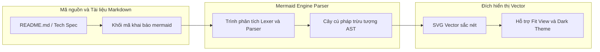
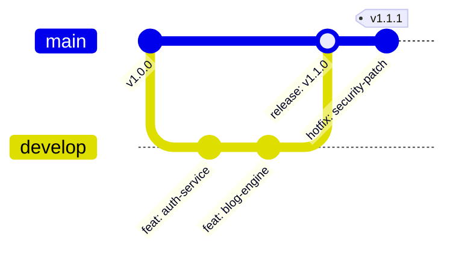

## Mục tiêu bài viết

Trong phát triển phần mềm hiện đại, tài liệu kỹ thuật và sơ đồ kiến trúc (Architecture Diagrams) đóng vai trò sống còn trong việc đồng bộ hóa nhận thức giữa các thành viên trong đội ngũ kỹ thuật. Tuy nhiên, phương pháp vẽ sơ đồ truyền thống bằng các công cụ đồ họa giao diện người dùng (như Draw.io, Visio, Lucidchart) lưu dưới dạng file ảnh nhị phân (.png, .jpg) thường bộc lộ những điểm yếu chí mạng:

- **Lệch pha tài liệu (Documentation Drift):** Khi code thay đổi, việc mở lại công cụ vẽ, sửa ảnh, xuất file và commit lại vào repository thường bị bỏ qua vì tốn nhiều công đoạn, khiến tài liệu nhanh chóng bị lỗi thời.
- **Không thể theo dõi thay đổi (No Git Diff):** Các file ảnh nhị phân không thể so sánh sự thay đổi theo từng dòng (line-by-line diff) trong các Pull Request, khiến việc review kiến trúc trở nên khó khăn.

Mục tiêu của bài viết này là giới thiệu giải pháp **Diagrams as Code (DaC)** thông qua thư viện **Mermaid.js** - biến việc vẽ biểu đồ thành các đoạn mã thuần văn bản (plain text) có thể phiên bản hóa (version-controlled), tự động render trên GitHub/GitLab và tích hợp trực tiếp vào tài liệu Markdown.

## Kiến trúc / Nguyên lý hoạt động

Nguyên lý cốt lõi của Mermaid.js là sử dụng cú pháp biểu diễn khai báo (declarative text syntax) để xây dựng cây cú pháp trừu tượng (AST) và biên dịch trực tiếp sang định dạng đồ họa vector có thể co giãn (SVG). Dưới đây là các họ biểu đồ quan trọng nhất thường dùng trong quy trình kỹ thuật:

1. **Flowchart & Architecture Graph:** Dùng để mô tả luồng điều hướng, cấu trúc hạ tầng hoặc phân tầng component. Hỗ trợ định hướng `TD` (Top-Down), `LR` (Left-Right) và nhóm khối `subgraph`.
2. **Sequence Diagram (Sơ đồ Tuần tự):** Cực kỳ mạnh mẽ để mô tả giao thức bắt tay (handshake), luồng gọi API giữa các microservices hoặc chu kỳ vòng đời tương tác. Hỗ trợ `autonumber`, `actor`, `participant`, `alt/else` (điều kiện rẽ nhánh) và `loop`.
3. **Git Graph:** Trực quan hóa chiến lược phân nhánh (GitFlow / Trunk-based development), chuỗi commit và thao tác merge/rebase một cách sinh động.
4. **Class & Entity Relationship Diagram (ERD):** Mô tả lược đồ quan hệ thực thể trong cơ sở dữ liệu hoặc cấu trúc lớp đối tượng trong lập trình hướng đối tượng.

## Từng bước thiết lập

Quy trình từng bước áp dụng Mermaid.js vào dự án phần mềm và tài liệu hóa:

1. **Khai báo khối Mermaid trong Markdown:** Sử dụng thẻ rào mã (code fence) chuẩn `mermaid` trong bất kỳ tài liệu Markdown nào. Các nền tảng như GitHub, GitLab, Notion và Obsidian đều hỗ trợ render trực tiếp từ năm 2022.
2. **Xây dựng sơ đồ phân nhánh GitFlow mẫu:**

3. **Tích hợp tự động hóa trong CI/CD Pipeline:** Sử dụng công cụ dòng lệnh `@mermaid-js/mermaid-cli` (lệnh `mmdc`) để tự động xuất sơ đồ sang file ảnh PDF/PNG phục vụ việc phát hành sách kỹ thuật hoặc tài liệu lưu trữ nội bộ.

## Troubleshooting & Common Pitfalls

Trong quá trình làm việc thực tế với Mermaid, các kỹ sư thường gặp phải 3 cạm bẫy phổ biến sau:

1. **Lỗi ký tự đặc biệt trong nhãn (Text Label Parsing Error):** Khi chuỗi văn bản trong nhãn chứa ngoặc đơn `()`, ngoặc vuông `[]`, hoặc dấu ngoặc kép `""`, Mermaid parser có thể hiểu nhầm đó là cú pháp định dạng hình dạng node. _Khắc phục:_ Tránh lồng các ký tự ngoặc đơn hoặc ngoặc vuông bên trong nhãn không bọc chuỗi, sử dụng dấu gạch ngang phân tách: `NodeA[Tên node - Kèm thông tin chi tiết]`.
2. **Ký tự HTML Entity:** Khi Markdown parser chuyển đổi `<` thành `<` hoặc `>` thành `>`, hãy thực hiện hàm chuẩn hóa (sanitize/unescape) chuỗi trước khi chuyển vào `mermaid.render()`.
3. **Tràn kích thước trên sơ đồ có quá nhiều nhánh:** Tránh đặt toàn bộ 50+ service trên một biểu đồ phẳng. Hãy tận dụng `subgraph` hoặc chia nhỏ thành các biểu đồ theo từng miền nghiệp vụ (Domain-Driven Context).

## Đánh giá & Mở rộng

- **Tối ưu hóa năng suất kỹ thuật (ROI):** Tiết kiệm tới **80% thời gian** cập nhật tài liệu khi hệ thống thay đổi kiến trúc. Mọi thay đổi đều được phản ánh trực tiếp qua các commit trong Git pull request.
- **Tự động sinh sơ đồ từ mã nguồn (AST to Diagram):** Kết hợp các plugin OpenAPI / Swagger hoặc trình phân tích cây AST của TypeScript/Go để tự động quét codebase và phát sinh sơ đồ lớp (Class Diagram) hoặc sơ đồ luồng dữ liệu tự động mà không cần gõ tay.
- **Khả năng tương thích nền tảng:** Định dạng vector SVG giúp biểu đồ luôn sắc nét trên mọi mật độ điểm ảnh (Retina/4K) và dễ dàng can thiệp tùy biến giao diện bằng CSS.
