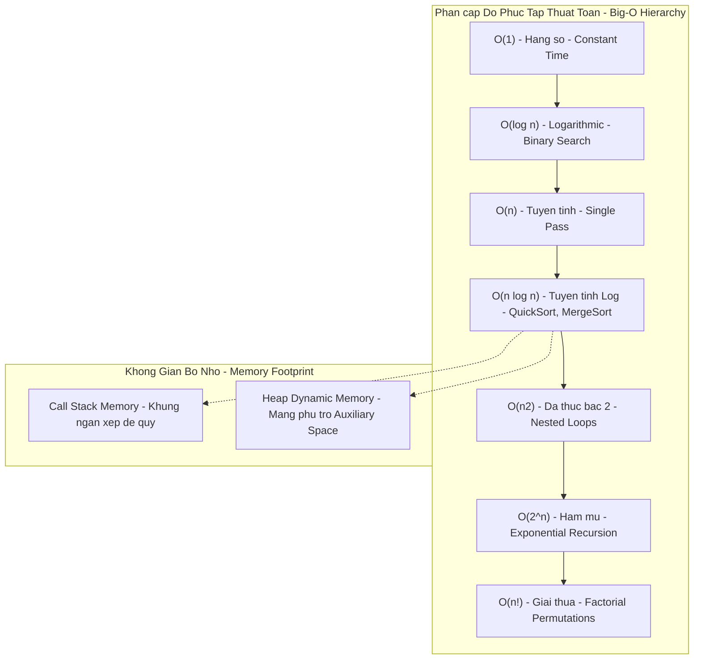

## Mô tả bài toán

Trong phát triển phần mềm và tối ưu hóa hệ thống, câu hỏi cốt tử mà mỗi kỹ sư phải trả lời trước khi đưa bất kỳ đoạn mã nào lên môi trường Production là: _'Thuật toán này chạy nhanh đến mức nào, và nó tiêu tốn bao nhiêu tài nguyên khi lượng dữ liệu người dùng tăng trưởng gấp 1,000 lần?'_.

Một sai lầm kinh điển của người mới lập trình là dùng đồng hồ bấm giờ (Wall-clock Time) qua các hàm như `console.time()` hay `System.nanoTime()` để đánh giá tốc độ. Cách làm này không thể đưa ra kết luận chuẩn xác vì thời gian chạy vật lý phụ thuộc hoàn toàn vào cấu hình phần cứng CPU, nhiệt độ máy, trình biên dịch, và các tiến trình chạy nền của hệ điều hành. Do đó, khoa học máy tính cần một **hệ thống thước đo toán học chuẩn hóa (Mathematical Framework)** để phân tích độc lập với môi trường phần cứng.

## Ý tưởng tiếp cận ban đầu

Cách tiếp cận thực nghiệm ban đầu (Empirical Benchmarking):

- Chạy thuật toán trên máy tính cá nhân với dữ liệu mẫu nhỏ (N = 100) và đo thời gian bằng mili-giây.
- _Tại sao phương pháp này thất bại?_ Một thuật toán O(N²) có thể chạy chỉ mất `0.2ms` khi N = 100, khiến lập trình viên lầm tưởng nó đủ nhanh. Nhưng khi N tăng lên 1,000,000 trên Production, thời gian thực thi sẽ bùng nổ lên tới **hơn 11 ngày**, làm tê liệt toàn bộ hệ thống (Server Freeze).

Chúng ta cần một tư duy định lượng tiệm cận (Asymptotic Analysis) để dự đoán xu hướng tăng trưởng của tài nguyên theo quy mô đầu vào N.

## Tư duy tối ưu & Cấu trúc thuật toán

Để đánh giá một thuật toán toàn diện, tôi thiết lập mô hình tính toán chuẩn dựa trên **Mô hình Máy tính RAM (Random Access Machine Model)** và 3 hệ số đo lường trụ cột:

1. **Phân cấp Ký hiệu Tiệm cận (Asymptotic Notations):**

- **Big-O (O):** Chặn trên (Upper Bound) - Đại diện cho kịch bản xấu nhất (Worst-Case Scenario). Đây là metric quan trọng nhất để cam kết SLA hệ thống.
- **Big-Omega (Ω):** Chặn dưới (Lower Bound) - Kịch bản tốt nhất (Best-Case Scenario).
- **Big-Theta (Θ):** Chặn chặt (Tight Bound) - Khi chặn trên và chặn dưới tiệm cận trùng nhau, phản ánh hành vi trung bình thực tế.

2. **Phân biệt Rạch ròi Time vs Space Complexity:**

- **Time Complexity:** Số lượng phép toán nguyên thủy (Primitive Operations: gán, so sánh, số học) theo hàm của N.
- **Space Complexity (Total Space vs Auxiliary Space):** Tổng dung lượng bộ nhớ thuật toán cần dùng. Trong đó, _Auxiliary Space_ (Bộ nhớ phụ trợ) là phần bộ nhớ tạm do thuật toán tự cấp phát thêm (không tính mảng đầu vào), bao gồm Heap allocations và Call Stack frames trong đệ quy.

## Triển khai mã nguồn & Dry Run

Bản đồ phân cấp tăng trưởng độ phức tạp thuật toán và cấu trúc bộ nhớ:

**Minh họa mã nguồn TypeScript chuẩn hóa các cấp độ Big-O:**

- **O(1) Constant Time:** Truy xuất phần tử theo index mảng `arr[0]` hoặc tra cứu khóa trong HashMap.
- **O(log N) Logarithmic Time:** Thuật toán tìm kiếm nhị phân chia đôi không gian tìm kiếm sau mỗi bước.
- **O(N) Linear Time:** Duyệt qua toàn bộ N phần tử trong mảng một lần duy nhất.
- **O(N log N) Linearithmic Time:** Các giải thuật chia để trị tối ưu như QuickSort, MergeSort, TimSort.
- **O(N²) Quadratic Time:** 2 vòng lặp lồng nhau duyệt qua tất cả các cặp (i, j).

## Đánh giá độ phức tạp & Ứng dụng thực tế

Từ bài viết này trở đi, mỗi thuật toán trong series sẽ được giải phẫu và chấm điểm dựa trên đúng 5 tiêu chí cốt lõi:

1. **Worst-Case Time Complexity (O):** Đảm bảo hệ thống không bị treo khi gặp dữ liệu nghịch đảo.
2. **Best/Average-Case Time (Ω / Θ):** Hiệu năng thực tế trong điều kiện dữ liệu ngẫu nhiên.
3. **Auxiliary Space Complexity:** Lượng RAM phụ cấp phát thêm trên Heap và Call Stack.
4. **Tính ổn định (Stability) & Khả năng xử lý tại chỗ (In-place):** Có làm thay đổi thứ tự tương đối của các phần tử bằng nhau hay không.
5. **Ngưỡng bùng nổ quy mô (Scalability Threshold):** Giới hạn N an toàn để thực thi trong dưới `100ms` trên môi trường Production.
