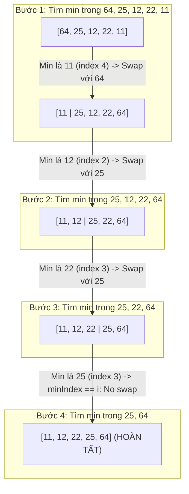

## Mô tả bài toán

Trong các hệ thống nhúng hoặc phần cứng sử dụng bộ nhớ Flash / EEPROM, mỗi thao tác ghi (Write Operation) đều làm hao mòn tuổi thọ vật lý của chip nhớ và tiêu tốn năng lượng. Đề bài đặt ra: Làm thế nào để sắp xếp một mảng số nguyên N phần tử với **số lần hoán đổi (Memory Writes) tối thiểu nhất có thể**?

Sắp xếp Chọn (Selection Sort) giải quyết bài toán này bằng cách phân vùng mảng và chỉ thực hiện đúng tối đa `N - 1` thao tác hoán đổi trong toàn bộ vòng đời sắp xếp.

## Ý tưởng tiếp cận ban đầu

Ý tưởng tiếp cận ngây thơ:

- Mỗi khi duyệt mảng và gặp một phần tử nhỏ hơn `arr[i]`, lập tức gọi hàm `std::swap`.
- *Hạn chế:* Cách làm này gây ra số lần ghi bộ nhớ không kiểm soát được (lên tới `O(N²)` lần hoán đổi), làm giảm hiệu năng ghi đệm của CPU và gây hao mòn bộ nhớ.

## Tư duy tối ưu & Cấu trúc thuật toán

Tư duy phân vùng và chọn lọc cực tiểu của Selection Sort:

1. **Phân chia Mảng thành 2 Vùng ảo (Logical Subarrays):** Mảng được chia thành Vùng đã sắp xếp `[0..i-1]` và Vùng chưa sắp xếp `[i..N-1]`.
2. **Quét Chỉ số Cực tiểu (Min-Index Scanning):** Tại mỗi bước `i`, chỉ ghi nhận chỉ số `minIndex = i`. Duyệt toàn bộ vùng chưa sắp xếp để tìm ra phần tử nhỏ nhất thực sự mà *không thực hiện bất kỳ phép hoán đổi nào trong quá trình quét*.
3. **Đúng 1 phép Hoán đổi duy nhất mỗi Pass:** Sau khi tìm được `minIndex` toàn cục của vùng chưa sắp xếp, chỉ thực hiện duy nhất một lệnh `std::swap(arr[i], arr[minIndex])` nếu `minIndex != i`. Đảm bảo tổng số lần ghi bộ nhớ cố định ở mức `O(N)`.

## Triển khai mã nguồn & Dry Run

Minh họa phân vùng và dịch chuyển phần tử cực tiểu của mảng `[64, 25, 12, 22, 11]`:



**Mã nguồn C++ chuẩn hóa:**

```c++
#include <iostream>
#include <vector>
#include <utility>

// Thuật toán Selection Sort: Tối ưu số lần ghi bộ nhớ với O(N) swaps
void selectionSort(std::vector<int>& arr) {
    int n = static_cast<int>(arr.size());
    for (int i = 0; i < n - 1; ++i) {
        int minIndex = i;
        // Tìm phần tử nhỏ nhất trong mảng con chưa sắp xếp [i+1 .. n-1]
        for (int j = i + 1; j < n; ++j) {
            if (arr[j] < arr[minIndex]) {
                minIndex = j;
            }
        }
        // Chỉ hoán đổi đúng 1 lần nếu vị trí cực tiểu khác vị trí hiện tại
        if (minIndex != i) {
            std::swap(arr[i], arr[minIndex]);
        }
    }
}

int main() {
    std::vector<int> data = {64, 25, 12, 22, 11};
    selectionSort(data);
    std::cout << "Mảng sau sắp xếp: ";
    for (int x : data) std::cout << x << " ";
    std::cout << std::endl;
    return 0;
}
```

**Phân tích luồng thực thi (Dry Run Trace):**

- *Khởi tạo:* `data = {64, 25, 12, 22, 11}` (`N = 5`).
- *Pass `i = 0`:* Vùng chưa sắp xếp `[64, 25, 12, 22, 11]`. Quét tìm min `->` `minIndex = 4` (giá trị 11). Swap `arr[0]` và `arr[4]` `->` Mảng thành `{11, 25, 12, 22, 64}`.
- *Pass `i = 1`:* Vùng chưa sắp xếp `[25, 12, 22, 64]`. Quét tìm min `->` `minIndex = 2` (giá trị 12). Swap `arr[1]` và `arr[2]` `->` Mảng thành `{11, 12, 25, 22, 64}`.
- *Pass `i = 2`:* Vùng chưa sắp xếp `[25, 22, 64]`. Quét tìm min `->` `minIndex = 3` (giá trị 22). Swap `arr[2]` và `arr[3]` `->` Mảng thành `{11, 12, 22, 25, 64}`.
- *Pass `i = 3`:* Vùng chưa sắp xếp `[25, 64]`. `minIndex = 3` trùng `i` `->` Không tốn phép swap. Mảng hoàn thành hoàn hảo!

## Đánh giá độ phức tạp & Ứng dụng thực tế

**Đánh giá Hiệu năng theo Framework Chuẩn:**

1. **Time Complexity:** `O(N²)`, `Ω(N²)`, `Θ(N²)` - Luôn duyệt đủ số phép so sánh `(N * (N - 1)) / 2` bất kể thứ tự mảng ban đầu.
2. **Memory Writes Complexity:** `O(N)` - Đúng tối đa `N - 1` lần hoán đổi (Ưu điểm tuyệt đối so với Bubble Sort và Insertion Sort có thể tốn `O(N²)` lần ghi).
3. **Auxiliary Space Complexity:** `O(1)` - In-place thuần túy.
4. **Tính ổn định (Stability):** Không ổn định (Unstable) vì phép hoán đổi khoảng cách xa có thể nhảy qua và đảo thứ tự của các phần tử bằng nhau (ví dụ `[4a, 4b, 2]` `->` `[2, 4b, 4a]`).

**Ứng dụng thực tế:** Hệ thống nhúng vi điều khiển sử dụng bộ nhớ Flash / EEPROM hạn chế chu kỳ ghi, và các bài toán sắp xếp khi chi phí ghi bộ nhớ đắt đỏ hơn nhiều so với chi phí đọc.
