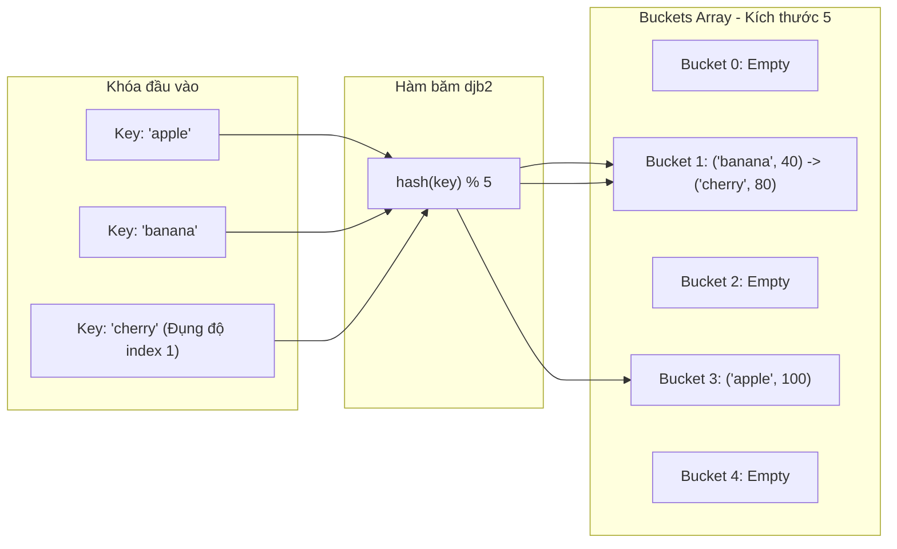

## 1. Mô tả bài toán

Trong các hệ thống phân tán, cơ sở dữ liệu và máy chủ web chịu tải cao, việc tìm kiếm dữ liệu theo khóa (Key-Value Lookup) phải diễn ra tức thì với độ trễ cực thấp. Đề bài đặt ra: Thiết kế một cấu trúc dữ liệu lưu trữ cho phép thực hiện các thao tác **Thêm (Insert), Tìm kiếm (Get) và Xóa (Delete) với thời gian trung bình kỳ vọng đạt `O(1)`**.

Bảng băm (Hash Table) kết hợp cùng Thuật toán Băm (Hashing) là giải pháp tiêu chuẩn toàn cầu để đạt được tốc độ truy xuất `O(1)` hằng số độc lập với kích thước dữ liệu.

## 2. Ý tưởng tiếp cận ban đầu

So sánh với các cấu trúc dữ liệu truyền thống:

- _Mảng phẳng (Array):_ Tìm kiếm tốn `O(N)` phép so sánh tuần tự.
- _Cây tìm kiếm nhị phân cân bằng (AVL / Red-Black Tree):_ Duy trì thời gian `O(log N)`, nhưng vẫn phát sinh chi phí so sánh khóa và mất chi phí xoay cây (Tree Rebalancing).

## 3. Tư duy tối ưu & Cấu trúc thuật toán

Kiến trúc Bảng băm và Chiến lược giải quyết Đụng độ (Collision Resolution):

1. **Hàm băm (Hash Function):** Ánh xạ một khóa có kích thước bất kỳ (chuỗi ký tự, object) thành một số nguyên `index = hash(key) % Capacity` phân bố đều khắp các ô nhớ (Buckets). Thuật toán băm chuỗi nổi tiếng: `djb2` (nhân 33 kết hợp XOR).
2. **Xử lý Đụng độ (Collision Resolution):** Khi hai khóa khác nhau tạo ra cùng một chỉ số băm:

- _Separate Chaining (Chuỗi liên kết riêng biệt):_ Mỗi bucket là một danh sách liên kết (Linked List). Khi đụng độ, chèn phần tử mới vào danh sách tại bucket đó.
- _Open Addressing (Địa chỉ mở):_ Dò tìm ô trống tiếp theo trong bảng (Linear Probing, Quadratic Probing, Double Hashing).

3. **Hệ số Tải (Load Factor `α`) & Tái băm (Rehashing):** Khi tỷ lệ `α = frac{	ext{numElements}}{	ext{Capacity}} >= 0.75`, bảng băm tự động nhân đôi kích thước và phân bổ lại toàn bộ phần tử để ngăn ngừa danh sách liên kết bị kéo dài, giữ vững hiệu năng `O(1)`.

## 4. Triển khai mã nguồn & Dry Run

Minh họa kiến trúc Bảng băm Separate Chaining xử lý đụng độ:



**Mã nguồn C++ triển khai đầy đủ Bảng băm hoàn chỉnh:**

```c++
#include <iostream>
#include <vector>
#include <list>
#include <string>
#include <utility>

// Bảng băm hoàn chỉnh xử lý đụng độ bằng Separate Chaining
class HashTable {
private:
    struct Entry {
        std::string key;
        int value;
    };

    std::vector<std::list<Entry>> table;
    int numElements;
    int capacity;

    // Hàm băm chuỗi kinh điển djb2
    int hashFunction(const std::string& key) const {
        unsigned long hash = 5381;
        for (char c : key) {
            hash = ((hash << 5) + hash) + static_cast<unsigned char>(c); // hash * 33 + c
        }
        return static_cast<int>(hash % capacity);
    }

    // Cơ chế Tái băm mở rộng kích thước khi Load Factor vượt ngưỡng
    void rehash() {
        int oldCapacity = capacity;
        capacity *= 2;
        std::vector<std::list<Entry>> oldTable = std::move(table);
        table.resize(capacity);
        numElements = 0;

        for (int i = 0; i < oldCapacity; ++i) {
            for (const auto& entry : oldTable[i]) {
                insert(entry.key, entry.value);
            }
        }
    }

public:
    HashTable(int initialCapacity = 7) : numElements(0), capacity(initialCapacity) {
        table.resize(capacity);
    }

    void insert(const std::string& key, int value) {
        // Ngưỡng Load Factor >= 0.75 kích hoạt Rehashing
        if (static_cast<double>(numElements) / capacity >= 0.75) {
            rehash();
        }

        int bucket = hashFunction(key);
        for (auto& entry : table[bucket]) {
            if (entry.key == key) {
                entry.value = value; // Cập nhật nếu khóa đã tồn tại
                return;
            }
        }
        table[bucket].push_back({key, value});
        ++numElements;
    }

    bool get(const std::string& key, int& outValue) const {
        int bucket = hashFunction(key);
        for (const auto& entry : table[bucket]) {
            if (entry.key == key) {
                outValue = entry.value;
                return true;
            }
        }
        return false;
    }

    bool remove(const std::string& key) {
        int bucket = hashFunction(key);
        for (auto it = table[bucket].begin(); it != table[bucket].end(); ++it) {
            if (it->key == key) {
                table[bucket].erase(it);
                --numElements;
                return true;
            }
        }
        return false;
    }
};

int main() {
    HashTable ht;
    ht.insert("apple", 100);
    ht.insert("banana", 40);
    ht.insert("cherry", 80);

    int val;
    if (ht.get("banana", val)) {
        std::cout << "Giá trị của banana: " << val << std::endl;
    }
    return 0;
}
```

**Phân tích luồng thực thi (Dry Run Trace):**

- _Khởi tạo:_ `capacity = 7`, `numElements = 0`.
- _Chèn "apple" (giá trị 100):_ `hashFunction("apple")` cho ra bucket `3` &rarr; Thêm `{"apple", 100}` vào `table[3]`. `numElements = 1` (`α = 1/7 pprox 0.14`).
- _Chèn "banana" (giá trị 40):_ `hashFunction("banana")` cho ra bucket `1` &rarr; Thêm `{"banana", 40}` vào `table[1]`. `numElements = 2`.
- _Chèn "cherry" (giá trị 80):_ Giả sử băm ra cùng bucket `1` &rarr; Đụng độ băm! Separate Chaining gắn tiếp `{"cherry", 80}` vào cuối danh sách liên kết tại `table[1]`.
- _Truy xuất `get("banana")`:_ Tính băm ra bucket `1` &rarr; Duyệt node đầu tiên của danh sách tìm thấy ngay khóa "banana" &rarr; Trả về `40` trong thời gian `O(1)`.

## 5. Đánh giá độ phức tạp & Ứng dụng thực tế

**Đánh giá Hiệu năng theo Framework Chuẩn:**

1. **Average-Case Time Complexity (`Θ`):** `Θ(1)` tuyệt đối cho cả ba thao tác Insert, Search và Delete khi hàm băm phân tán tốt và `α < 0.75`.
2. **Worst-Case Time Complexity (`O`):** `O(N)` trong kịch bản suy biến cực đoan khi toàn bộ `N` phần tử đều bị đụng độ dồn vào đúng một bucket duy nhất.
3. **Auxiliary Space Complexity:** `O(N)` lưu trữ mảng bucket và các node liên kết.
4. **Bảo mật Hàm băm:** Trong môi trường Production đối mặt với tấn công từ chối dịch vụ (HashDoS Attacks), cần sử dụng các hàm băm chống xung đột như **SipHash** thay vì hàm băm đơn giản.

**Ứng dụng thực tế:** `std::unordered_map` / `std::unordered_set` trong C++ STL, HashMap trong Java, Objects/Maps trong JavaScript V8, Redis In-Memory Cache, Database Query Hash-Join và Bộ định tuyến Routing Table trong mạng máy tính.
