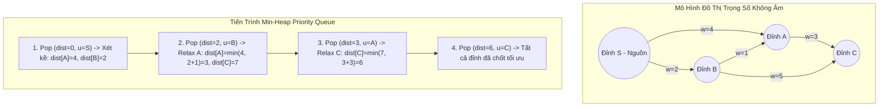

## 1. Mô tả bài toán

Bài toán Tìm đường đi ngắn nhất từ một nguồn duy nhất (Single-Source Shortest Path - SSSP) là bài toán cốt lõi trong lý thuyết đồ thị và kỹ thuật định tuyến mạng. Đề bài đặt ra:

Cho một đồ thị có hướng hoặc vô hướng `G = (V, E)` gồm `V` đỉnh và `E` cạnh, mỗi cạnh `(u, v)` được gán một trọng số không âm `w(u, v) >= 0` (đại diện cho khoảng cách địa lý, độ trễ mạng mạng gói, hoặc chi phí nhiên liệu). Cho trước một đỉnh nguồn `s in V`, hãy tìm độ dài đường đi ngắn nhất từ `s` đến tất cả các đỉnh còn lại trong đồ thị, đồng thời phục dựng lại hành trình di chuyển cụ thể.

Thuật toán Dijkstra do nhà khoa học máy tính huyền thoại Edsger W. Dijkstra phát minh năm 1956 là giải thuật tối ưu nhất và được sử dụng rộng rãi nhất cho bài toán này khi đồ thị không chứa trọng số âm.

## 2. Ý tưởng tiếp cận ban đầu

Cách tiếp cận ngây thơ ban đầu là sử dụng giải thuật Tìm kiếm theo chiều rộng (BFS). Tuy nhiên, BFS truyền thống chỉ hoạt động chính xác khi tất cả các cạnh có _trọng số đồng nhất bằng 1_. Khi đồ thị có trọng số biến thiên, đỉnh được duyệt đầu tiên chưa chắc đã có khoảng cách ngắn nhất.

Phiên bản Dijkstra nguyên bản duyệt mảng tuyến tính: Tại mỗi bước, thuật toán quét qua toàn bộ `V` đỉnh để chọn ra đỉnh có khoảng cách nhỏ nhất chưa được cố định. Độ phức tạp của phiên bản này là `O(V²)`. Với các đồ thị thưa (Sparse Graph có `E ~ V`), việc duyệt mảng tốn kém tài nguyên không cần thiết và hoạt động rất chậm trên các mạng lưới giao thông hàng triệu đỉnh.

## 3. Tư duy tối ưu & Cấu trúc thuật toán

Thuật toán Dijkstra vận hành dựa trên **Nguyên lý Tham lam (Greedy Paradigm)** và cơ chế **Tối ưu hóa cạnh (Edge Relaxation)**:

1. **Mảng khoảng cách & Tập đỉnh đã chốt (Visited Set):** Duy trì mảng `dist[v]` lưu khoảng cách ngắn nhất hiện thời từ nguồn `s` đến `v`. Ban đầu `dist[s] = 0`, tất cả các đỉnh khác gán `&infin;` (vô cực).
2. **Chiến lược Tham lam:** Tại mỗi bước, chọn đỉnh `u` có `dist[u]` nhỏ nhất trong số các đỉnh chưa được chốt. Vì đồ thị có trọng số không âm, giá trị `dist[u]` lúc này chắc chắn là khoảng cách ngắn nhất tuyệt đối không thể tối ưu thêm (Invariance).
3. **Cơ chế Relaxation (Nới lỏng cạnh):** Với mọi đỉnh kề `v` của `u`, nếu đi qua `u` giúp rút ngắn khoảng cách tới `v`, ta cập nhật lại:

```c++
if (dist[u] + w(u, v) < dist[v]) {
    dist[v] = dist[u] + w(u, v);
    parent[v] = u; // Lưu vết đường đi
}
```

4. **Tối ưu cấu trúc dữ liệu Min-Heap:** Thay vì duyệt mảng `O(V)` để tìm đỉnh cực tiểu, ta sử dụng Hàng đợi ưu tiên (`std::priority_queue` với `std::greater`) để lấy đỉnh nhỏ nhất trong `O(log V)`. Mỗi cạnh được nới lỏng đẩy vào heap tối đa 1 lần, giúp tổng thời gian thực thi giảm xuống `O((V + E) log V)`.

**Lưu ý quan trọng:** Dijkstra _không hoạt động chính xác_ trên đồ thị có cạnh mang trọng số âm, vì giả định tham lam bị phá vỡ (việc đi qua một cạnh âm trong tương lai có thể làm giảm khoảng cách của một đỉnh đã bị chốt).

## 4. Triển khai mã nguồn & Dry Run

Sơ đồ chuyển trạng thái và cơ chế Relaxation trong Dijkstra với Min-Heap:



**Mã nguồn C++ hoàn chỉnh (Dijkstra với std::priority_queue và Truy vết đường đi):**

```c++
#include <iostream>
#include <vector>
#include <queue>
#include <utility>
#include <algorithm>

const long long INF = 1e18; // Đại diện cho vô cực

struct Edge {
    int to;
    long long weight;
};

// Cặp trạng thái trong Min-Heap: {khoảng cách, đỉnh}
using State = std::pair<long long, int>;

void dijkstra(int startNode, int numVertices,
              const std::vector<std::vector<Edge>>& graph,
              std::vector<long long>& dist,
              std::vector<int>& parent) {
    dist.assign(numVertices, INF);
    parent.assign(numVertices, -1);

    // Min-heap ưu tiên phần tử có khoảng cách nhỏ nhất lên đầu
    std::priority_queue<State, std::vector<State>, std::greater<State>> pq;

    dist[startNode] = 0;
    pq.push({0, startNode});

    while (!pq.empty()) {
        auto [d, u] = pq.top();
        pq.pop();

        // Bỏ qua các bản ghi cũ không còn tối ưu trong Lazy Deletion
        if (d > dist[u]) {
            continue;
        }

        // Nới lỏng (Relax) tất cả các cạnh kề từ đỉnh u
        for (const auto& edge : graph[u]) {
            int v = edge.to;
            long long w = edge.weight;

            if (dist[u] + w < dist[v]) {
                dist[v] = dist[u] + w;
                parent[v] = u; // Ghi nhận đỉnh cha để phục dựng hành trình
                pq.push({dist[v], v});
            }
        }
    }
}

// Hàm phục dựng đường đi từ đỉnh nguồn đến đỉnh đích
std::vector<int> reconstructPath(int target, const std::vector<int>& parent) {
    std::vector<int> path;
    for (int curr = target; curr != -1; curr = parent[curr]) {
        path.push_back(curr);
    }
    std::reverse(path.begin(), path.end());
    return path;
}

int main() {
    int V = 5; // Đồ thị gồm 5 đỉnh: 0, 1, 2, 3, 4
    std::vector<std::vector<Edge>> graph(V);

    // Thêm các cạnh có hướng (u, v, w)
    graph[0].push_back({1, 4});
    graph[0].push_back({2, 2});
    graph[2].push_back({1, 1});
    graph[2].push_back({3, 5});
    graph[1].push_back({3, 3});
    graph[1].push_back({4, 6});
    graph[3].push_back({4, 1});

    std::vector<long long> dist;
    std::vector<int> parent;
    dijkstra(0, V, graph, dist, parent);

    std::cout << "--- KET QUA DUONG DI NGAN NHAT TU DINH 0 ---" << std::endl;
    for (int i = 0; i < V; ++i) {
        std::cout << "Khoang cach den dinh " << i << ": " << dist[i] << " | Duong di: ";
        auto path = reconstructPath(i, parent);
        for (size_t j = 0; j < path.size(); ++j) {
            std::cout << path[j] << (j + 1 < path.size() ? " -> " : "");
        }
        std::cout << std::endl;
    }

    return 0;
}
```

**Phân tích luồng thực thi chi tiết (Dry Run Trace):**

- _Khởi tạo:_ `dist = [0, &infin;, &infin;, &infin;, &infin;]`, `pq = {(0, 0)}`.
- _Bước 1:_ Pop `(0, 0)`. Xét kề đỉnh 0:
  - Cạnh `(0->1, w=4)`: `dist[1] = 4, parent[1] = 0` &rarr; Push `(4, 1)`.
  - Cạnh `(0->2, w=2)`: `dist[2] = 2, parent[2] = 0` &rarr; Push `(2, 2)`.
- *Bước 2:* Pop `(2, 2)` (nhỏ nhất trong heap). Xét kề đỉnh 2:
  - Cạnh `(2->1, w=1)`: `dist[0] + 2 + 1 = 3 < dist[1]=4` &rarr; Relaxation thành công! `dist[1] = 3, parent[1] = 2` &rarr; Push `(3, 1)`.
  - Cạnh `(2->3, w=5)`: `dist[3] = 2 + 5 = 7, parent[3] = 2` &rarr; Push `(7, 3)`.
- *Bước 3:* Pop `(3, 1)`. Xét kề đỉnh 1:
  - Cạnh `(1->3, w=3)`: `3 + 3 = 6 < dist[3]=7` &rarr; Relaxation! `dist[3] = 6, parent[3] = 1` &rarr; Push `(6, 3)`.
  - Cạnh `(1->4, w=6)`: `3 + 6 = 9 < dist[4]=&infin;` &rarr; `dist[4] = 9, parent[4] = 1` &rarr; Push `(9, 4)`.
- *Bước 4:* Pop `(4, 1)` &rarr; Bị loại bỏ do `d = 4 > dist[1] = 3` (Lazy Deletion).
- *Bước 5:* Pop `(6, 3)`. Xét kề đỉnh 3:
  - Cạnh `(3->4, w=1)`: `6 + 1 = 7 < dist[4]=9` &rarr; Relaxation! `dist[4] = 7, parent[4] = 3` &rarr; Push `(7, 4)`.
- *Bước 6 & 7:* Pop `(7, 4)`, sau đó các trạng thái cũ bị bỏ qua &rarr; Đường đi đến đỉnh 4 chốt giá trị tối ưu là `7` với hành trình `0 -> 2 -> 1 -> 3 -> 4`.

## 5. Đánh giá độ phức tạp & Ứng dụng thực tế

Bảng tổng hợp chỉ số hiệu năng theo hệ quy chiếu chuẩn RAM Model:

- **Độ phức tạp Thời gian (Time Complexity):** `O((V + E) \log V)` khi dùng Binary Heap (hoặc `O(E + V \log V)` nếu dùng Fibonacci Heap theo lý thuyết). Mỗi đỉnh được lấy ra khỏi heap 1 lần (`V \log V`) và mỗi cạnh được relax tối đa 1 lần (`E \log V`).
- **Độ phức tạp Không gian (Space Complexity):** `O(V + E)` để lưu danh sách kề (Adjacency List) cùng các mảng `dist`, `parent` và hàng đợi ưu tiên `pq`.
- **Ứng dụng thực tế:**
  - **Hệ thống bản đồ số (GPS Navigation):** Trái tim của thuật toán tìm đường trên Google Maps, OSRM, Apple Maps (thường kết hợp thêm kỹ thuật Heuristic A* hoặc Contraction Hierarchies).
  - **Giao thức định tuyến mạng Internet:** Giao thức OSPF (Open Shortest Path First) và IS-IS trong kiến trúc mạng lõi viễn thông.
  - **Phát triển Game (Game AI Pathfinding):** Tìm đường di chuyển tối ưu cho nhân vật tránh chướng ngại vật trong thời gian thực.
  - **Mạng xã hội (Social Graphs):** Đo lường mức độ ảnh hưởng và khoảng cách kết nối (Six Degrees of Separation) giữa người dùng.
