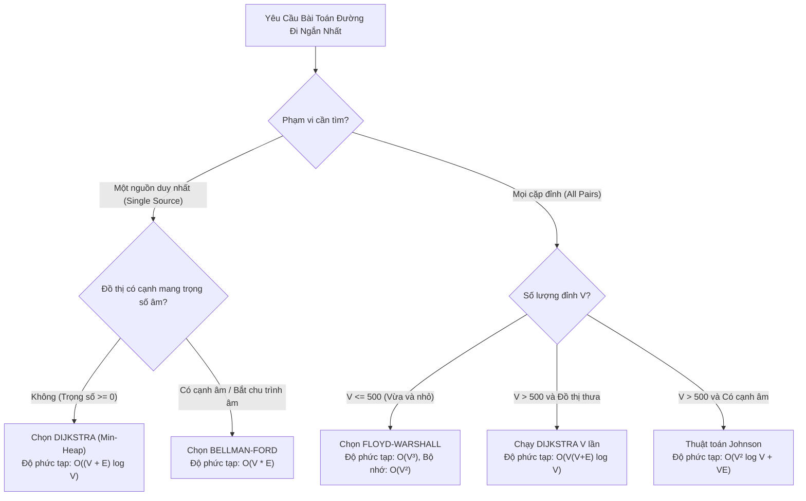

## 1. Mô tả bài toán

Trong kỹ thuật phần mềm, việc lựa chọn sai thuật toán tìm đường đi ngắn nhất có thể dẫn đến hậu quả nghiêm trọng: Chương trình chạy chậm hàng nghìn lần (Time Limit Exceeded), tràn bộ nhớ (Out of Memory), hoặc sai lệch logic hoàn toàn khi gặp dữ liệu biên (như trọng số âm gây vòng lặp vô tận).

Ba trụ cột kinh điển trong bài toán tìm đường đi ngắn nhất gồm:

1. **Dijkstra:** Giải thuật Tham lam (Greedy) tốc độ cao cho đồ thị trọng số không âm.
2. **Bellman-Ford:** Giải thuật Quy hoạch động duyệt cạnh xử lý an toàn trọng số âm và phát hiện chu trình âm.
3. **Floyd-Warshall:** Giải thuật Quy hoạch động ma trận tìm đường đi ngắn nhất giữa mọi cặp đỉnh (All-Pairs).

Bài viết này thiết lập một khung so sánh chuẩn xác, định lượng và cung cấp Cây quyết định trực quan giúp các kỹ sư kiến trúc hệ thống đưa ra quyết định tối ưu.

## 2. Ý tưởng tiếp cận ban đầu

Các sai lầm phổ biến khi lựa chọn thuật toán trong các dự án thực tế:

- **Lạm dụng Dijkstra trên đồ thị chứa trọng số âm:** Dẫn đến kết quả sai lệch âm thầm mà không hề có ngoại lệ (Exception) hay cảnh báo nào phát sinh từ thư viện.
- **Dùng Bellman-Ford trên bản đồ giao thông khổng lồ:** Với mạng lưới đường bộ có hàng triệu nút, Bellman-Ford mất hàng giờ để xử lý trong khi Dijkstra với Min-Heap giải quyết chỉ trong vài mili-giây.
- **Chạy Dijkstra V lần trên đồ thị dày thay vì Floyd-Warshall:** Gặp chi phí overhead quản lý hàng đợi ưu tiên và phân mảnh bộ nhớ lớn hơn nhiều so với thao tác duyệt ma trận tuần tự `O(V³)` có độ tối ưu hóa phần cứng cao.

## 3. Tư duy tối ưu & Cấu trúc thuật toán

**Ma trận So sánh Đa chiều (Comparative Architecture Matrix):**

<table style="width:100%; border-collapse: collapse; margin-bottom: 20px;">
  <thead>
    <tr style="border-bottom: 2px solid #e2e8f0; text-align: left;">
      <th style="padding: 8px;">Tiêu chí Đánh giá</th>
      <th style="padding: 8px;">Dijkstra</th>
      <th style="padding: 8px;">Bellman-Ford</th>
      <th style="padding: 8px;">Floyd-Warshall</th>
    </tr>
  </thead>
  <tbody>
    <tr style="border-bottom: 1px solid #edf2f7;">
      <td style="padding: 8px"><b>Phạm vi bài toán</b></td>
      <td style="padding: 8px">Một nguồn (Single-Source)</td>
      <td style="padding: 8px">Một nguồn (Single-Source)</td>
      <td style="padding: 8px">Mọi cặp đỉnh (All-Pairs)</td>
    </tr>
    <tr style="border-bottom: 1px solid #edf2f7;">
      <td style="padding: 8px"><b>Độ phức tạp Thời gian</b></td>
      <td style="padding: 8px">`O((V + E) \log V)`</td>
      <td style="padding: 8px">`O(V x E)` (Best: `O(E)`)</td>
      <td style="padding: 8px">`Θ(V³)`</td>
    </tr>
    <tr style="border-bottom: 1px solid #edf2f7;">
      <td style="padding: 8px"><b>Độ phức tạp Không gian</b></td>
      <td style="padding: 8px">`O(V + E)`</td>
      <td style="padding: 8px">`O(V + E)`</td>
      <td style="padding: 8px">`O(V²)`</td>
    </tr>
    <tr style="border-bottom: 1px solid #edf2f7;">
      <td style="padding: 8px"><b>Trọng số cạnh âm</b></td>
      <td style="padding: 8px">KHÔNG hỗ trợ</td>
      <td style="padding: 8px">HỖ TRỢ an toàn</td>
      <td style="padding: 8px">HỖ TRỢ an toàn</td>
    </tr>
    <tr style="border-bottom: 1px solid #edf2f7;">
      <td style="padding: 8px"><b>Phát hiện Chu trình âm</b></td>
      <td style="padding: 8px">KHÔNG hỗ trợ</td>
      <td style="padding: 8px">CÓ (ở lượt duyệt V)</td>
      <td style="padding: 8px">CÓ (`dist[i][i] < 0`)</td>
    </tr>
    <tr style="border-bottom: 1px solid #edf2f7;">
      <td style="padding: 8px"><b>Cấu trúc Dữ liệu</b></td>
      <td style="padding: 8px">Min-Heap + Adjacency List</td>
      <td style="padding: 8px">Edge List (Mảng cạnh)</td>
      <td style="padding: 8px">2D Matrix (Ma trận kề)</td>
    </tr>
    <tr>
      <td style="padding: 8px"><b>Giao thức / Ứng dụng</b></td>
      <td style="padding: 8px">OSPF, Google Maps, GPS</td>
      <td style="padding: 8px">RIP, Currency Arbitrage</td>
      <td style="padding: 8px">Transitive Closure, Logistics</td>
    </tr>
  </tbody>
</table>

## 4. Triển khai mã nguồn & Dry Run

Cây quyết định (Decision Tree) giúp kỹ sư lựa chọn thuật toán chuẩn mực theo bài toán:



**Bộ kiểm thử Benchmark tích hợp C++ (Đo đạc và xác thực 3 thuật toán trên cùng đồ thị):**

```c++
#include <iostream>
#include <vector>
#include <queue>
#include <chrono>

const long long INF = 1e15;

// Cấu trúc cạnh chung
struct Edge {
    int from, to;
    long long weight;
};

// 1. Dijkstra Benchmark Wrapper
long long benchmarkDijkstra(int V, int start, int end, const std::vector<std::vector<std::pair<int, long long>>>& adj) {
    std::vector<long long> dist(V, INF);
    using State = std::pair<long long, int>;
    std::priority_queue<State, std::vector<State>, std::greater<State>> pq;

    dist[start] = 0;
    pq.push({0, start});

    while (!pq.empty()) {
        auto [d, u] = pq.top();
        pq.pop();
        if (d > dist[u]) continue;
        if (u == end) break; // Dừng sớm khi đã tìm thấy đích

        for (const auto& edge : adj[u]) {
            int v = edge.first;
            long long w = edge.second;
            if (dist[u] + w < dist[v]) {
                dist[v] = dist[u] + w;
                pq.push({dist[v], v});
            }
        }
    }
    return dist[end];
}

// 2. Bellman-Ford Benchmark Wrapper
long long benchmarkBellmanFord(int V, int start, int end, const std::vector<Edge>& edges) {
    std::vector<long long> dist(V, INF);
    dist[start] = 0;

    for (int i = 1; i <= V - 1; ++i) {
        bool updated = false;
        for (const auto& e : edges) {
            if (dist[e.from] != INF && dist[e.from] + e.weight < dist[e.to]) {
                dist[e.to] = dist[e.from] + e.weight;
                updated = true;
            }
        }
        if (!updated) break;
    }
    return dist[end];
}

// 3. Floyd-Warshall Benchmark Wrapper
long long benchmarkFloydWarshall(int V, int start, int end, std::vector<std::vector<long long>> dist) {
    for (int k = 0; k < V; ++k) {
        for (int i = 0; i < V; ++i) {
            for (int j = 0; j < V; ++j) {
                if (dist[i][k] != INF && dist[k][j] != INF) {
                    dist[i][j] = std::min(dist[i][j], dist[i][k] + dist[k][j]);
                }
            }
        }
    }
    return dist[start][end];
}

int main() {
    int V = 5;
    std::vector<Edge> edgeList = {
        {0, 1, 4}, {0, 2, 2}, {1, 2, 1}, {1, 3, 5},
        {2, 3, 8}, {2, 4, 10}, {3, 4, 2}
    };

    std::vector<std::vector<std::pair<int, long long>>> adj(V);
    std::vector<std::vector<long long>> matrix(V, std::vector<long long>(V, INF));
    for (int i = 0; i < V; ++i) matrix[i][i] = 0;

    for (const auto& e : edgeList) {
        adj[e.from].push_back({e.to, e.weight});
        matrix[e.from][e.to] = e.weight;
    }

    std::cout << "--- KET QUA DUONG DI TU 0 DEN 4 CUA 3 THUAT TOAN ---" << std::endl;
    std::cout << "1. Dijkstra:       Khoang cach = " << benchmarkDijkstra(V, 0, 4, adj) << std::endl;
    std::cout << "2. Bellman-Ford:  Khoang cach = " << benchmarkBellmanFord(V, 0, 4, edgeList) << std::endl;
    std::cout << "3. Floyd-Warshall: Khoang cach = " << benchmarkFloydWarshall(V, 0, 4, matrix) << std::endl;

    return 0;
}
```

## 5. Đánh giá độ phức tạp & Ứng dụng thực tế

Tổng kết chiến lược ứng dụng cho kỹ sư phần mềm:

1. **Khi nào chọn Dijkstra?** Khi cần tìm đường đi ngắn nhất từ một điểm xuất phát trên đồ thị lớn (đường bộ, mạng máy tính, đồ thị mạng xã hội) và đảm bảo 100% trọng số &ge; 0. Đây là giải thuật có hiệu năng cao nhất trong thực tế.
2. **Khi nào chọn Bellman-Ford?** Khi đồ thị có khả năng xuất hiện chi phí âm (giao dịch tiền tệ, mạng năng lượng) hoặc khi cần một thuật toán phân tán đơn giản (Distance Vector trong định tuyến RIP) nơi mỗi router chỉ trao đổi thông tin với láng giềng.
3. **Khi nào chọn Floyd-Warshall?** Khi số lượng đỉnh vừa phải (`V <= 500`) và hệ thống yêu cầu tra cứu khoảng cách giữa mọi cặp đỉnh tức thời trong `O(1)` mà không cần tính toán lại.
